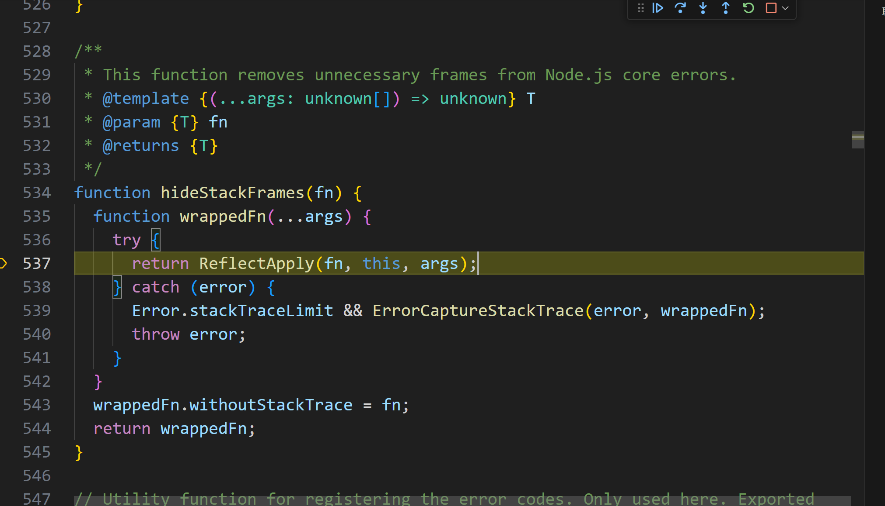
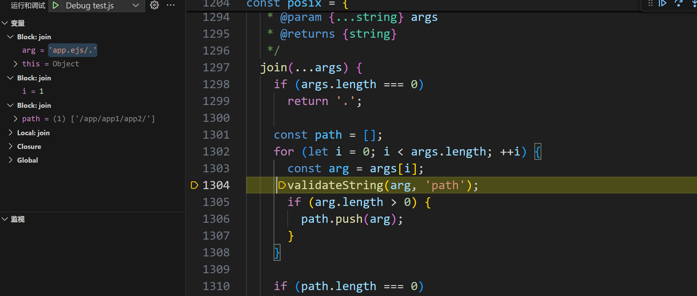

#### path.join() 

<!-- more -->

```js
const path = require('path');

const STATIC_DIR = path.join("/app","/app1/app2/")

console.log(STATIC_DIR);

const filePath = path.join(STATIC_DIR, "app.ejs/.");

console.log(filePath);
```

跟进到 `join()` ,输入的参数是一个数组 

```js
[
  "/app/app1/app2/",
  "app.ejs/.",
]
```

这是 `join()` 的实现

```js
join(...args) {
    // 先判断数组长度是否为0 直接返回 
if (args.length === 0)
  return '.';
	// 写一个空数组
const path = [];
    // 对传入的参数进行逐步解析
for (let i = 0; i < args.length; ++i) {
  const arg = args[i];
    
  validateString(arg, 'path');
  if (arg.length > 0) {
    path.push(arg);
  }
}

if (path.length === 0)
  return '.';

return posix.normalize(ArrayPrototypeJoin(path, '/'));
}
```

走到` validateString() ，`跟进后跳转到这



这我没搞懂，应该是一个简单判断，继续走就是判断传入的 arg 是不是字符串

第二轮

走到这个地方,可以看到` arg = "app.ejs/."`

第二轮进行完，得到 `path` 数组

```js
[
  "/app/app1/app2/",
  "app.ejs/.",
]
```

关键部分

```js
    return posix.normalize(ArrayPrototypeJoin(path, '/'));
```

跟进后发现`path` 变成 

```js
"/app/app1/app2//app.ejs/."
```

可能是`ArrayPrototypeJoin(path, '/') `的处理，不知道怎么会多一个 /  

下面是 `normalize()`

```js
normalize(path) {
validateString(path, 'path');

if (path.length === 0)
  return '.';
    // 绝对路径 true
const isAbsolute =
  StringPrototypeCharCodeAt(path, 0) === CHAR_FORWARD_SLASH;
    // 判断末尾是不是有分隔符 / false
const trailingSeparator =
  StringPrototypeCharCodeAt(path, path.length - 1) === CHAR_FORWARD_SLASH;

// Normalize the path
path = normalizeString(path, !isAbsolute, '/', isPosixPathSeparator);

if (path.length === 0) {
  if (isAbsolute)
    return '/';
  return trailingSeparator ? './' : '.';
}
if (trailingSeparator)
  path += '/';

return isAbsolute ? `/${path}` : path;
},
```

```js
function normalizeString(path, allowAboveRoot, separator, isPathSeparator) {
let res = '';
let lastSegmentLength = 0;
let lastSlash = -1;
let dots = 0;
let code = 0;
    
for (let i = 0; i <= path.length; ++i) {
if (i < path.length)
  code = StringPrototypeCharCodeAt(path, i);
else if (isPathSeparator(code))
  break;
else
  code = CHAR_FORWARD_SLASH;

if (isPathSeparator(code)) {
    
  if (lastSlash === i - 1 || dots === 1) {
    // NOOP
  } 
  else if (dots === 2) {
    if (res.length < 2 || lastSegmentLength !== 2 ||
        StringPrototypeCharCodeAt(res, res.length - 1) !== CHAR_DOT ||
        StringPrototypeCharCodeAt(res, res.length - 2) !== CHAR_DOT) {
      if (res.length > 2) {
        const lastSlashIndex = res.length - lastSegmentLength - 1;
        if (lastSlashIndex === -1) {
          res = '';
          lastSegmentLength = 0;
        } else {
          res = StringPrototypeSlice(res, 0, lastSlashIndex);
          lastSegmentLength =
            res.length - 1 - StringPrototypeLastIndexOf(res, separator);
        }
        lastSlash = i;
        dots = 0;
        continue;
      } 
      else if (res.length !== 0) {
        res = '';
        lastSegmentLength = 0;
        lastSlash = i;
        dots = 0;
        continue;
      }
    }
    if (allowAboveRoot) {
      res += res.length > 0 ? `${separator}..` : '..';
      lastSegmentLength = 2;
    }
  } 
  else {
    if (res.length > 0)
      res += `${separator}${StringPrototypeSlice(path, lastSlash + 1, i)}`;
    else
      res = StringPrototypeSlice(path, lastSlash + 1, i);
    lastSegmentLength = i - lastSlash - 1;
  }
  lastSlash = i;
  dots = 0;
} 
  else if (code === CHAR_DOT && dots !== -1) {
  	++dots;
} 
  else {
  	dots = -1;
}
}
return res;
}
```

主要是下面那个循环处理，如果连续遇到两个 // 

比如，`app/app1//app2/1.txt `有如下处理

```js
if (lastSlash === i - 1 || dots === 1) 
//直接跳出整个判断处理，然后
lastSlash = i;
dots = 0;
//点数重置，上一个分隔符的位置更新，所以字符串切片拼接路径时，不会导致连续两个分隔符出现。
```

字符串切片有两种情况,

一种是如果没有积累 `res` ，刚开头就直接从上一个分隔符的后一位开始，一直到分隔符前的都切片拼接到`res`

`/app/app1`

进行到第二个`/ `的时候把` app` 拼接到` res`

```js
if (res.length > 0)
  res += `${separator}${StringPrototypeSlice(path, lastSlash + 1, i)}`;
else
  res = StringPrototypeSlice(path, lastSlash + 1, i);
```

对点的处理，如果分隔符后第一位不是点，赋值 `dots = -1`，应该是按照文件的后缀` . `来处理的，

```js
 else if (code === CHAR_DOT && dots !== -1) {
      ++dots;
```

否则当成` . .. `来处理

最后，到最后一位字符时，因为` i >= path.length `会进入` else `分支

```js
if (i < path.length)
  code = StringPrototypeCharCodeAt(path, i);
else if (isPathSeparator(code))
  break;
else
  code = CHAR_FORWARD_SLASH;
```

然后因为 `code` = 分隔符的 `ascii`，重置 `lashslash dots` ，自此 `for `循环结束，会发现是没有把最后的 `/.`拼接到 `res` 的，所以走出来的 `res` 就是

```js
res = "app/app1/app2//app.ejs"
```

回到 `normalize()` 函数

```javascript
path = normalizeString(path, !isAbsolute, '/', isPosixPathSeparator);

if (path.length === 0) {
  if (isAbsolute)
    return '/';
  return trailingSeparator ? './' : '.';
}
if (trailingSeparator)
  path += '/';

return isAbsolute ? `/${path}` : path;
```

此时，因为` isAbsolute trailingSeparator `前面已经判断好了， `true false`

```javascript
 path = "app/app1/app2/app.ejs"
```

直接返回 

```js
`/${path}`
```

即返回 `/app/app1/app2/app.ejs`

`/app/a.ejs/` 不会被处理成 `/app/a.ejs ` 因为 normalizing() 处理前判断了最后一位是不是分隔符，如果 true ，normalizing() 处理完不带的最后一位分隔符会在这加上。

```js
if (trailingSeparator)
path += '/';
```

