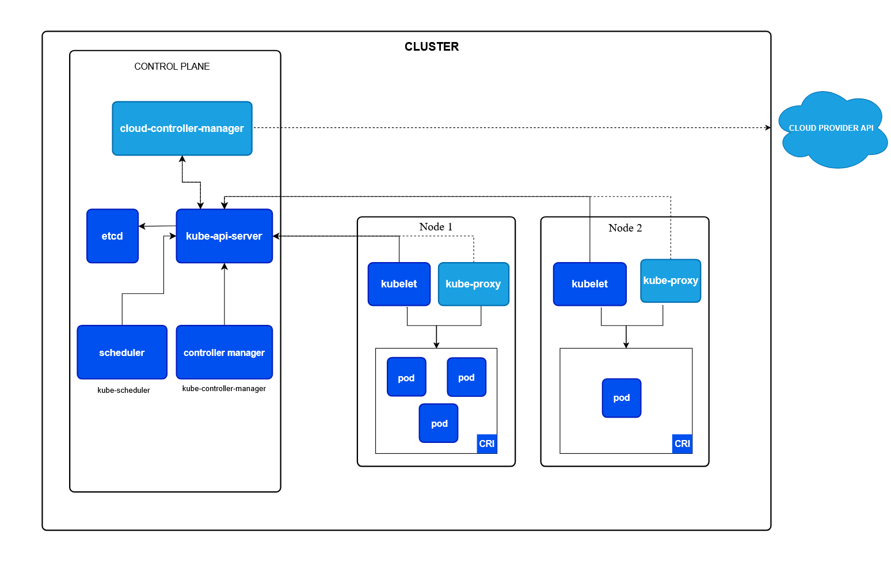
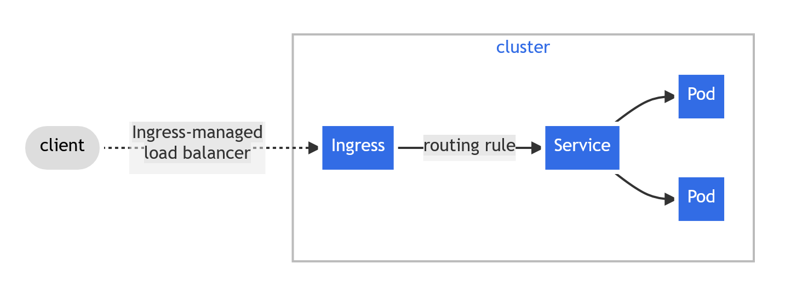
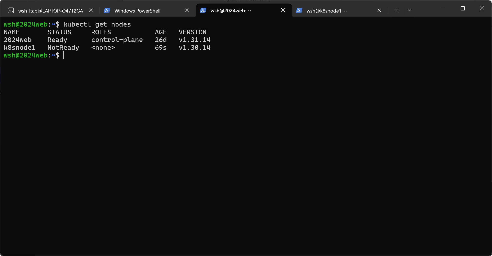

## k8s（Kubernetes）

### k8s 概念

​	k8s 是一个容器编排平台，用于自动化部署、扩展、管理容器化应用程序。在现代开发中，为了解决环境不一致导致的各种运行问题，应用通常被打包在 docker 容器中，对于几个 docker 容器，只需要手动管理即可，随着应用规模不断扩大，容器数量不断上涨，如何处理故障，处理项目迭代所需的平滑升级，处理资源分配成为手动管理无法解决的问题，因此引入 k8s 解决这些问题。

### k8s 核心组件

​	k8s 由控制平面和工作节点组成，工作节点托管 Pods，控制平面管理集群中的工作节点和 Pods。



#### kube-api-server

​	核心组件服务器，负责暴露 Kubernetes HTTP API,组件之间通过其进行通信。

#### etcd

​	分布式键值存储系统，负责存储 k8s 集群的持久化数据，在分布式环境下多个副本之间的数据严格一致。

#### kube-scheduler

​	k8s pod 分配的决策中心，为新创建或者还没有分配节点的 pod 分配最合适的运行节点。

#### kube-controller-manager

​	内部集成多种控制器，每种控制器实例负责对应的资源的生命周期管理，核心逻辑就是获取实际状态 --> 对比期望状态 --> 纠正偏离。

#### kubelet

​	运行在 Node 上的代理程序，负责执行来自控制平台的指令，确保 Node 上的容器状态与 etcd 存储的期望容器状态一致。

#### kube-proxy

​	节点上的网络控制核心，通过维护节点上的网络规则，将访问 Service Cluster ip 的流量转发到后端的 Pod 实例上，通过 linux netfilter 框架的 hook 实现，当数据包经过这些 hook 点时触发到相应规则，凡是发到某个 service 的包都要拦截，然后改写目标地址为真实 pod ip 。

#### container runtime

镜像管理 

- 连接远程镜像仓库，如 Docker Hub。
- pull 镜像并存储在节点本地。

容器执行

- 创建：根据镜像创建相应环境。
- 启动：运行容器内的进程。
- 停止/删除：清理进程及临时资源。

资源隔离与限制：

- 调用 Linux 内核的 Namespaces（实现环境隔离，如网络、进程空间）。
- 调用 Cgroups（实现资源限制，如限制该容器只能用 1GB 内存）。

交互支持：

- 提供容器日志采集、标准输入输出流接入。


### k8s Object

​	k8s 对象就是存储在 etcd 中的数据，通过这些数据告诉 k8s 控制平面，我期望 k8s 集群应该是什么样子，k8s 控制平面不断工作调整，使得集群状态和期望状态一致。每个 k8s 对象通常包含 spec 和 status 两个关键字段，前者是你所定义的期望状态，后者是 k8s 观测到的实际状态。无论我们创建什么对象，pod、service、deployment ，其 yaml 文件必须包含以下四个字段 apiVersion、kind、meta、spec，例如

```yaml

apiVersion: apps/v1 # 用的是哪个版本的 Kubernetes API 来创建这个对象
kind: Deployment # 创建的对象类型，pod service ingress deployment 等
metadata: # 元数据
  name: nginx-deployment
spec: # 预期状态
  selector:
    matchLabels:
      app: nginx
  replicas: 2 # tells deployment to run 2 pods matching the template
  template:
    metadata:
      labels:
        app: nginx
    spec:
      containers:
      - name: nginx
        image: nginx:1.14.2
        ports:
        - containerPort: 80

```

接下来讲几个基本对象

#### pod

​	Pod 类似于一组具有共享命名空间和共享文件系统卷的容器，k8s 中常见用例为一个 pod 一个 container，或者一个 pod 中存放多个 container (这些 container 需要共享资源共同组成一个整体)。k8s 不直接管理容器，而是管理 pod ，pod 是 k8s 最小单元。

​	下面是一个运行 nginx:1.14.2 的容器组成的 pod，simple-pod.yaml

```yaml

apiVersion: v1
kind: Pod
metadata:
  name: nginx
spec:
  containers:
  - name: nginx
    image: nginx:1.14.2
    ports:
    - containerPort: 80

```

​	要创建上述 pod ，执行 `kubectl apply -f simple-pod.yaml` 。但是一般我们不直接创建 pod ,即使是单个 Pod。我们通过 deployment 或是 job resource 去创建 pod ,如果 pod 需要跟踪状态，也可使用 StatefulSet resource，因为单个创建的 pod ，假设它所在节点宕机或是进程崩溃，pod 会彻底消失无法恢复，然而通过 deployment 管理，控制器发现 pod 数目变少会在其他健康节点拉起新的 pod 保证服务。当然不只是这一个作用，还有滚动升级等。接下来讲几个常见的 workload source。

#### Deployment

​	通常用来管理一组无状态 pod ，以下是一个示例 nginx-deployment.yaml 

```yaml

apiVersion: apps/v1
kind: Deployment
metadata:
  name: nginx-deployment
  labels:
    app: nginx
spec:
  replicas: 3
  selector:
    matchLabels:
      app: nginx
  template:
    metadata:
      labels:
        app: nginx
    spec:
      containers:
      - name: nginx
        image: nginx:1.14.2
        ports:
        - containerPort: 80

```

​	通过 kubectl apply -f nginx-deployment.yaml 创建 deployment ，kubectl get deployments 检查该 deployment 是否创建成功.

​	当我们要更新 pod 内应用程序版本时，例如更新 nginx 版本从 1.14.2 - 1.16.1 ，需要通过  kubectl set image deployment/nginx-deployment nginx=nginx:1.16.1 实现，查看更新状态使用 kubectl rollout status deployment/deploymentName。

​	如果上线新版本出现故障需要回滚到旧版本，通常 kubectl rollout history deployment/nginx-deployment 先获取更新历史，输出内容大致如下

```

deployments "nginx-deployment"
REVISION    CHANGE-CAUSE
1           <none>
2           <none>
3           <none>

```

可以通过  --to-revision=2 指定操作版本，例如查看版本 2 详细信息，kubectl rollout history deployment/nginx-deployment --revision=2，回滚到版本 2 ，kubectl rollout undo deployment/nginx-deployment --to-revision=2

其余详细内容见  https://kubernetes.io/docs/concepts/workloads/controllers/deployment/

#### StatefulSets

​	和 deployment 类似，管理一组有相同容器规范的 pods ，不同的是 statefulSets 会为每个 pod 维护一个身份，每个 pod 都是独一无二的。

​	局限性，更新时可能出现故障导致需要手动操作修复；当 StatefulSets 被删除时 ，pod 不一定终止，因此在删除前需要先将 replicas 指定为 0。


```yaml

apiVersion: v1
kind: Service
metadata:
  name: nginx
  labels:
    app: nginx
spec:
  ports:
  - port: 80
    name: web
  clusterIP: None
  selector:
    app: nginx
---
apiVersion: apps/v1
kind: StatefulSet
metadata:
  name: web
spec:
  selector:
    matchLabels:
      app: nginx 
  serviceName: "nginx"
  replicas: 3 
  minReadySeconds: 10 
  template:
    metadata:
      labels:
        app: nginx 
    spec:
      terminationGracePeriodSeconds: 10
      containers:
      - name: nginx
        image: registry.k8s.io/nginx-slim:0.24
        ports:
        - containerPort: 80
          name: web
        volumeMounts:
        - name: www
          mountPath: /usr/share/nginx/html
  volumeClaimTemplates:
  - metadata:
      name: www
    spec:
      accessModes: [ "ReadWriteOnce" ]
      storageClassName: "my-storage-class"
      resources:
        requests:
          storage: 1Gi
          
```

除此之外，还有 DaemonSet, Job/CronJob .... （我没怎么用过）

#### service

​	对于一些为其他 pods 提供服务的 pods ,暂且称为 前端 pods 后端 pods ，每个 pod 都有自己的 IP 地址，并且后端 pods 因为某些故障重启之后 IP 会随之改变，那么前端 pods 如何寻找为其提供服务的后端 pods ，为此引入 service。svc 可以通过 selectot 的 label 定位与之相关联的 pods，也可以不使用 selector ，这通常允许 svc 将流量转发到集群外部（例如访问外部数据库）。

​	**工作原理** ： 如果 svc 定义了 selector ，k8s 控制平面的 kube-controller-manager 中的 Endpoints Controller 会自动寻找匹配标签的 pods，并将它们的 ip 填入 EndpointSlice。所以对于哪些没定义 selector 的 svc ,我们可以手动创建一个 EndpointSlice 对象，声明流量应该发往哪些 Ip。 kube-proxy 将 EndpointSlice 转换为 linux 指令，通过 iptabes 将规则注入内核中。

```yaml

apiVersion: v1
kind: Service
metadata:
  name: v1-service
spec:
  selector:
    app.kubernetes.io/name: web-app        # 必须与 Pod 的 Label 一致
  ports:
    - protocol: TCP
      port: 80             # Service 暴露的端口（集群内访问端口）
      targetPort: 8080     # Pod 中容器监听的端口

```

或是

```yaml

apiVersion: v1
kind: Service
metadata:
  name: service_one
spec:
  ports:
    - name: http_port
      protocol: TCP
      port: 80
      targetPort: 8080

---
apiVersion: discovery.k8s.io/v1
kind: EndpointSlice
metadata:
  name: my-service-1                      
  labels:
    # should set the "kubernetes.io/service-name" label.
    # Set its value to match the name of the Service
    kubernetes.io/service-name: service_one
addressType: IPv4
ports:
  - name: http_port
    appProtocol: http
    protocol: TCP
    port: 8080
endpoints:
  - addresses:
      - "10.0.0.6"
  - addresses:
      - "10.0.0.3"
      
```

​	了解 netfilter 可以知道，有 5 个 hook 点（好像是，记不太清了），设置 service ip 为目标地址，进入网络协议栈之后，假设在某个 hook 点触发了规则，将 service ip 改为真实 pod ip，数据包就会发往这个 pod ip ，但是如果我们在 endpints 中再次填写一个 service ip ,由于数据包不会重新从顶层再次向底层流动，所以不能触发 service 的流量转发规则，导致数据包发送失败，因此 endpoints 中必须填真实可达 ip。

​	service type 有以下几种，NodePort、LoadBanlancer、ExterName。

​	默认类型就是 clusterIP （上面讲的就是），很明显 ClusterIP 是一个虚拟 IP 地址，实际并不存在这样的一个网卡或者物理设备，因此也无法暴露服务到公网，只能保证内网通信，pod 之间的通信。NodePort 模式相当于在 clusterIp 的基础之上为每个 Node 分配一个高位 port (30000-32676)，外网可以通过 NodeIP:port 访问内部服务，LoadBalancer 模式类似，在 NodePort 的基础上，云厂商创建一个真实的 LB 实例，外部流量 --> LB 实例 --> NodeIP:NodePort --> ClusterIP --> Pod IP，LB 只需知道 NodeIP，其余的流量分发逻辑，转发至 service 下的哪个 pod 交给 kube-proxy 处理。ExterName 跟不指定 selector 差不多，后者是通过 Ip 访问外部服务，ExterName 模式是通过域名访问外部服务。

```yaml

apiVersion: v1
kind: Service
metadata:
  name: external-db
spec:
  type: ExternalName
  externalName: www.xxx.com  # 外部真实的域名地址
  
```

剩下的还有一些无头服务的概念（我没用到过这种场景，大家有需要的看一下吧）

#### ingress

​	前面我们提到 service 可以使用 LB 将服务暴露至公网，那为什么不使用这个方案？因为一个 service 对应一个 LB ，每个 service 都需要要一个 LB 设备导致成本变高，引入 ingress ，将发送到不同路径的请求转发到不同的 service ，例如 http://www.xxx.com/api  转发到 api-service ，http://www.xxx.com/dashboard 转发到 dashboard-service ，这样一个 LB 一个公网 ip ，域名即可支持多个 service。



```yaml

apiVersion: networking.k8s.io/v1
kind: Ingress
metadata:
  name: my-app-ingress
  annotations:
    # 各种注解，用于实现 Ingress 原生不支持的一些功能，每个厂商之间都不太一样，导致很混乱
    nginx.ingress.kubernetes.io/proxy-body-size: "10m"
    nginx.ingress.kubernetes.io/ssl-redirect: "true"
spec:
  rules: 
  - host: api.example.com
    http:
      paths:
      - path: /v1(/|$)(.*)
        pathType: ImplementationSpecific
        backend:
          service:
            name: v1-service
            port:
              number: 80
              
```

#### Gateway API

不是原生 k8s 支持的对象，需要先安装 CRDs 

```yaml
kubectl apply -f https://github.com/kubernetes-sigs/gateway-api/releases/download/v1.3.0/standard-install.yaml
```

gateway api 将其拆解为三个相互关联的对象

GatewayClass 指定使用什么技术实现网关，例如 nginx envoy ......

```yaml
apiVersion: gateway.networking.k8s.io/v1
kind: GatewayClass
metadata:
  name: nginx_1
spec:
  controllerName: nginx.org/nginx-gateway-controller
```

Gateway 定义流量从哪里进来

```yaml
apiVersion: gateway.networking.k8s.io/v1
kind: Gateway
metadata:
  name: nginx-gateway
spec:
  gatewayClassName: nginx_1
  listeners:
  - name: http
    port: 80 # 监听该网关所在公网 IP 的 80 端口
    protocol: HTTP
```

HttpRoute 定义流量怎么分发到相应的 svc

```yaml
apiVersion: gateway.networking.k8s.io/v1
kind: HTTPRoute
metadata:
  name: example-route
spec:
  parentRefs:
  - name: nginx-gateway # 引用上文的网关 meta.name ，不同的 svc 可以引用不同的 meta.name 继而实现开发者可以自定义路由规则，配置业务路径。
  hostnames:
  - "example.com" # 匹配 hdr 为 example.com
  rules:
  - matches:
    - path:
        type: PathPrefix
        value: /
    backendRefs:
    - name: example-service # 流量最终转发到的目标 Service 名称
      port: 80 # 目标 Service 暴露的端口
```


### 可视化插件

https://github.com/kubernetes-retired/dashboard#kubernetes-dashboard，

https://github.com/eip-work/kuboard-press，

可视化应该更方便一些。

### k8s 环境搭建

配置系统环境

```bash
# 1. 临时禁用 Swap，永久禁用需修改 /etc/fstab 注释掉 swap 行
sudo swapoff -a
sudo sed -i '/swap/s/^/#/' /etc/fstab

# 2. 修改主机名
sudo hostnamectl set-hostname master-node

# 3. 配置内核参数，允许转发流量
cat <<EOF | sudo tee /etc/modules-load.d/k8s.conf
overlay
br_netfilter
EOF

sudo modprobe overlay
sudo modprobe br_netfilter

cat <<EOF | sudo tee /etc/sysctl.d/k8s.conf
net.bridge.bridge-nf-call-iptables  = 1
net.bridge.bridge-nf-call-ip6tables = 1
net.ipv4.ip_forward                 = 1
EOF

sudo sysctl --system
```

安装 containerd kubeadm kubectl kubelet

```bash

sudo apt-get update
sudo apt-get install -y containerd

# 生成默认配置并修改 SystemdCgroup
sudo mkdir -p /etc/containerd
containerd config default | sudo tee /etc/containerd/config.toml
sudo sed -i 's/SystemdCgroup = false/SystemdCgroup = true/g' /etc/containerd/config.toml

# 重启服务
sudo systemctl restart containerd
sudo systemctl enable containerd

sudo apt-get update && sudo apt-get install -y apt-transport-https
curl -fsSL https://mirrors.aliyun.com/kubernetes-new/core/stable/v1.30/deb/Release.key | sudo gpg --dearmor -o /etc/apt/keyrings/kubernetes-apt-keyring.gpg

echo "deb [signed-by=/etc/apt/keyrings/kubernetes-apt-keyring.gpg] https://mirrors.aliyun.com/kubernetes-new/core/stable/v1.30/deb/ /" | sudo tee /etc/apt/sources.list.d/kubernetes.list

sudo apt-get update
sudo apt-get install -y kubelet kubeadm kubectl
sudo apt-mark hold kubelet kubeadm kubectl
```

到这里 master 节点使用 kubeadm 初始化集群

```bash
sudo kubeadm init \
  --apiserver-advertise-address=<Master内网IP> \
  --image-repository registry.aliyuncs.com/google_containers \
  --kubernetes-version v1.30.0 \
  --pod-network-cidr=10.244.0.0/16


mkdir -p $HOME/.kube
sudo cp -i /etc/kubernetes/admin.conf $HOME/.kube/config
sudo chown $(id -u):$(id -g) $HOME/.kube/config
```

安装网络插件

```bash
kubectl create -f https://raw.githubusercontent.com/projectcalico/calico/v3.27.3/manifests/tigera-operator.yaml
kubectl create -f https://raw.githubusercontent.com/projectcalico/calico/v3.27.3/manifests/custom-resources.yaml
```

而工作节点需要

```bash
sudo kubeadm join <Master-IP>:6443 --token <token> \
    --discovery-token-ca-cert-hash sha256:<hash>
```

以上内容在 master 节点使用 kubeadm token create --print-join-command 得到。

工作节点加入后，在主节点通过  kubectl get nodes 可以看到。




参考链接

https://tttang.com/archive/1465/#toc_k8s_1

https://kubernetes.feisky.xyz/

https://kuboard.cn/

