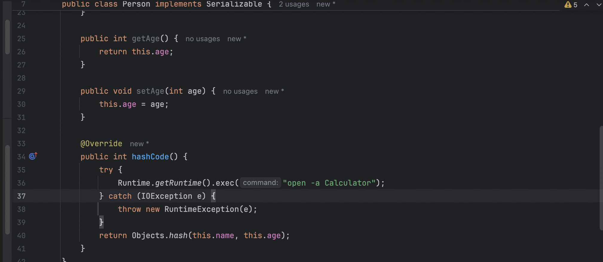
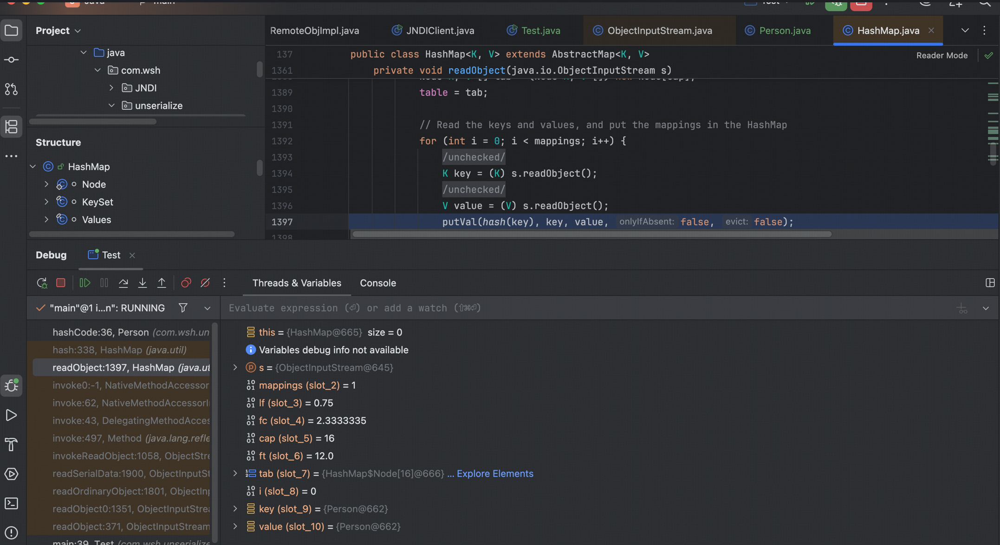
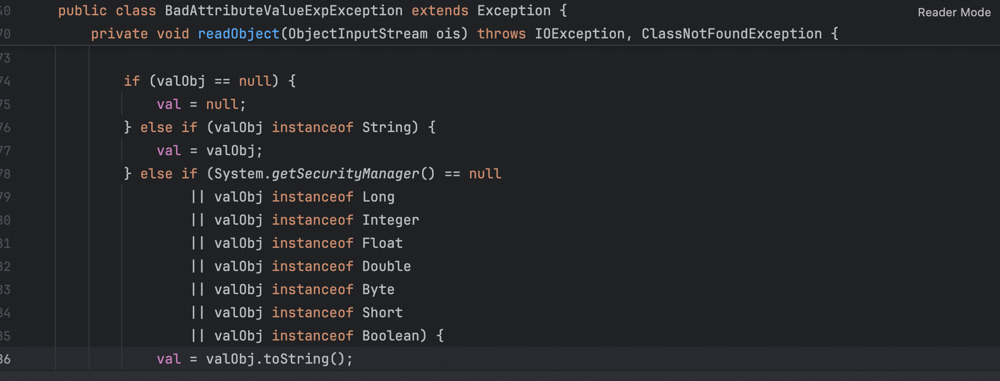
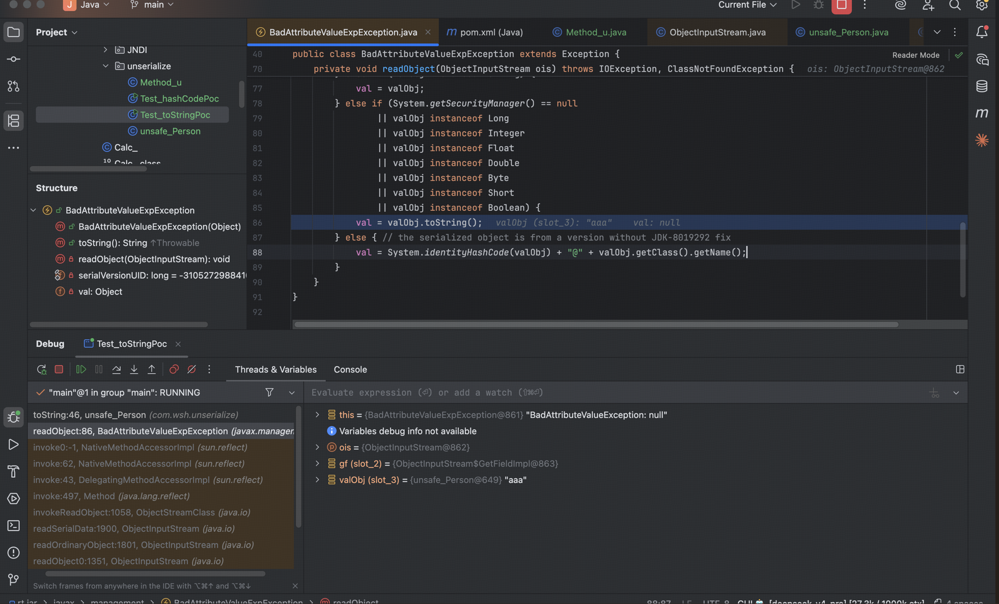
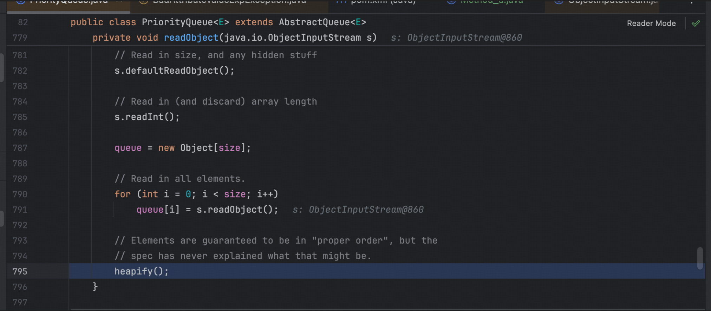
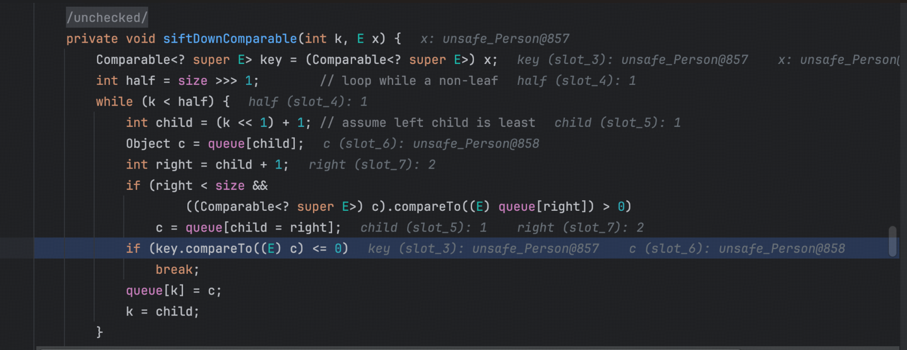

#### 0x01 

序列化/反序列化是为了能够保存对象状态，并且可以走网络中传输等。接受方通过这些数据来重建对象，依托于 Java 反射机制，理论上可以实例化绝大多数的类并控制绝大多数类的成员函数，这里可以进一步走到反射调用危险方法，字节码加载等 sink 点。

#### 0x02

我们在反序列化的时候重建一个 Java 类，构造出具备攻击性例如rce、文件读取、dns 外链、内存马植入的类，通过调用该类的成员函数，在合适的地方填入相应的参数来实现攻击目的。

走到最后要么是动态加载字节码，urlClassloader loadClass defineClass 要么是 method.invoke() 这样的危险方法调用

#### 0x03 readObject 

接下来讲解一些常见的入口点，例如 

##### 0x01 hashCode() 



我们可以通过 HashMap 对象反序列化时为了将对象放回相应的位置，会对其进行 hashCode() 计算，来构造一个 map 对象来实现。

```java
package com.wsh.unserialize;

import java.io.*;
import java.lang.reflect.Array;
import java.lang.reflect.Constructor;
import java.lang.reflect.Field;
import java.lang.reflect.InvocationTargetException;
import java.util.HashMap;

public class Test {
    public static void main(String[] args) throws IOException, ClassNotFoundException, NoSuchMethodException, IllegalAccessException, NoSuchFieldException, InvocationTargetException, InstantiationException {
        Person p1 = new Person("aaa",13);
//        p1.hashCode();
        HashMap<Object, Object> map = new HashMap<>();

        Class<?> nodeClass = Class.forName("java.util.HashMap$Node");
        Object[] table = (Object[]) Array.newInstance(nodeClass, 16);

        Constructor<?> nodeCons = nodeClass.getDeclaredConstructor(int.class, Object.class, Object.class, nodeClass);
        nodeCons.setAccessible(true);
        Object node = nodeCons.newInstance(1, p1, p1, null);
        table[0] = node;

        Field tableField = HashMap.class.getDeclaredField("table");
        tableField.setAccessible(true);
        tableField.set(map, table);

        Field sizeField = HashMap.class.getDeclaredField("size");
        sizeField.setAccessible(true);
        sizeField.set(map, 1);

        FileOutputStream fos = new FileOutputStream("ser.bin");
        ObjectOutputStream oos = new ObjectOutputStream(fos);
        oos.writeObject(map);
        oos.close();

        FileInputStream fis = new FileInputStream("ser.bin");
        ObjectInputStream ois = new ObjectInputStream(fis);
        ois.readObject();
    }
}

```

调用栈如下



##### 0x02 toString() 

通过 BadAttributeValueExpException 类的反序列化来触发 



```java
BadAttributeValueExpException bavee = new BadAttributeValueExpException()
Method_u.setFieldValue(badAttributeValueExpException,"val",p1);
```

反序列化时会执行 val.toString() 



##### 0x03 equals()

见 https://wele.vercel.app/posts/post19-fastjson2/1/ ，HashMap 的 反序列化的过程中如果 HashCode 值相同，那么会调用 equals() ,可以使用 map yy zZ 的技巧或者 hsts 类来满足 HashCode 值相同


##### 0x04 compareTo() 

我们通常选用 PriorityQueue 来包装恶意类，通过反射赋值将恶意类写入优先队列中，反序列化 PriorityQueue 对象时会触发到 compareTo() 方法。

PriorityQueue 类的 readObject 方法调用 heapify ，反序列化填充完值之后需要还原合法堆结构或者说成小顶堆，保证序列化/反序列化之后结构正确。



因此会涉及到元素之间的比较，进而触发 compareTo() 方法



#### 0x04 setter 方法

todo

fastjson jackson

#### 0x05 getter 方法

Fastjson rome

#### 0x06 动态代理的应用

Fastjson2 fastjson 1.2.83 

jdk8u 原生链


