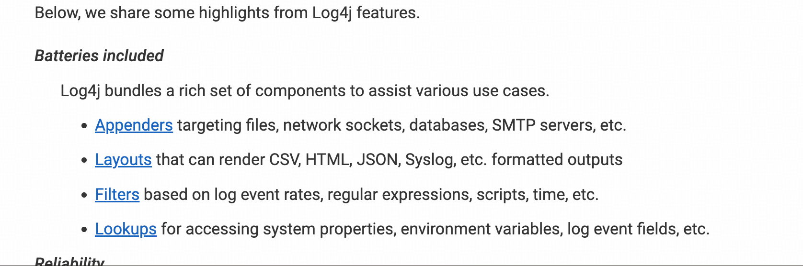
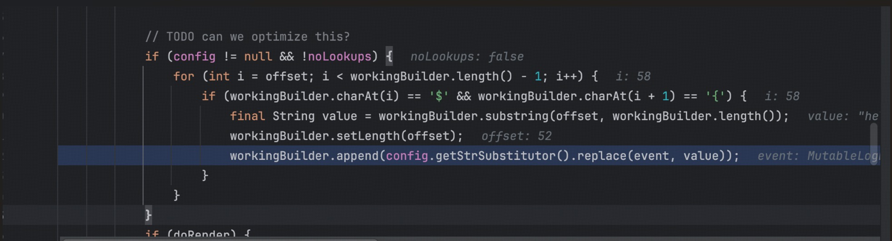
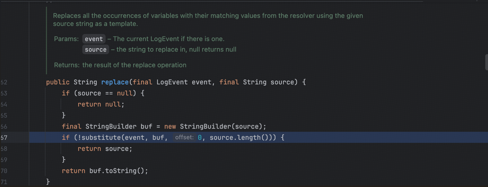
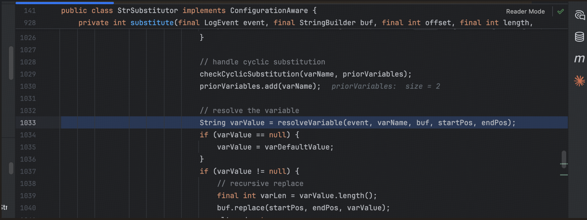
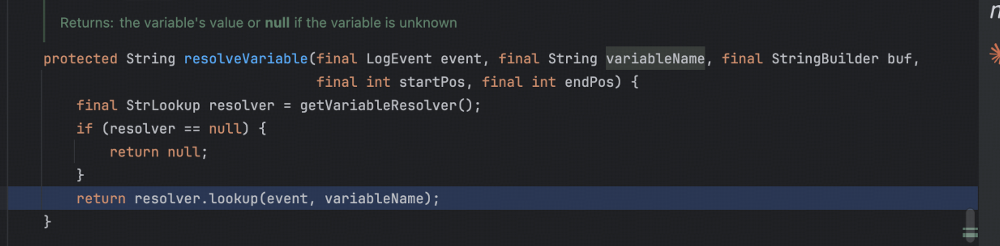
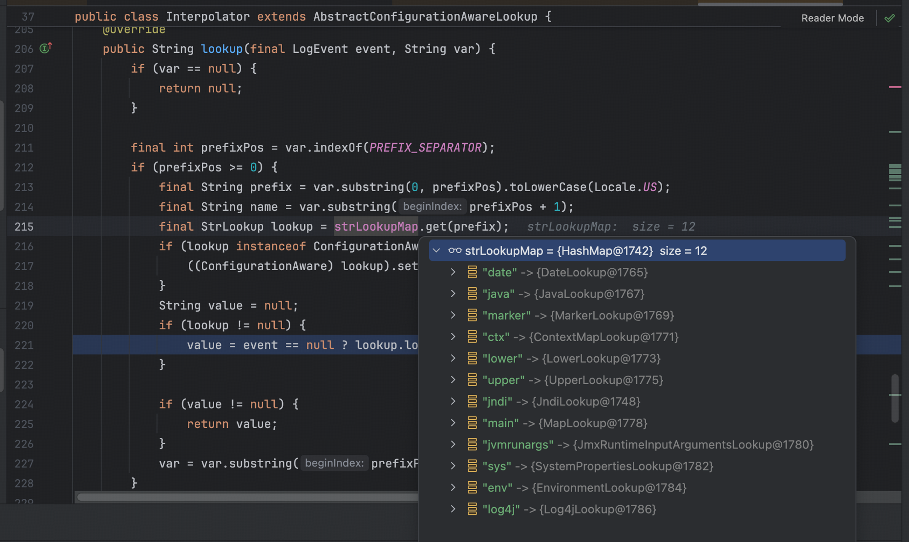

Log4j 是 java 的一个日志框架，支持 lookup 服用于查询系统配置，环境变量，日志事件字段等信息，所以可以用于资源定位，比如开发者想查看当前服务器 jdk 版本，数据源信息，可以直接操作，而不需要重新写代码查询这些信息。

```java
loggrt.info("当前 Jdk: {}","${java:os}")
logger.info("开发数据源: {}", "${jndi:devDS}");
logger.info("生产数据源: {}", "${jndi:prodDS}");
```

xxxxxx 日志信息：xxxxxx 



环境依赖

```xml
<dependency>
    <groupId>org.apache.logging.log4j</groupId>
    <artifactId>log4j-core</artifactId>
    <version>2.14.1</version>
    <scope>java</scope>
</dependency>
<dependency>
    <groupId>org.apache.logging.log4j</groupId>
    <artifactId>log4j-api</artifactId>
    <version>2.14.1</version>
    <scope>java</scope>
</dependency>
```


调试的过程比较繁琐，前面一直转来转去的，我觉得大致从这里开始，判断是否含有 ${ ，然后截取其中的字符串



往下跟进到该方法，大概意思是将变量名替换为对应的值



继续跟进到 resolveVariable 函数，很明显用于解析变量，



继续跟进，这里调用 lookup 方法



查看 resolver ,支持如下协议，


然后通过前缀来判断使用什么协议解析



我们的 payload 前缀为 Jndi ，继续跟进发现走到 jndi 的原生 lookup 方法中，后续就是普通的 jndi 注入。

**绕过**

```
${::-J}ndi
```

unicode 特殊字符大小写转换

ı => upper => i 

ſ => upper => S 

**防御**

1. 禁用关键词 jndi ,lower upper
2. 禁止外连
3. 更新 log4j 版本至安全版本 2.16.0 
4. 从 jar 包中删除 JndiLookup 类
