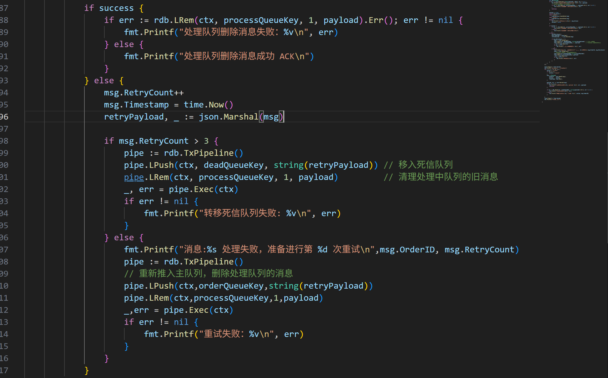
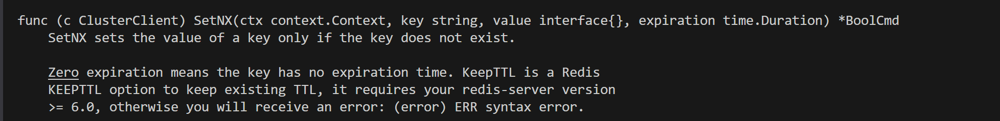
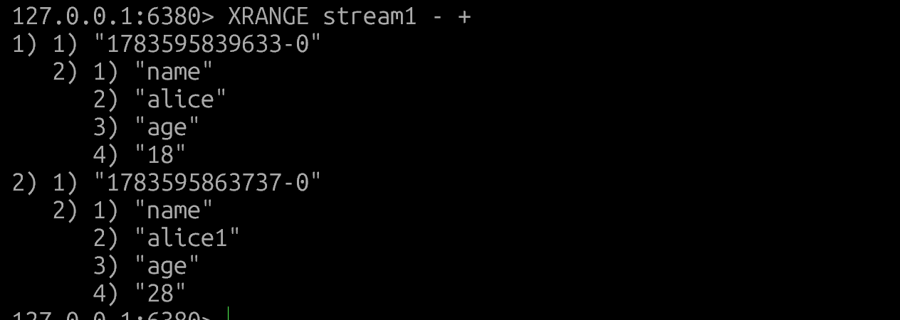
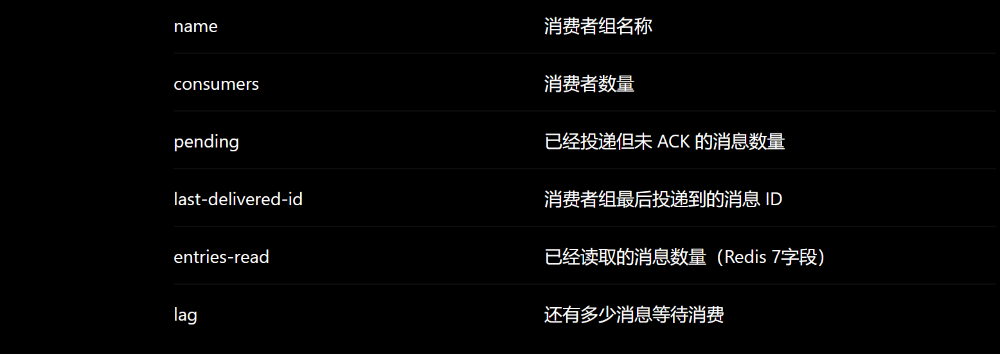
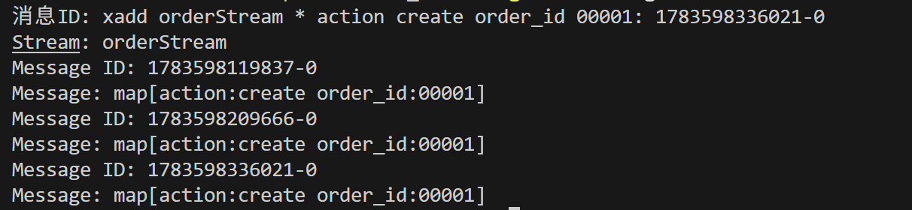
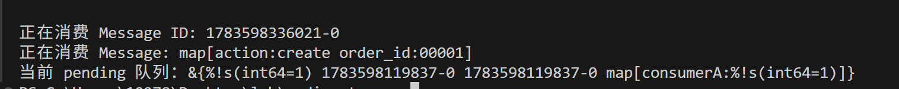
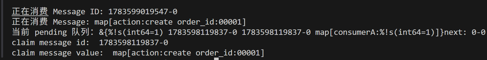

### redis list 

```go
package main

import (
	"context"
	"encoding/json"
	"fmt"
	"time"

	"github.com/google/uuid"
	"github.com/redis/go-redis/v9"
)

type Message struct {
	OrderID   string    `json:"order_id"`
	Action    string    `json:"action"` // "create" "cancel" "successd"
	Timestamp time.Time `json:"timestamp"`
}

// 处理订单业务的 Service
type OrderService struct{}

// OrderService 方法 , 创建订单
func (s *OrderService) CreateOrder(msg Message) {
	fmt.Printf("[OrderService] 正在处理 [创建订单] 业务，订单号:%s, 发生时间:%s\n", msg.OrderID, msg.Timestamp.Format("15:04:05"))

}

// OrderService 方法 , 取消订单
func (s *OrderService) cancelOrder(msg Message) {
	fmt.Printf("[OrderService]正在处理 [取消订单] 业务，订单号:%s，发生时间:%s\n", msg.OrderID, msg.Timestamp.Format("15:04:05"))
}

func main() {
	ctx := context.Background()
	rdb := redis.NewClient(&redis.Options{
		Addr: "localhost:6379",
		DB:   1,
	})
	fmt.Printf("Redis initialized successfully: %s\n", rdb)
	queueKey := "Order:"
	orderService := &OrderService{}
	go func() {
		fmt.Printf("[consume] 正在监听队列...\n")
		for {

			// results 为切片类型 [key,value]
			results, err := rdb.BRPop(ctx, 0, queueKey).Result()
			if err != nil {
				fmt.Printf("获取消息失败：%v,稍后重试\n", err)
				time.Sleep(1 * time.Second)
				continue
			}

			payload := results[1]
			var msg Message
			if err := json.Unmarshal([]byte(payload), &msg); err != nil {
				fmt.Printf("解析消息失败：%v，payload: %s\n", err, payload)
				continue
			}

			switch msg.Action {
			case "create":
				orderService.CreateOrder(msg)
			case "cancel":
				orderService.cancelOrder(msg)
			default:
				fmt.Printf("未知消息类型：%s\n", msg.Action)
			}
		}
	}()

	time.Sleep(3 * time.Second)
	fmt.Printf("[producer] 开始发送消息")
	for i := 1; i <= 10; i++ {
		action := "create"
		if i%2 == 0 {
			action = "cancel"
		}
		msg := Message{
			OrderID:   uuid.NewString(),
			Action:    action,
			Timestamp: time.Now(),
		}

		payload, err := json.Marshal(msg)
		if err != nil {
			fmt.Printf("序列化消息失败：%v, payload: %s\n", err, payload)
			continue
		}

		if err = rdb.LPush(ctx, queueKey, string(payload)).Err(); err != nil {
			fmt.Printf("发送消息失败：%v\n", err)
		} else {
			fmt.Printf("成功发送消息:[%s] 订单号: %s\n", action, msg.OrderID)
		}

	}
	time.Sleep(3 * time.Second)
	fmt.Println("程序运行结束")
}
```

大概结构如下

```
Producer（生产者）
        |
        | LPush
        ↓
Redis List
        |
        | BRPop
        ↓
Consumer（消费者）
        |
        ↓
OrderService 处理业务
```

但是存在以下几个问题

#### 0x01 problem

首先拿到了一个消息 , 此时 redis list 清除了该消息

```go
results, err := rdb.BRPop(ctx,0,queueKey).Result()
```

但是后续对该消息进行处理过程中，例如在这里，程序 panic 网络断开，那么该消息没有成功创建订单，并且也不存在初始的队列中，导致消息丢失，或者说这里数据库连接断开，消息已经消费了，但是创建订单失败，还是出现问题。

```go
orderService.CreateOrder(msg)
```

redis list 没有 ack 重试机制，引入 ack 之后假如由于网络原因重试，消费者可能重复接受到同一条信息，导致重复执行数据库操作，因此这里应该保证**幂等性**。重试机制也会引入一个问题，那就是一些消息可能本身存在问题导致一直重试陷入死循环，因此一般在消息体中添加重试次数，当次数大于n次时将其投入 Order:DeadLetter 队列，这里人工审查该队列。

随着生产者速率远大于消费者，需要构建多个消费者合并成消费者组


#### 0x02 引入 ACK 

```go
package main

import (
	"context"
	"encoding/json"
	"fmt"
	"time"

	"github.com/google/uuid"
	"github.com/redis/go-redis/v9"
)

type Message struct {
	OrderID   string    `json:"order_id"`
	Action    string    `json:"action"` // "create" "cancel"
	Timestamp time.Time `json:"timestamp"`
}

const (
	orderQueueKey   = "Order:"
	processQueueKey = "Process:"
)

const (
	TaskCreate = "create"
	TaskCancel = "cancel"
)

// 处理订单业务的 Service
type OrderService struct{}

// OrderService 方法 , 创建订单
func (s *OrderService) CreateOrder(msg Message) {
	fmt.Printf("[OrderService] 正在处理 [创建订单] 业务，订单号:%s, 发生时间:%s\n", msg.OrderID, msg.Timestamp.Format("15:04:05"))

}

// OrderService 方法 , 取消订单
func (s *OrderService) CancelOrder(msg Message) {
	fmt.Printf("[OrderService]正在处理 [取消订单] 业务，订单号:%s，发生时间:%s\n", msg.OrderID, msg.Timestamp.Format("15:04:05"))
}

func main() {
	ctx := context.Background()
	rdb := redis.NewClient(&redis.Options{
		Addr: "localhost:6379",
		DB:   1,
	})
	fmt.Printf("Redis initialized successfully: %s\n", rdb)
	orderService := &OrderService{}
	go func() {
		fmt.Printf("[consume] 正在监听队列...\n")
		for {

			//BRPop 返回 results 为切片类型 [key,value]
			//BRPopLPush 返回 的就是 value 字符串类型
			payload, err := rdb.BRPopLPush(ctx, orderQueueKey, processQueueKey, 0).Result()
			if err != nil {
				fmt.Printf("获取消息失败：%v,稍后重试\n", err)
				time.Sleep(1 * time.Second)
				continue
			}

			var msg Message
			if err := json.Unmarshal([]byte(payload), &msg); err != nil {
				fmt.Printf("解析消息失败：%v，payload: %s\n", err, payload)
				// 解析失败记得将其 从处理队列中删除
				if err := rdb.LRem(ctx, processQueueKey, 1, payload).Err(); err != nil {
					fmt.Printf("处理队列删除消息失败：%v\n", err)
				}
				continue
			}

			success := true
			switch msg.Action {
			case "create":
				orderService.CreateOrder(msg)
			case "cancel":
				orderService.CancelOrder(msg)
			default:
				fmt.Printf("未知消息类型：%s\n", msg.Action)
				success = false
			}

			if success {
				if err := rdb.LRem(ctx, processQueueKey, 1, payload).Err(); err != nil {
					fmt.Printf("处理队列删除消息失败：%v\n", err)
				} else {
					fmt.Printf("处理队列删除消息成功 ACK\n")
				}
			} else {
				fmt.Printf("处理队列删除消息失败 拒绝 ACK\n")
			}
		}
	}()

	time.Sleep(3 * time.Second)
	fmt.Printf("[producer] 开始发送消息")
	for i := 1; i <= 10; i++ {
		action := "create"
		if i%2 == 0 {
			action = "cancel"
		}
		msg := Message{
			OrderID:   uuid.NewString(),
			Action:    action,
			Timestamp: time.Now(),
		}

		payload, err := json.Marshal(msg)
		if err != nil {
			fmt.Printf("序列化消息失败：%v, payload: %s\n", err, payload)
			continue
		}

		if err = rdb.LPush(ctx, orderQueueKey, string(payload)).Err(); err != nil {
			fmt.Printf("发送消息失败：%v\n", err)
		} else {
			fmt.Printf("成功发送消息:[%s] 订单号: %s\n", action, msg.OrderID)
		}

	}
	time.Sleep(3 * time.Second)
	fmt.Println("程序运行结束")
}
```

对于处理队列中的消息，执行 LRem 时出现问题，没有将其从处理队列中删除，由于消费端一直在监听主队列，就会导致该消息一直滞留在处理队列中，因此还需要一个新的巡检程序，通过消息在处理队列的滞留时间来判断是不是故障导致的滞留消息，将其重新推回主队列。

#### 0x03 重试

主要改动在于消息结构体添加重试次数，以及未 ack 之后的处理



#### 0x04 幂等性

将 msg.OrderID 拼成一个唯一的 ID ，消费者执行如下代码

```go
idempotentKey := fmt.Sprintf("%s%s", idempotentPrefix, msg.OrderID)
// 2. 尝试抢占锁，初始状态为 "processing"，设置 10 分钟超时防止死锁
isNew, err := rdb.SetNX(ctx, idempotentKey, "processing", 10*time.Minute).Result()
if err != nil {
    fmt.Printf("Redis 校验幂等失败：%v\n", err)
    time.Sleep(1 * time.Second)
    continue
}
if !isNew {
    // 不是新的id，说明该消息正在处理中，或者已经被处理过了
    status, _ := rdb.Get(ctx, idempotentKey).Result()
    if status == "success" {
        fmt.Printf("检测到重复消息，且已成功消费，直接 ACK 过滤: %s\n", msg.OrderID)
        rdb.LRem(ctx, processQueueKey, 1, payload) // 清理处理队列，即 ACK
    } else {
        fmt.Printf("消息正在被其他进程处理中，当前跳过: %s\n", msg.OrderID) 
    }
    continue
}
```

```go
rdb.SetNX(ctx,ID,"status",10 * time.Minute)
```



返回 *BoolCmd ,如果返回 true 表示这个订单号之前没有，消费者正常做业务处理，如果返回 false ，表示 redis 已经存在这个 key 了，消费者不去做相应的业务处理。

业务处理成功之后,设置 success 状态，ack

```go
rdb.Set(ctx, idempotentKey, "success", 24*time.Hour)
```


### redis Stream

redis 在 5.0 推出，支持以上 ACK、消息幂等机制，

```
XADD stream1 * name alice age 18
```


查看 stream 的所有数据

```
XRANGE stream1 - +
```



创建消费者组

```
XGROUP CREATE stream1 consumer1 0
```

消费

```
XREADGROUP GROUP consumer1 consumer1 COUNT 1 STREAMS stream1 >
```

查看待 ack 消息

```
XPENDING stream1 consumer1
```

ACK 

```
XACK stream1 consumer1 1783595839633-0
```



以上算是一个循环，创建--消费--ack

#### 0x01 Go-API

##### 1、XADD

```go
ID, err := rdb.XAdd(ctx,&redis.XADDArgs{
    Stream:"orderStream",
    Values: map[string]interface{}{
        "action":"create"
        "orderId":111""
    }
}).Result()
if err != nil {
    fmt.Printf("生产消息出错:%S",err)
}
```

##### 2、XREAD

// 返回一个 []redis.XStream

```go
streams, err := rdb.XRead(ctx, &redis.XReadArgs{
    Streams: []string{
        "orderStream",
        "$",
    },
    Block: 0,
}).Result()
```

// 通过遍历逐个提取 stream 中的数据

```go
for _, stream := range streams{
    fmt.Println("Stream:", stream.Stream)
    for _, message := range stream.Messages{
        fmt.Println("Message ID:", message.ID)
        fmt.Println("Message:", message.Values)
    }
}
```



##### 3、消费

```go
Astreams, err := rdb.XReadGroup(ctx, &redis.XReadGroupArgs{
    Group:    "consumerGroup1",
    Consumer: "consumerA",

    Streams: []string{
        "orderStream",
        ">",
    },

    Count: 1,

    Block: 0,
}).Result()
if err != nil{
    fmt.Printf("错误: %v",err)
    return
}
```

##### 5、ACK

```go
_, err = rdb.XAck(
    ctx,
    "orderStream",
    "consumerGroup1",
    message.ID,
).Result()
if err != nil{
    fmt.Printf("ack失败: %v\n",err)
}
```

##### 6、查看 pending

```go
pending, err := rdb.XPending(
    ctx,
    "orderStream",
    "consumerGroup1",
).Result()

fmt.Println(pending)
```




##### 7、消费长时间待在 pending 的消息

```go
msgs, next, err := rdb.XAutoClaim(ctx, &redis.XAutoClaimArgs{
    Stream:   "orderStream",
    Group:    "consumerGroup1",
    Consumer: "consumerA",

    MinIdle: time.Minute,

    Start: "0-0",

    Count: 10,
}).Result()
if err != nil {
    fmt.Printf("claim queue err: ",err)
}
fmt.Printf("next: %s \n", next)
for _, msg := range msgs {
    fmt.Println("claim message id: ", msg.ID)
    fmt.Println("claim message value: ", msg.Values)
}
```



### Asynq 

大致生产消费流程如下

```go
package main

import (
	"encoding/json"
	"fmt"
	"context"
	"time"

	"github.com/hibiken/asynq"
)

type Email struct {
	To      string
	Time    time.Time
	Subject string
	Body    string
}

func HandleEmailTask(ctx context.Context,t *asynq.Task)error{
	var m Email
	if err:=json.Unmarshal(t.Payload(),&m);err!=nil{
		return fmt.Errorf("could not Unmarshal payload: %v",err)
	}
	fmt.Printf("Processing email: to=%s, time=%s, subject=%s, body=%s\n",m.To,m.Time,m.Subject,m.Body)
	return nil
}

func main() {
	client := asynq.NewClient(&asynq.RedisClientOpt{
		Addr: "127.0.0.1:6380",
		DB:7,
		Network: "tcp",
	})
	defer client.Close()

	email := &Email{
		To:"cby",
		Time:time.Now(),
		Subject:"ctf",
		Body:"ack",
	}
	emailPayload,err := json.Marshal(email)
	if err != nil {
		fmt.Printf("Failed to marshal email:%s\n",err)
		return
	}

	EmailSendTask := asynq.NewTask("email:send",emailPayload)

	info, err := client.Enqueue(
		EmailSendTask,
	)
	if err != nil {
		fmt.Printf("Failed to enqueue task: %s\n", err)
		return
	}
	fmt.Printf("Task: %s\n",EmailSendTask)
	fmt.Printf("Enqueued task: id=%s, type=\"%s\", payload=%s\n", info.ID, info.Type, info.Payload)

	server := asynq.NewServer(
		asynq.RedisClientOpt{
			Addr:"localhost:6380",
			DB:7,
			Network: "tcp",
		},

		asynq.Config{
			Concurrency:10,
		},
	)
	mux := asynq.NewServeMux()
	// 将 email:send type 分配给 HandleEmailTask 函数去处理
	mux.HandleFunc("email:send",HandleEmailTask)

	if err:=server.Run(mux); err!=nil{
		panic(err)
	}
}
```


